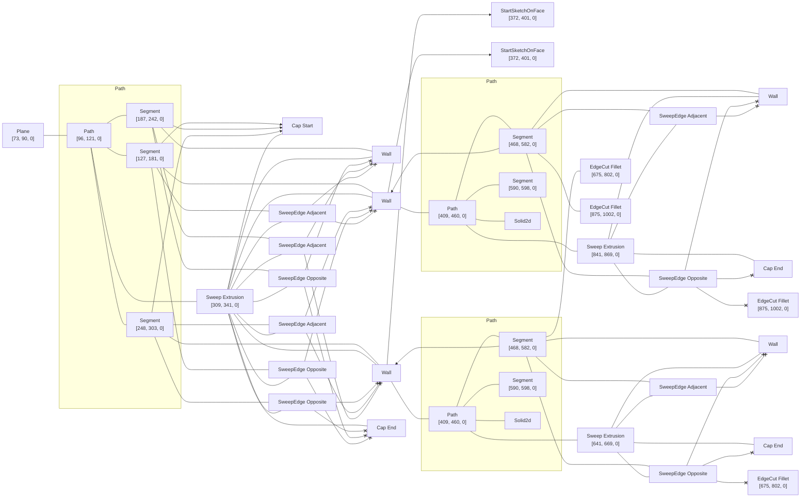

```mermaid
flowchart LR
  subgraph path4 [Path]
    4["Path<br>[96, 121, 0]"]
    7["Segment<br>[127, 181, 0]"]
    8["Segment<br>[187, 242, 0]"]
    9["Segment<br>[248, 303, 0]"]
  end
  subgraph path5 [Path]
    5["Path<br>[409, 460, 0]"]
    10["Segment<br>[468, 582, 0]"]
    13["Segment<br>[590, 598, 0]"]
    14[Solid2d]
  end
  subgraph path6 [Path]
    6["Path<br>[409, 460, 0]"]
    11["Segment<br>[468, 582, 0]"]
    12["Segment<br>[590, 598, 0]"]
    15[Solid2d]
  end
  1["Plane<br>[73, 90, 0]"]
  2["StartSketchOnFace<br>[372, 401, 0]"]
  3["StartSketchOnFace<br>[372, 401, 0]"]
  16["Sweep Extrusion<br>[309, 341, 0]"]
  17["Sweep Extrusion<br>[641, 669, 0]"]
  18["Sweep Extrusion<br>[841, 869, 0]"]
  19[Wall]
  20[Wall]
  21[Wall]
  22[Wall]
  23[Wall]
  24["Cap Start"]
  25["Cap End"]
  26["Cap End"]
  27["Cap End"]
  28["SweepEdge Opposite"]
  29["SweepEdge Adjacent"]
  30["SweepEdge Opposite"]
  31["SweepEdge Adjacent"]
  32["SweepEdge Opposite"]
  33["SweepEdge Adjacent"]
  34["SweepEdge Opposite"]
  35["SweepEdge Adjacent"]
  36["SweepEdge Opposite"]
  37["SweepEdge Adjacent"]
  38["EdgeCut Fillet<br>[675, 802, 0]"]
  39["EdgeCut Fillet<br>[675, 802, 0]"]
  40["EdgeCut Fillet<br>[875, 1002, 0]"]
  41["EdgeCut Fillet<br>[875, 1002, 0]"]
  1 --- 4
  22 x--> 2
  23 x--> 3
  4 --- 7
  4 --- 8
  4 --- 9
  4 ---- 16
  5 --- 10
  5 --- 13
  5 --- 14
  5 ---- 17
  22 --- 5
  6 --- 11
  6 --- 12
  6 --- 15
  6 ---- 18
  23 --- 6
  7 --- 23
  7 x--> 24
  7 --- 36
  7 --- 37
  8 --- 21
  8 x--> 24
  8 --- 34
  8 --- 35
  9 --- 22
  9 x--> 24
  9 --- 32
  9 --- 33
  10 --- 20
  10 x--> 22
  10 --- 30
  10 --- 31
  10 --- 38
  11 --- 19
  11 x--> 23
  11 --- 28
  11 --- 29
  11 --- 40
  16 --- 21
  16 --- 22
  16 --- 23
  16 --- 24
  16 --- 25
  16 --- 32
  16 --- 33
  16 --- 34
  16 --- 35
  16 --- 36
  16 --- 37
  17 --- 20
  17 --- 26
  17 --- 30
  17 --- 31
  18 --- 19
  18 --- 27
  18 --- 28
  18 --- 29
  28 <--x 19
  29 <--x 19
  30 <--x 20
  31 <--x 20
  34 <--x 21
  35 <--x 21
  37 <--x 21
  32 <--x 22
  33 <--x 22
  35 <--x 22
  33 <--x 23
  36 <--x 23
  37 <--x 23
  32 <--x 25
  34 <--x 25
  36 <--x 25
  30 <--x 26
  28 <--x 27
  28 <--x 41
  30 <--x 39
```
