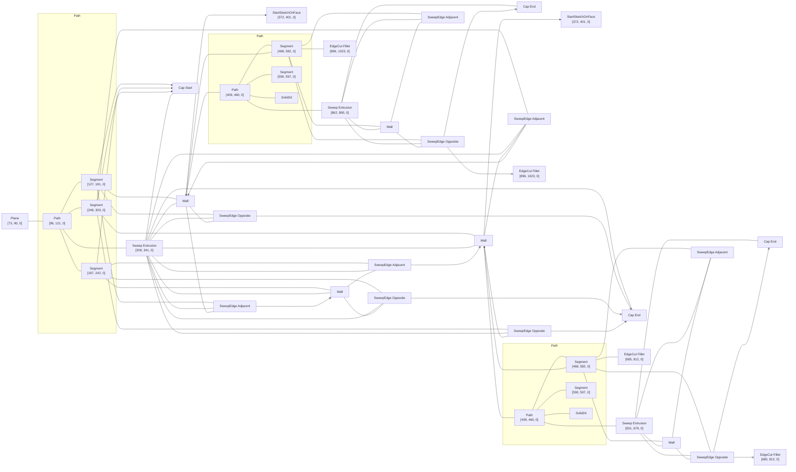

```mermaid
flowchart LR
  subgraph path4 [Path]
    4["Path<br>[96, 121, 0]"]
      %% [ProgramBodyItem { index: 4 }, VariableDeclarationDeclaration, VariableDeclarationInit, PipeBodyItem { index: 1 }]
    7["Segment<br>[127, 181, 0]"]
      %% [ProgramBodyItem { index: 4 }, VariableDeclarationDeclaration, VariableDeclarationInit, PipeBodyItem { index: 2 }]
    8["Segment<br>[187, 242, 0]"]
      %% [ProgramBodyItem { index: 4 }, VariableDeclarationDeclaration, VariableDeclarationInit, PipeBodyItem { index: 3 }]
    9["Segment<br>[248, 303, 0]"]
      %% [ProgramBodyItem { index: 4 }, VariableDeclarationDeclaration, VariableDeclarationInit, PipeBodyItem { index: 4 }]
  end
  subgraph path5 [Path]
    5["Path<br>[409, 460, 0]"]
      %% [ProgramBodyItem { index: 5 }, VariableDeclarationDeclaration, VariableDeclarationInit, FunctionExpressionBody, FunctionExpressionBodyItem { index: 0 }, ReturnStatementArg, PipeBodyItem { index: 1 }]
    11["Segment<br>[468, 582, 0]"]
      %% [ProgramBodyItem { index: 5 }, VariableDeclarationDeclaration, VariableDeclarationInit, FunctionExpressionBody, FunctionExpressionBodyItem { index: 0 }, ReturnStatementArg, PipeBodyItem { index: 2 }]
    12["Segment<br>[590, 597, 0]"]
      %% [ProgramBodyItem { index: 5 }, VariableDeclarationDeclaration, VariableDeclarationInit, FunctionExpressionBody, FunctionExpressionBodyItem { index: 0 }, ReturnStatementArg, PipeBodyItem { index: 3 }]
    14[Solid2d]
  end
  subgraph path6 [Path]
    6["Path<br>[409, 460, 0]"]
      %% [ProgramBodyItem { index: 5 }, VariableDeclarationDeclaration, VariableDeclarationInit, FunctionExpressionBody, FunctionExpressionBodyItem { index: 0 }, ReturnStatementArg, PipeBodyItem { index: 1 }]
    10["Segment<br>[468, 582, 0]"]
      %% [ProgramBodyItem { index: 5 }, VariableDeclarationDeclaration, VariableDeclarationInit, FunctionExpressionBody, FunctionExpressionBodyItem { index: 0 }, ReturnStatementArg, PipeBodyItem { index: 2 }]
    13["Segment<br>[590, 597, 0]"]
      %% [ProgramBodyItem { index: 5 }, VariableDeclarationDeclaration, VariableDeclarationInit, FunctionExpressionBody, FunctionExpressionBodyItem { index: 0 }, ReturnStatementArg, PipeBodyItem { index: 3 }]
    15[Solid2d]
  end
  1["Plane<br>[73, 90, 0]"]
    %% [ProgramBodyItem { index: 4 }, VariableDeclarationDeclaration, VariableDeclarationInit, PipeBodyItem { index: 0 }]
  2["StartSketchOnFace<br>[372, 401, 0]"]
    %% [ProgramBodyItem { index: 5 }, VariableDeclarationDeclaration, VariableDeclarationInit, FunctionExpressionBody, FunctionExpressionBodyItem { index: 0 }, ReturnStatementArg, PipeBodyItem { index: 0 }]
  3["StartSketchOnFace<br>[372, 401, 0]"]
    %% [ProgramBodyItem { index: 5 }, VariableDeclarationDeclaration, VariableDeclarationInit, FunctionExpressionBody, FunctionExpressionBodyItem { index: 0 }, ReturnStatementArg, PipeBodyItem { index: 0 }]
  16["Sweep Extrusion<br>[309, 341, 0]"]
    %% [ProgramBodyItem { index: 4 }, VariableDeclarationDeclaration, VariableDeclarationInit, PipeBodyItem { index: 5 }]
  17["Sweep Extrusion<br>[651, 679, 0]"]
    %% [ProgramBodyItem { index: 7 }, VariableDeclarationDeclaration, VariableDeclarationInit, PipeBodyItem { index: 1 }]
  18["Sweep Extrusion<br>[862, 890, 0]"]
    %% [ProgramBodyItem { index: 9 }, VariableDeclarationDeclaration, VariableDeclarationInit, PipeBodyItem { index: 1 }]
  19[Wall]
  20[Wall]
  21[Wall]
  22[Wall]
  23[Wall]
  24["Cap Start"]
  25["Cap End"]
  26["Cap End"]
  27["Cap End"]
  28["SweepEdge Opposite"]
  29["SweepEdge Opposite"]
  30["SweepEdge Opposite"]
  31["SweepEdge Opposite"]
  32["SweepEdge Opposite"]
  33["SweepEdge Adjacent"]
  34["SweepEdge Adjacent"]
  35["SweepEdge Adjacent"]
  36["SweepEdge Adjacent"]
  37["SweepEdge Adjacent"]
  38["EdgeCut Fillet<br>[685, 812, 0]"]
    %% [ProgramBodyItem { index: 7 }, VariableDeclarationDeclaration, VariableDeclarationInit, PipeBodyItem { index: 2 }]
  39["EdgeCut Fillet<br>[685, 812, 0]"]
    %% [ProgramBodyItem { index: 7 }, VariableDeclarationDeclaration, VariableDeclarationInit, PipeBodyItem { index: 2 }]
  40["EdgeCut Fillet<br>[896, 1023, 0]"]
    %% [ProgramBodyItem { index: 9 }, VariableDeclarationDeclaration, VariableDeclarationInit, PipeBodyItem { index: 2 }]
  41["EdgeCut Fillet<br>[896, 1023, 0]"]
    %% [ProgramBodyItem { index: 9 }, VariableDeclarationDeclaration, VariableDeclarationInit, PipeBodyItem { index: 2 }]
  1 --- 4
  22 x--> 2
  23 x--> 3
  4 --- 7
  4 --- 8
  4 --- 9
  4 ---- 16
  5 --- 11
  5 --- 12
  5 --- 14
  5 ---- 18
  23 --- 5
  6 --- 10
  6 --- 13
  6 --- 15
  6 ---- 17
  22 --- 6
  7 --- 23
  7 x--> 24
  7 --- 30
  7 --- 35
  8 --- 21
  8 x--> 24
  8 --- 31
  8 --- 36
  9 --- 22
  9 x--> 24
  9 --- 32
  9 --- 37
  10 --- 19
  10 x--> 22
  10 --- 28
  10 --- 33
  10 --- 39
  11 --- 20
  11 x--> 23
  11 --- 29
  11 --- 34
  11 --- 40
  16 --- 21
  16 --- 22
  16 --- 23
  16 --- 24
  16 --- 27
  16 --- 30
  16 --- 31
  16 --- 32
  16 --- 35
  16 --- 36
  16 --- 37
  17 --- 19
  17 --- 26
  17 --- 28
  17 --- 33
  18 --- 20
  18 --- 25
  18 --- 29
  18 --- 34
  19 --- 28
  19 --- 33
  20 --- 29
  20 --- 34
  21 --- 31
  35 <--x 21
  21 --- 36
  22 --- 32
  36 <--x 22
  22 --- 37
  23 --- 30
  23 --- 35
  37 <--x 23
  29 <--x 25
  28 <--x 26
  30 <--x 27
  31 <--x 27
  32 <--x 27
  28 <--x 38
  29 <--x 41
```
