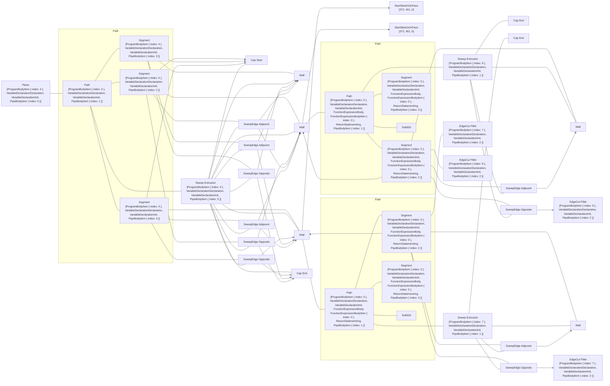

```mermaid
flowchart LR
  subgraph path4 [Path]
    4["Path<br>[ProgramBodyItem { index: 4 }, VariableDeclarationDeclaration, VariableDeclarationInit, PipeBodyItem { index: 1 }]"]
    7["Segment<br>[ProgramBodyItem { index: 4 }, VariableDeclarationDeclaration, VariableDeclarationInit, PipeBodyItem { index: 2 }]"]
    8["Segment<br>[ProgramBodyItem { index: 4 }, VariableDeclarationDeclaration, VariableDeclarationInit, PipeBodyItem { index: 3 }]"]
    9["Segment<br>[ProgramBodyItem { index: 4 }, VariableDeclarationDeclaration, VariableDeclarationInit, PipeBodyItem { index: 4 }]"]
  end
  subgraph path5 [Path]
    5["Path<br>[ProgramBodyItem { index: 5 }, VariableDeclarationDeclaration, VariableDeclarationInit, FunctionExpressionBody, FunctionExpressionBodyItem { index: 0 }, ReturnStatementArg, PipeBodyItem { index: 1 }]"]
    10["Segment<br>[ProgramBodyItem { index: 5 }, VariableDeclarationDeclaration, VariableDeclarationInit, FunctionExpressionBody, FunctionExpressionBodyItem { index: 0 }, ReturnStatementArg, PipeBodyItem { index: 2 }]"]
    13["Segment<br>[ProgramBodyItem { index: 5 }, VariableDeclarationDeclaration, VariableDeclarationInit, FunctionExpressionBody, FunctionExpressionBodyItem { index: 0 }, ReturnStatementArg, PipeBodyItem { index: 3 }]"]
    14[Solid2d]
  end
  subgraph path6 [Path]
    6["Path<br>[ProgramBodyItem { index: 5 }, VariableDeclarationDeclaration, VariableDeclarationInit, FunctionExpressionBody, FunctionExpressionBodyItem { index: 0 }, ReturnStatementArg, PipeBodyItem { index: 1 }]"]
    11["Segment<br>[ProgramBodyItem { index: 5 }, VariableDeclarationDeclaration, VariableDeclarationInit, FunctionExpressionBody, FunctionExpressionBodyItem { index: 0 }, ReturnStatementArg, PipeBodyItem { index: 2 }]"]
    12["Segment<br>[ProgramBodyItem { index: 5 }, VariableDeclarationDeclaration, VariableDeclarationInit, FunctionExpressionBody, FunctionExpressionBodyItem { index: 0 }, ReturnStatementArg, PipeBodyItem { index: 3 }]"]
    15[Solid2d]
  end
  1["Plane<br>[ProgramBodyItem { index: 4 }, VariableDeclarationDeclaration, VariableDeclarationInit, PipeBodyItem { index: 0 }]"]
  2["StartSketchOnFace<br>[372, 401, 0]"]
  3["StartSketchOnFace<br>[372, 401, 0]"]
  16["Sweep Extrusion<br>[ProgramBodyItem { index: 4 }, VariableDeclarationDeclaration, VariableDeclarationInit, PipeBodyItem { index: 5 }]"]
  17["Sweep Extrusion<br>[ProgramBodyItem { index: 7 }, VariableDeclarationDeclaration, VariableDeclarationInit, PipeBodyItem { index: 1 }]"]
  18["Sweep Extrusion<br>[ProgramBodyItem { index: 9 }, VariableDeclarationDeclaration, VariableDeclarationInit, PipeBodyItem { index: 1 }]"]
  19[Wall]
  20[Wall]
  21[Wall]
  22[Wall]
  23[Wall]
  24["Cap Start"]
  25["Cap End"]
  26["Cap End"]
  27["Cap End"]
  28["SweepEdge Opposite"]
  29["SweepEdge Opposite"]
  30["SweepEdge Opposite"]
  31["SweepEdge Opposite"]
  32["SweepEdge Opposite"]
  33["SweepEdge Adjacent"]
  34["SweepEdge Adjacent"]
  35["SweepEdge Adjacent"]
  36["SweepEdge Adjacent"]
  37["SweepEdge Adjacent"]
  38["EdgeCut Fillet<br>[ProgramBodyItem { index: 7 }, VariableDeclarationDeclaration, VariableDeclarationInit, PipeBodyItem { index: 2 }]"]
  39["EdgeCut Fillet<br>[ProgramBodyItem { index: 7 }, VariableDeclarationDeclaration, VariableDeclarationInit, PipeBodyItem { index: 2 }]"]
  40["EdgeCut Fillet<br>[ProgramBodyItem { index: 9 }, VariableDeclarationDeclaration, VariableDeclarationInit, PipeBodyItem { index: 2 }]"]
  41["EdgeCut Fillet<br>[ProgramBodyItem { index: 9 }, VariableDeclarationDeclaration, VariableDeclarationInit, PipeBodyItem { index: 2 }]"]
  1 --- 4
  22 x--> 2
  23 x--> 3
  4 --- 7
  4 --- 8
  4 --- 9
  4 ---- 16
  5 --- 10
  5 --- 13
  5 --- 14
  5 ---- 17
  22 --- 5
  6 --- 11
  6 --- 12
  6 --- 15
  6 ---- 18
  23 --- 6
  7 --- 23
  7 x--> 24
  7 --- 32
  7 --- 36
  8 --- 21
  8 x--> 24
  8 --- 31
  8 --- 35
  9 --- 22
  9 x--> 24
  9 --- 30
  9 --- 37
  10 --- 20
  10 x--> 22
  10 --- 29
  10 --- 34
  10 --- 38
  11 --- 19
  11 x--> 23
  11 --- 28
  11 --- 33
  11 --- 40
  16 --- 21
  16 --- 22
  16 --- 23
  16 --- 24
  16 --- 27
  16 --- 30
  16 --- 31
  16 --- 32
  16 --- 35
  16 --- 36
  16 --- 37
  17 --- 20
  17 --- 26
  17 --- 29
  17 --- 34
  18 --- 19
  18 --- 25
  18 --- 28
  18 --- 33
  33 <--x 19
  34 <--x 20
  31 <--x 21
  35 <--x 21
  36 <--x 21
  30 <--x 22
  35 <--x 22
  37 <--x 22
  32 <--x 23
  36 <--x 23
  37 <--x 23
  30 <--x 27
  31 <--x 27
  32 <--x 27
  28 <--x 41
  29 <--x 39
```
