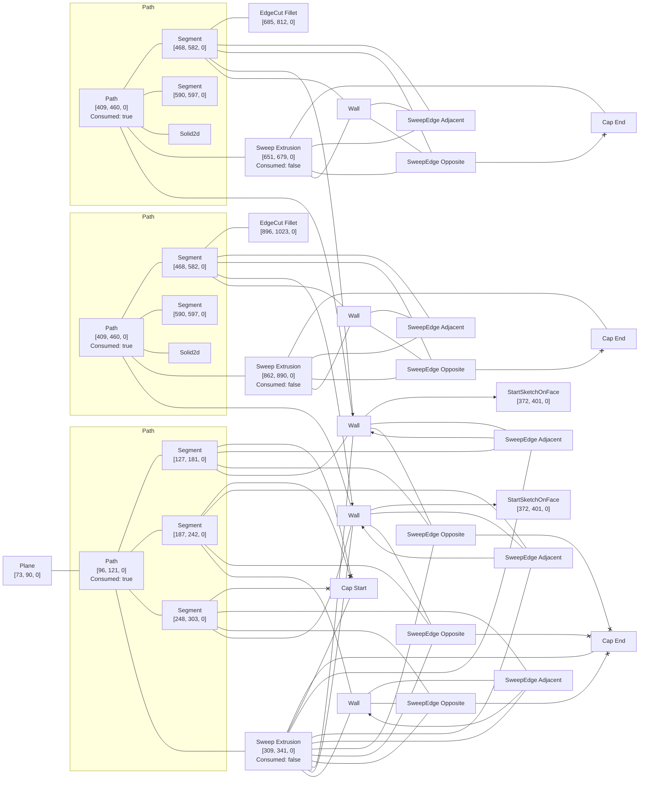

```mermaid
flowchart LR
  subgraph path9 [Path]
    9["Path<br>[96, 121, 0]<br>Consumed: true"]
      %% [ProgramBodyItem { index: 4 }, VariableDeclarationDeclaration, VariableDeclarationInit, PipeBodyItem { index: 1 }]
    11["Segment<br>[127, 181, 0]"]
      %% [ProgramBodyItem { index: 4 }, VariableDeclarationDeclaration, VariableDeclarationInit, PipeBodyItem { index: 2 }]
    12["Segment<br>[187, 242, 0]"]
      %% [ProgramBodyItem { index: 4 }, VariableDeclarationDeclaration, VariableDeclarationInit, PipeBodyItem { index: 3 }]
    13["Segment<br>[248, 303, 0]"]
      %% [ProgramBodyItem { index: 4 }, VariableDeclarationDeclaration, VariableDeclarationInit, PipeBodyItem { index: 4 }]
  end
  subgraph path7 [Path]
    7["Path<br>[409, 460, 0]<br>Consumed: true"]
      %% [ProgramBodyItem { index: 5 }, VariableDeclarationDeclaration, VariableDeclarationInit, FunctionExpressionBody, FunctionExpressionBodyItem { index: 0 }, ReturnStatementArg, PipeBodyItem { index: 1 }]
    14["Segment<br>[468, 582, 0]"]
      %% [ProgramBodyItem { index: 5 }, VariableDeclarationDeclaration, VariableDeclarationInit, FunctionExpressionBody, FunctionExpressionBodyItem { index: 0 }, ReturnStatementArg, PipeBodyItem { index: 2 }]
    16["Segment<br>[590, 597, 0]"]
      %% [ProgramBodyItem { index: 5 }, VariableDeclarationDeclaration, VariableDeclarationInit, FunctionExpressionBody, FunctionExpressionBodyItem { index: 0 }, ReturnStatementArg, PipeBodyItem { index: 3 }]
    18[Solid2d]
  end
  subgraph path8 [Path]
    8["Path<br>[409, 460, 0]<br>Consumed: true"]
      %% [ProgramBodyItem { index: 5 }, VariableDeclarationDeclaration, VariableDeclarationInit, FunctionExpressionBody, FunctionExpressionBodyItem { index: 0 }, ReturnStatementArg, PipeBodyItem { index: 1 }]
    15["Segment<br>[468, 582, 0]"]
      %% [ProgramBodyItem { index: 5 }, VariableDeclarationDeclaration, VariableDeclarationInit, FunctionExpressionBody, FunctionExpressionBodyItem { index: 0 }, ReturnStatementArg, PipeBodyItem { index: 2 }]
    17["Segment<br>[590, 597, 0]"]
      %% [ProgramBodyItem { index: 5 }, VariableDeclarationDeclaration, VariableDeclarationInit, FunctionExpressionBody, FunctionExpressionBodyItem { index: 0 }, ReturnStatementArg, PipeBodyItem { index: 3 }]
    19[Solid2d]
  end
  10["Plane<br>[73, 90, 0]"]
    %% [ProgramBodyItem { index: 4 }, VariableDeclarationDeclaration, VariableDeclarationInit, PipeBodyItem { index: 0 }]
  22["Sweep Extrusion<br>[309, 341, 0]<br>Consumed: false"]
    %% [ProgramBodyItem { index: 4 }, VariableDeclarationDeclaration, VariableDeclarationInit, PipeBodyItem { index: 5 }]
  35[Wall]
    %% face_code_ref=[ProgramBodyItem { index: 5 }, VariableDeclarationDeclaration, VariableDeclarationInit, FunctionExpressionBody, FunctionExpressionBodyItem { index: 0 }, ReturnStatementArg, PipeBodyItem { index: 0 }]
  37[Wall]
    %% face_code_ref=Missing NodePath
  36[Wall]
    %% face_code_ref=[ProgramBodyItem { index: 5 }, VariableDeclarationDeclaration, VariableDeclarationInit, FunctionExpressionBody, FunctionExpressionBodyItem { index: 0 }, ReturnStatementArg, PipeBodyItem { index: 0 }]
  4["Cap Start"]
    %% face_code_ref=Missing NodePath
  1["Cap End"]
    %% face_code_ref=Missing NodePath
  30["SweepEdge Opposite"]
  25["SweepEdge Adjacent"]
  31["SweepEdge Opposite"]
  26["SweepEdge Adjacent"]
  32["SweepEdge Opposite"]
  27["SweepEdge Adjacent"]
  23["Sweep Extrusion<br>[651, 679, 0]<br>Consumed: false"]
    %% [ProgramBodyItem { index: 7 }, VariableDeclarationDeclaration, VariableDeclarationInit, PipeBodyItem { index: 1 }]
  38[Wall]
    %% face_code_ref=Missing NodePath
  2["Cap End"]
    %% face_code_ref=Missing NodePath
  33["SweepEdge Opposite"]
  28["SweepEdge Adjacent"]
  5["EdgeCut Fillet<br>[685, 812, 0]"]
    %% [ProgramBodyItem { index: 7 }, VariableDeclarationDeclaration, VariableDeclarationInit, PipeBodyItem { index: 2 }]
  24["Sweep Extrusion<br>[862, 890, 0]<br>Consumed: false"]
    %% [ProgramBodyItem { index: 9 }, VariableDeclarationDeclaration, VariableDeclarationInit, PipeBodyItem { index: 1 }]
  39[Wall]
    %% face_code_ref=Missing NodePath
  3["Cap End"]
    %% face_code_ref=Missing NodePath
  34["SweepEdge Opposite"]
  29["SweepEdge Adjacent"]
  6["EdgeCut Fillet<br>[896, 1023, 0]"]
    %% [ProgramBodyItem { index: 9 }, VariableDeclarationDeclaration, VariableDeclarationInit, PipeBodyItem { index: 2 }]
  20["StartSketchOnFace<br>[372, 401, 0]"]
    %% [ProgramBodyItem { index: 5 }, VariableDeclarationDeclaration, VariableDeclarationInit, FunctionExpressionBody, FunctionExpressionBodyItem { index: 0 }, ReturnStatementArg, PipeBodyItem { index: 0 }]
  21["StartSketchOnFace<br>[372, 401, 0]"]
    %% [ProgramBodyItem { index: 5 }, VariableDeclarationDeclaration, VariableDeclarationInit, FunctionExpressionBody, FunctionExpressionBodyItem { index: 0 }, ReturnStatementArg, PipeBodyItem { index: 0 }]
  22 --- 1
  30 <--x 1
  31 <--x 1
  32 <--x 1
  23 --- 2
  33 <--x 2
  24 --- 3
  34 <--x 3
  11 <--x 4
  12 <--x 4
  13 <--x 4
  22 --- 4
  14 --- 5
  15 --- 6
  7 --- 14
  7 --- 16
  7 --- 18
  7 ---- 23
  35 --- 7
  8 --- 15
  8 --- 17
  8 --- 19
  8 ---- 24
  36 --- 8
  10 --- 9
  9 --- 11
  9 --- 12
  9 --- 13
  9 ---- 22
  11 --- 25
  11 --- 30
  11 --- 35
  12 --- 26
  12 --- 31
  12 --- 37
  13 --- 27
  13 --- 32
  13 --- 36
  14 --- 28
  14 --- 33
  14 x--> 35
  14 --- 38
  15 --- 29
  15 --- 34
  15 x--> 36
  15 --- 39
  35 x--> 20
  36 x--> 21
  22 --- 25
  22 --- 26
  22 --- 27
  22 --- 30
  22 --- 31
  22 --- 32
  22 --- 35
  22 --- 36
  22 --- 37
  23 --- 28
  23 --- 33
  23 --- 38
  24 --- 29
  24 --- 34
  24 --- 39
  35 --- 25
  25 x--> 35
  36 --- 26
  26 x--> 36
  37 --- 27
  27 x--> 37
  38 --- 28
  39 --- 29
  35 --- 30
  36 --- 31
  37 --- 32
  38 --- 33
  39 --- 34
```
