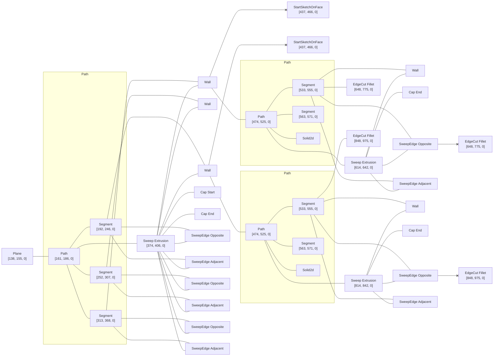

```mermaid
flowchart LR
  subgraph path2 [Path]
    2["Path<br>[161, 186, 0]"]
    3["Segment<br>[192, 246, 0]"]
    4["Segment<br>[252, 307, 0]"]
    5["Segment<br>[313, 368, 0]"]
  end
  subgraph path18 [Path]
    18["Path<br>[474, 525, 0]"]
    19["Segment<br>[533, 555, 0]"]
    20["Segment<br>[563, 571, 0]"]
    21[Solid2d]
  end
  subgraph path29 [Path]
    29["Path<br>[474, 525, 0]"]
    30["Segment<br>[533, 555, 0]"]
    31["Segment<br>[563, 571, 0]"]
    32[Solid2d]
  end
  1["Plane<br>[138, 155, 0]"]
  6["Sweep Extrusion<br>[374, 406, 0]"]
  7[Wall]
  8[Wall]
  9[Wall]
  10["Cap Start"]
  11["Cap End"]
  12["SweepEdge Opposite"]
  13["SweepEdge Adjacent"]
  14["SweepEdge Opposite"]
  15["SweepEdge Adjacent"]
  16["SweepEdge Opposite"]
  17["SweepEdge Adjacent"]
  22["Sweep Extrusion<br>[614, 642, 0]"]
  23[Wall]
  24["Cap End"]
  25["SweepEdge Opposite"]
  26["SweepEdge Adjacent"]
  27["EdgeCut Fillet<br>[648, 775, 0]"]
  28["EdgeCut Fillet<br>[648, 775, 0]"]
  33["Sweep Extrusion<br>[814, 842, 0]"]
  34[Wall]
  35["Cap End"]
  36["SweepEdge Opposite"]
  37["SweepEdge Adjacent"]
  38["EdgeCut Fillet<br>[848, 975, 0]"]
  39["EdgeCut Fillet<br>[848, 975, 0]"]
  40["StartSketchOnFace<br>[437, 466, 0]"]
  41["StartSketchOnFace<br>[437, 466, 0]"]
  1 --- 2
  2 --- 3
  2 --- 4
  2 --- 5
  2 ---- 6
  3 --- 7
  3 --- 12
  3 --- 13
  4 --- 8
  4 --- 14
  4 --- 15
  5 --- 9
  5 --- 16
  5 --- 17
  6 --- 7
  6 --- 8
  6 --- 9
  6 --- 10
  6 --- 11
  6 --- 12
  6 --- 13
  6 --- 14
  6 --- 15
  6 --- 16
  6 --- 17
  7 --- 29
  9 --- 18
  18 --- 19
  18 --- 20
  18 ---- 22
  18 --- 21
  19 --- 23
  19 --- 25
  19 --- 26
  19 --- 27
  22 --- 23
  22 --- 24
  22 --- 25
  22 --- 26
  25 <--x 28
  29 --- 30
  29 --- 31
  29 ---- 33
  29 --- 32
  30 --- 34
  30 --- 36
  30 --- 37
  30 --- 38
  33 --- 34
  33 --- 35
  33 --- 36
  33 --- 37
  36 <--x 39
  9 <--x 40
  7 <--x 41
```
