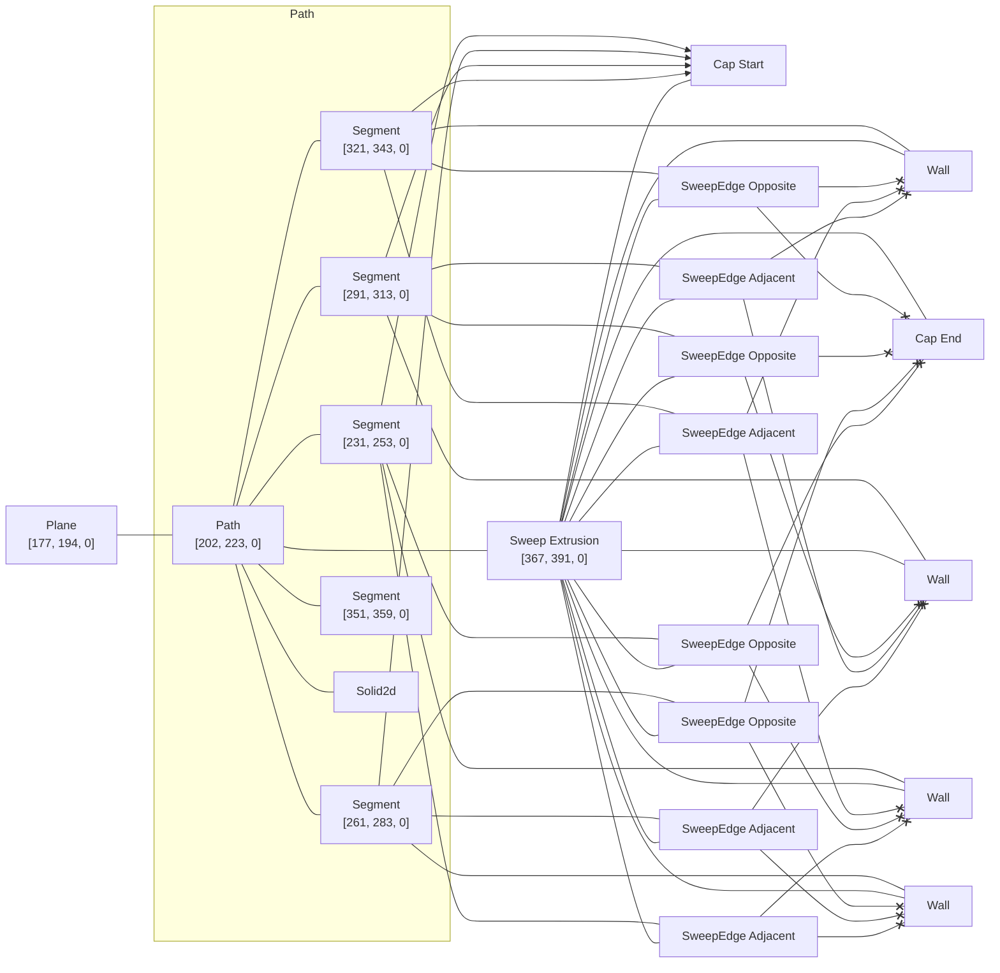

```mermaid
flowchart LR
  subgraph path2 [Path]
    2["Path<br>[202, 223, 0]"]
    3["Segment<br>[231, 253, 0]"]
    4["Segment<br>[261, 283, 0]"]
    5["Segment<br>[291, 313, 0]"]
    6["Segment<br>[321, 343, 0]"]
    7["Segment<br>[351, 359, 0]"]
    8[Solid2d]
  end
  1["Plane<br>[177, 194, 0]"]
  9["Sweep Extrusion<br>[367, 391, 0]"]
  10[Wall]
  11[Wall]
  12[Wall]
  13[Wall]
  14["Cap Start"]
  15["Cap End"]
  16["SweepEdge Opposite"]
  17["SweepEdge Adjacent"]
  18["SweepEdge Opposite"]
  19["SweepEdge Adjacent"]
  20["SweepEdge Opposite"]
  21["SweepEdge Adjacent"]
  22["SweepEdge Opposite"]
  23["SweepEdge Adjacent"]
  1 --- 2
  2 --- 3
  2 --- 4
  2 --- 5
  2 --- 6
  2 --- 7
  2 ---- 9
  2 --- 8
  3 --- 13
  3 --- 22
  3 --- 23
  3 x--> 14
  4 --- 12
  4 --- 20
  4 --- 21
  4 x--> 14
  5 --- 11
  5 --- 18
  5 --- 19
  5 x--> 14
  6 --- 10
  6 --- 16
  6 --- 17
  6 x--> 14
  9 --- 10
  9 --- 11
  9 --- 12
  9 --- 13
  9 --- 14
  9 --- 15
  9 --- 16
  9 --- 17
  9 --- 18
  9 --- 19
  9 --- 20
  9 --- 21
  9 --- 22
  9 --- 23
  16 <--x 10
  16 <--x 15
  17 <--x 10
  17 <--x 13
  18 <--x 11
  18 <--x 15
  19 <--x 10
  19 <--x 11
  20 <--x 12
  20 <--x 15
  21 <--x 11
  21 <--x 12
  22 <--x 13
  22 <--x 15
  23 <--x 12
  23 <--x 13
```
