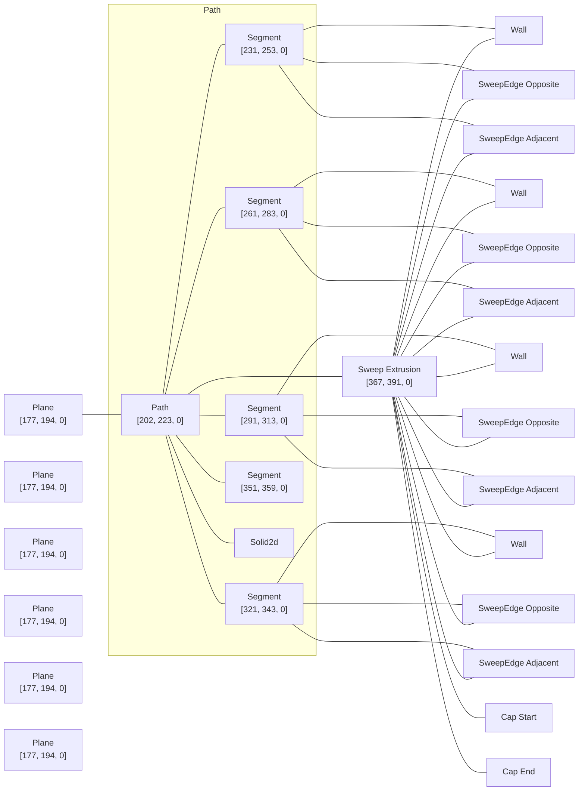

```mermaid
flowchart LR
  subgraph path7 [Path]
    7["Path<br>[202, 223, 0]"]
    8["Segment<br>[231, 253, 0]"]
    9["Segment<br>[261, 283, 0]"]
    10["Segment<br>[291, 313, 0]"]
    11["Segment<br>[321, 343, 0]"]
    12["Segment<br>[351, 359, 0]"]
    13[Solid2d]
  end
  1["Plane<br>[177, 194, 0]"]
  2["Plane<br>[177, 194, 0]"]
  3["Plane<br>[177, 194, 0]"]
  4["Plane<br>[177, 194, 0]"]
  5["Plane<br>[177, 194, 0]"]
  6["Plane<br>[177, 194, 0]"]
  14["Sweep Extrusion<br>[367, 391, 0]"]
  15[Wall]
  16[Wall]
  17[Wall]
  18[Wall]
  19["Cap Start"]
  20["Cap End"]
  21["SweepEdge Opposite"]
  22["SweepEdge Adjacent"]
  23["SweepEdge Opposite"]
  24["SweepEdge Adjacent"]
  25["SweepEdge Opposite"]
  26["SweepEdge Adjacent"]
  27["SweepEdge Opposite"]
  28["SweepEdge Adjacent"]
  1 --- 7
  7 --- 8
  7 --- 9
  7 --- 10
  7 --- 11
  7 --- 12
  7 ---- 14
  7 --- 13
  8 --- 18
  8 --- 27
  8 --- 28
  9 --- 17
  9 --- 25
  9 --- 26
  10 --- 16
  10 --- 23
  10 --- 24
  11 --- 15
  11 --- 21
  11 --- 22
  14 --- 15
  14 --- 16
  14 --- 17
  14 --- 18
  14 --- 19
  14 --- 20
  14 --- 21
  14 --- 22
  14 --- 23
  14 --- 24
  14 --- 25
  14 --- 26
  14 --- 27
  14 --- 28
```
