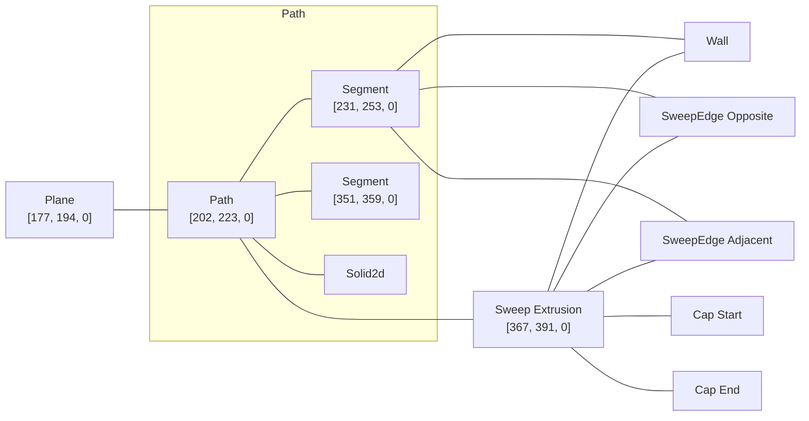

```mermaid
flowchart LR
  subgraph path2 [Path]
    2["Path<br>[202, 223, 0]"]
    3["Segment<br>[231, 253, 0]"]
    4["Segment<br>[351, 359, 0]"]
    5[Solid2d]
  end
  1["Plane<br>[177, 194, 0]"]
  6["Sweep Extrusion<br>[367, 391, 0]"]
  7[Wall]
  8["Cap Start"]
  9["Cap End"]
  10["SweepEdge Opposite"]
  11["SweepEdge Adjacent"]
  1 --- 2
  2 --- 3
  2 --- 4
  2 ---- 6
  2 --- 5
  3 --- 7
  3 --- 10
  3 --- 11
  6 --- 7
  6 --- 8
  6 --- 9
  6 --- 10
  6 --- 11
```
