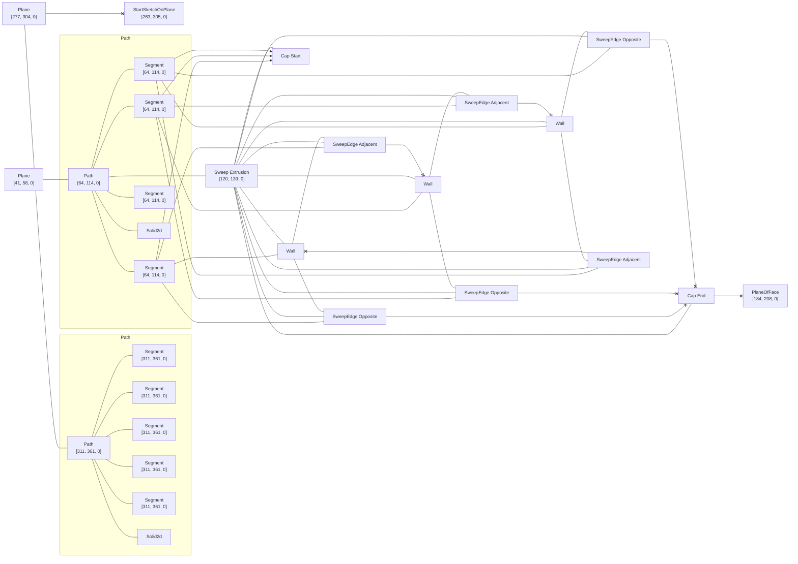

```mermaid
flowchart LR
  subgraph path2 [Path]
    2["Path<br>[64, 114, 0]"]
      %% [ProgramBodyItem { index: 0 }, VariableDeclarationDeclaration, VariableDeclarationInit, PipeBodyItem { index: 1 }]
    3["Segment<br>[64, 114, 0]"]
      %% [ProgramBodyItem { index: 0 }, VariableDeclarationDeclaration, VariableDeclarationInit, PipeBodyItem { index: 1 }]
    4["Segment<br>[64, 114, 0]"]
      %% [ProgramBodyItem { index: 0 }, VariableDeclarationDeclaration, VariableDeclarationInit, PipeBodyItem { index: 1 }]
    5["Segment<br>[64, 114, 0]"]
      %% [ProgramBodyItem { index: 0 }, VariableDeclarationDeclaration, VariableDeclarationInit, PipeBodyItem { index: 1 }]
    6["Segment<br>[64, 114, 0]"]
      %% [ProgramBodyItem { index: 0 }, VariableDeclarationDeclaration, VariableDeclarationInit, PipeBodyItem { index: 1 }]
    7[Solid2d]
  end
  subgraph path22 [Path]
    22["Path<br>[311, 361, 0]"]
      %% [ProgramBodyItem { index: 2 }, ExpressionStatementExpr, PipeBodyItem { index: 1 }]
    23["Segment<br>[311, 361, 0]"]
      %% [ProgramBodyItem { index: 2 }, ExpressionStatementExpr, PipeBodyItem { index: 1 }]
    24["Segment<br>[311, 361, 0]"]
      %% [ProgramBodyItem { index: 2 }, ExpressionStatementExpr, PipeBodyItem { index: 1 }]
    25["Segment<br>[311, 361, 0]"]
      %% [ProgramBodyItem { index: 2 }, ExpressionStatementExpr, PipeBodyItem { index: 1 }]
    26["Segment<br>[311, 361, 0]"]
      %% [ProgramBodyItem { index: 2 }, ExpressionStatementExpr, PipeBodyItem { index: 1 }]
    27["Segment<br>[311, 361, 0]"]
      %% [ProgramBodyItem { index: 2 }, ExpressionStatementExpr, PipeBodyItem { index: 1 }]
    28[Solid2d]
  end
  1["Plane<br>[41, 58, 0]"]
    %% [ProgramBodyItem { index: 0 }, VariableDeclarationDeclaration, VariableDeclarationInit, PipeBodyItem { index: 0 }]
  8["Sweep Extrusion<br>[120, 139, 0]"]
    %% [ProgramBodyItem { index: 0 }, VariableDeclarationDeclaration, VariableDeclarationInit, PipeBodyItem { index: 2 }]
  9[Wall]
    %% face_code_ref=Missing NodePath
  10[Wall]
    %% face_code_ref=Missing NodePath
  11[Wall]
    %% face_code_ref=Missing NodePath
  12["Cap Start"]
    %% face_code_ref=Missing NodePath
  13["Cap End"]
    %% face_code_ref=Missing NodePath
  14["SweepEdge Opposite"]
  15["SweepEdge Adjacent"]
  16["SweepEdge Opposite"]
  17["SweepEdge Adjacent"]
  18["SweepEdge Opposite"]
  19["SweepEdge Adjacent"]
  20["PlaneOfFace<br>[184, 208, 0]"]
    %% [ProgramBodyItem { index: 1 }, VariableDeclarationDeclaration, VariableDeclarationInit]
  21["Plane<br>[277, 304, 0]"]
    %% [ProgramBodyItem { index: 2 }, ExpressionStatementExpr, PipeBodyItem { index: 0 }, CallKwUnlabeledArg]
  29["StartSketchOnPlane<br>[263, 305, 0]"]
    %% [ProgramBodyItem { index: 2 }, ExpressionStatementExpr, PipeBodyItem { index: 0 }]
  1 --- 2
  2 --- 3
  2 --- 4
  2 --- 5
  2 --- 6
  2 --- 7
  2 ---- 8
  3 --- 9
  3 x--> 12
  3 --- 14
  3 --- 15
  4 --- 10
  4 x--> 12
  4 --- 16
  4 --- 17
  5 --- 11
  5 x--> 12
  5 --- 18
  5 --- 19
  8 --- 9
  8 --- 10
  8 --- 11
  8 --- 12
  8 --- 13
  8 --- 14
  8 --- 15
  8 --- 16
  8 --- 17
  8 --- 18
  8 --- 19
  9 --- 14
  9 --- 15
  19 <--x 9
  15 <--x 10
  10 --- 16
  10 --- 17
  17 <--x 11
  11 --- 18
  11 --- 19
  14 <--x 13
  16 <--x 13
  18 <--x 13
  13 <--x 20
  21 --- 22
  21 <--x 29
  22 --- 23
  22 --- 24
  22 --- 25
  22 --- 26
  22 --- 27
  22 --- 28
```
