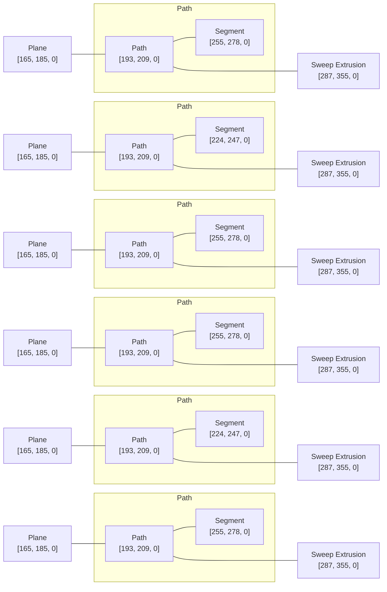

```mermaid
flowchart LR
  subgraph path2 [Path]
    2["Path<br>[193, 209, 0]"]
      %% [ProgramBodyItem { index: 1 }, VariableDeclarationDeclaration, VariableDeclarationInit, FunctionExpressionBody, FunctionExpressionBodyItem { index: 1 }, ReturnStatementArg, PipeBodyItem { index: 1 }]
    3["Segment<br>[255, 278, 0]"]
      %% [ProgramBodyItem { index: 1 }, VariableDeclarationDeclaration, VariableDeclarationInit, FunctionExpressionBody, FunctionExpressionBodyItem { index: 1 }, ReturnStatementArg, PipeBodyItem { index: 2 }, IfExpressionElse, ProgramBodyItem { index: 0 }, ExpressionStatementExpr]
  end
  subgraph path6 [Path]
    6["Path<br>[193, 209, 0]"]
      %% [ProgramBodyItem { index: 1 }, VariableDeclarationDeclaration, VariableDeclarationInit, FunctionExpressionBody, FunctionExpressionBodyItem { index: 1 }, ReturnStatementArg, PipeBodyItem { index: 1 }]
    7["Segment<br>[224, 247, 0]"]
      %% [ProgramBodyItem { index: 1 }, VariableDeclarationDeclaration, VariableDeclarationInit, FunctionExpressionBody, FunctionExpressionBodyItem { index: 1 }, ReturnStatementArg, PipeBodyItem { index: 2 }, IfExpressionThen, ProgramBodyItem { index: 0 }, ExpressionStatementExpr]
  end
  subgraph path10 [Path]
    10["Path<br>[193, 209, 0]"]
      %% [ProgramBodyItem { index: 1 }, VariableDeclarationDeclaration, VariableDeclarationInit, FunctionExpressionBody, FunctionExpressionBodyItem { index: 1 }, ReturnStatementArg, PipeBodyItem { index: 1 }]
    11["Segment<br>[255, 278, 0]"]
      %% [ProgramBodyItem { index: 1 }, VariableDeclarationDeclaration, VariableDeclarationInit, FunctionExpressionBody, FunctionExpressionBodyItem { index: 1 }, ReturnStatementArg, PipeBodyItem { index: 2 }, IfExpressionElse, ProgramBodyItem { index: 0 }, ExpressionStatementExpr]
  end
  subgraph path14 [Path]
    14["Path<br>[193, 209, 0]"]
      %% [ProgramBodyItem { index: 1 }, VariableDeclarationDeclaration, VariableDeclarationInit, FunctionExpressionBody, FunctionExpressionBodyItem { index: 1 }, ReturnStatementArg, PipeBodyItem { index: 1 }]
    15["Segment<br>[255, 278, 0]"]
      %% [ProgramBodyItem { index: 1 }, VariableDeclarationDeclaration, VariableDeclarationInit, FunctionExpressionBody, FunctionExpressionBodyItem { index: 1 }, ReturnStatementArg, PipeBodyItem { index: 2 }, IfExpressionElse, ProgramBodyItem { index: 0 }, ExpressionStatementExpr]
  end
  subgraph path18 [Path]
    18["Path<br>[193, 209, 0]"]
      %% [ProgramBodyItem { index: 1 }, VariableDeclarationDeclaration, VariableDeclarationInit, FunctionExpressionBody, FunctionExpressionBodyItem { index: 1 }, ReturnStatementArg, PipeBodyItem { index: 1 }]
    19["Segment<br>[224, 247, 0]"]
      %% [ProgramBodyItem { index: 1 }, VariableDeclarationDeclaration, VariableDeclarationInit, FunctionExpressionBody, FunctionExpressionBodyItem { index: 1 }, ReturnStatementArg, PipeBodyItem { index: 2 }, IfExpressionThen, ProgramBodyItem { index: 0 }, ExpressionStatementExpr]
  end
  subgraph path22 [Path]
    22["Path<br>[193, 209, 0]"]
      %% [ProgramBodyItem { index: 1 }, VariableDeclarationDeclaration, VariableDeclarationInit, FunctionExpressionBody, FunctionExpressionBodyItem { index: 1 }, ReturnStatementArg, PipeBodyItem { index: 1 }]
    23["Segment<br>[255, 278, 0]"]
      %% [ProgramBodyItem { index: 1 }, VariableDeclarationDeclaration, VariableDeclarationInit, FunctionExpressionBody, FunctionExpressionBodyItem { index: 1 }, ReturnStatementArg, PipeBodyItem { index: 2 }, IfExpressionElse, ProgramBodyItem { index: 0 }, ExpressionStatementExpr]
  end
  1["Plane<br>[165, 185, 0]"]
    %% [ProgramBodyItem { index: 1 }, VariableDeclarationDeclaration, VariableDeclarationInit, FunctionExpressionBody, FunctionExpressionBodyItem { index: 1 }, ReturnStatementArg, PipeBodyItem { index: 0 }]
  4["Sweep Extrusion<br>[287, 355, 0]"]
    %% [ProgramBodyItem { index: 1 }, VariableDeclarationDeclaration, VariableDeclarationInit, FunctionExpressionBody, FunctionExpressionBodyItem { index: 1 }, ReturnStatementArg, PipeBodyItem { index: 3 }]
  5["Plane<br>[165, 185, 0]"]
    %% [ProgramBodyItem { index: 1 }, VariableDeclarationDeclaration, VariableDeclarationInit, FunctionExpressionBody, FunctionExpressionBodyItem { index: 1 }, ReturnStatementArg, PipeBodyItem { index: 0 }]
  8["Sweep Extrusion<br>[287, 355, 0]"]
    %% [ProgramBodyItem { index: 1 }, VariableDeclarationDeclaration, VariableDeclarationInit, FunctionExpressionBody, FunctionExpressionBodyItem { index: 1 }, ReturnStatementArg, PipeBodyItem { index: 3 }]
  9["Plane<br>[165, 185, 0]"]
    %% [ProgramBodyItem { index: 1 }, VariableDeclarationDeclaration, VariableDeclarationInit, FunctionExpressionBody, FunctionExpressionBodyItem { index: 1 }, ReturnStatementArg, PipeBodyItem { index: 0 }]
  12["Sweep Extrusion<br>[287, 355, 0]"]
    %% [ProgramBodyItem { index: 1 }, VariableDeclarationDeclaration, VariableDeclarationInit, FunctionExpressionBody, FunctionExpressionBodyItem { index: 1 }, ReturnStatementArg, PipeBodyItem { index: 3 }]
  13["Plane<br>[165, 185, 0]"]
    %% [ProgramBodyItem { index: 1 }, VariableDeclarationDeclaration, VariableDeclarationInit, FunctionExpressionBody, FunctionExpressionBodyItem { index: 1 }, ReturnStatementArg, PipeBodyItem { index: 0 }]
  16["Sweep Extrusion<br>[287, 355, 0]"]
    %% [ProgramBodyItem { index: 1 }, VariableDeclarationDeclaration, VariableDeclarationInit, FunctionExpressionBody, FunctionExpressionBodyItem { index: 1 }, ReturnStatementArg, PipeBodyItem { index: 3 }]
  17["Plane<br>[165, 185, 0]"]
    %% [ProgramBodyItem { index: 1 }, VariableDeclarationDeclaration, VariableDeclarationInit, FunctionExpressionBody, FunctionExpressionBodyItem { index: 1 }, ReturnStatementArg, PipeBodyItem { index: 0 }]
  20["Sweep Extrusion<br>[287, 355, 0]"]
    %% [ProgramBodyItem { index: 1 }, VariableDeclarationDeclaration, VariableDeclarationInit, FunctionExpressionBody, FunctionExpressionBodyItem { index: 1 }, ReturnStatementArg, PipeBodyItem { index: 3 }]
  21["Plane<br>[165, 185, 0]"]
    %% [ProgramBodyItem { index: 1 }, VariableDeclarationDeclaration, VariableDeclarationInit, FunctionExpressionBody, FunctionExpressionBodyItem { index: 1 }, ReturnStatementArg, PipeBodyItem { index: 0 }]
  24["Sweep Extrusion<br>[287, 355, 0]"]
    %% [ProgramBodyItem { index: 1 }, VariableDeclarationDeclaration, VariableDeclarationInit, FunctionExpressionBody, FunctionExpressionBodyItem { index: 1 }, ReturnStatementArg, PipeBodyItem { index: 3 }]
  1 --- 2
  2 --- 3
  2 ---- 4
  5 --- 6
  6 --- 7
  6 ---- 8
  9 --- 10
  10 --- 11
  10 ---- 12
  13 --- 14
  14 --- 15
  14 ---- 16
  17 --- 18
  18 --- 19
  18 ---- 20
  21 --- 22
  22 --- 23
  22 ---- 24
```
