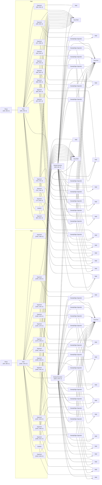

```mermaid
flowchart LR
  subgraph path2 [Path]
    2["Path<br>[206, 250, 0]"]
    3["Segment<br>[256, 290, 0]"]
    4["Segment<br>[296, 365, 0]"]
    5["Segment<br>[371, 398, 0]"]
    6["Segment<br>[404, 435, 0]"]
    7["Segment<br>[441, 476, 0]"]
    8["Segment<br>[482, 562, 0]"]
    9["Segment<br>[568, 599, 0]"]
    10["Segment<br>[605, 664, 0]"]
    11["Segment<br>[670, 697, 0]"]
    12["Segment<br>[703, 725, 0]"]
    13["Segment<br>[731, 766, 0]"]
    14["Segment<br>[772, 818, 0]"]
    15["Segment<br>[824, 832, 0]"]
    16[Solid2d]
  end
  subgraph path46 [Path]
    46["Path<br>[1000, 1044, 0]"]
    47["Segment<br>[1050, 1084, 0]"]
    48["Segment<br>[1090, 1159, 0]"]
    49["Segment<br>[1165, 1192, 0]"]
    50["Segment<br>[1198, 1229, 0]"]
    51["Segment<br>[1235, 1270, 0]"]
    52["Segment<br>[1276, 1356, 0]"]
    53["Segment<br>[1362, 1393, 0]"]
    54["Segment<br>[1399, 1458, 0]"]
    55["Segment<br>[1464, 1491, 0]"]
    56["Segment<br>[1497, 1519, 0]"]
    57["Segment<br>[1525, 1560, 0]"]
    58["Segment<br>[1566, 1612, 0]"]
    59["Segment<br>[1618, 1626, 0]"]
    60[Solid2d]
  end
  1["Plane<br>[182, 200, 0]"]
  17["Sweep Revolve<br>[843, 962, 0]"]
  18[Wall]
  19[Wall]
  20[Wall]
  21[Wall]
  22[Wall]
  23[Wall]
  24[Wall]
  25[Wall]
  26[Wall]
  27[Wall]
  28[Wall]
  29[Wall]
  30[Wall]
  31["Cap Start"]
  32["Cap End"]
  33["SweepEdge Opposite"]
  34["SweepEdge Opposite"]
  35["SweepEdge Opposite"]
  36["SweepEdge Opposite"]
  37["SweepEdge Opposite"]
  38["SweepEdge Opposite"]
  39["SweepEdge Opposite"]
  40["SweepEdge Opposite"]
  41["SweepEdge Opposite"]
  42["SweepEdge Opposite"]
  43["SweepEdge Opposite"]
  44["SweepEdge Opposite"]
  45["Plane<br>[976, 994, 0]"]
  61["Sweep Extrusion<br>[1632, 1670, 0]"]
  62[Wall]
  63[Wall]
  64[Wall]
  65[Wall]
  66[Wall]
  67[Wall]
  68[Wall]
  69[Wall]
  70[Wall]
  71[Wall]
  72[Wall]
  73[Wall]
  74[Wall]
  75["Cap Start"]
  76["Cap End"]
  77["SweepEdge Opposite"]
  78["SweepEdge Opposite"]
  79["SweepEdge Opposite"]
  80["SweepEdge Opposite"]
  81["SweepEdge Opposite"]
  82["SweepEdge Opposite"]
  83["SweepEdge Opposite"]
  84["SweepEdge Opposite"]
  85["SweepEdge Opposite"]
  86["SweepEdge Opposite"]
  87["SweepEdge Opposite"]
  88["SweepEdge Opposite"]
  1 --- 2
  2 --- 3
  2 --- 4
  2 --- 5
  2 --- 6
  2 --- 7
  2 --- 8
  2 --- 9
  2 --- 10
  2 --- 11
  2 --- 12
  2 --- 13
  2 --- 14
  2 --- 15
  2 ---- 17
  2 --- 16
  3 --- 18
  3 x--> 31
  4 --- 19
  4 --- 33
  4 x--> 31
  5 --- 20
  5 --- 34
  5 x--> 31
  6 --- 21
  6 --- 35
  6 x--> 31
  7 --- 22
  7 --- 36
  7 x--> 31
  8 --- 23
  8 --- 37
  8 x--> 31
  9 --- 24
  9 --- 38
  9 x--> 31
  10 --- 25
  10 --- 39
  10 x--> 31
  11 --- 26
  11 --- 40
  11 x--> 31
  12 --- 27
  12 --- 41
  12 x--> 31
  13 --- 28
  13 --- 42
  13 x--> 31
  14 --- 29
  14 --- 43
  14 x--> 31
  15 --- 30
  15 --- 44
  15 x--> 31
  17 --- 18
  17 --- 19
  17 --- 20
  17 --- 21
  17 --- 22
  17 --- 23
  17 --- 24
  17 --- 25
  17 --- 26
  17 --- 27
  17 --- 28
  17 --- 29
  17 --- 30
  17 --- 31
  17 --- 32
  17 --- 33
  17 --- 34
  17 --- 35
  17 --- 36
  17 --- 37
  17 --- 38
  17 --- 39
  17 --- 40
  17 --- 41
  17 --- 42
  17 --- 43
  17 --- 44
  33 <--x 19
  33 <--x 32
  34 <--x 20
  34 <--x 32
  35 <--x 21
  35 <--x 32
  36 <--x 22
  36 <--x 32
  37 <--x 23
  37 <--x 32
  38 <--x 24
  38 <--x 32
  39 <--x 25
  39 <--x 32
  40 <--x 26
  40 <--x 32
  41 <--x 27
  41 <--x 32
  42 <--x 28
  42 <--x 32
  43 <--x 29
  43 <--x 32
  44 <--x 30
  44 <--x 32
  45 --- 46
  46 --- 47
  46 --- 48
  46 --- 49
  46 --- 50
  46 --- 51
  46 --- 52
  46 --- 53
  46 --- 54
  46 --- 55
  46 --- 56
  46 --- 57
  46 --- 58
  46 --- 59
  46 ---- 61
  46 --- 60
  47 --- 62
  47 x--> 75
  48 --- 63
  48 --- 77
  48 x--> 75
  49 --- 64
  49 --- 78
  49 x--> 75
  50 --- 65
  50 --- 79
  50 x--> 75
  51 --- 66
  51 --- 80
  51 x--> 75
  52 --- 67
  52 --- 81
  52 x--> 75
  53 --- 68
  53 --- 82
  53 x--> 75
  54 --- 69
  54 --- 83
  54 x--> 75
  55 --- 70
  55 --- 84
  55 x--> 75
  56 --- 71
  56 --- 85
  56 x--> 75
  57 --- 72
  57 --- 86
  57 x--> 75
  58 --- 73
  58 --- 87
  58 x--> 75
  59 --- 74
  59 --- 88
  59 x--> 75
  61 --- 62
  61 --- 63
  61 --- 64
  61 --- 65
  61 --- 66
  61 --- 67
  61 --- 68
  61 --- 69
  61 --- 70
  61 --- 71
  61 --- 72
  61 --- 73
  61 --- 74
  61 --- 75
  61 --- 76
  61 --- 77
  61 --- 78
  61 --- 79
  61 --- 80
  61 --- 81
  61 --- 82
  61 --- 83
  61 --- 84
  61 --- 85
  61 --- 86
  61 --- 87
  61 --- 88
  77 <--x 63
  77 <--x 76
  78 <--x 64
  78 <--x 76
  79 <--x 65
  79 <--x 76
  80 <--x 66
  80 <--x 76
  81 <--x 67
  81 <--x 76
  82 <--x 68
  82 <--x 76
  83 <--x 69
  83 <--x 76
  84 <--x 70
  84 <--x 76
  85 <--x 71
  85 <--x 76
  86 <--x 72
  86 <--x 76
  87 <--x 73
  87 <--x 76
  88 <--x 74
  88 <--x 76
```
