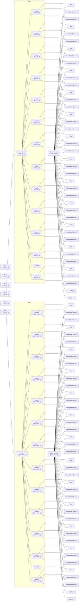

```mermaid
flowchart LR
  subgraph path7 [Path]
    7["Path<br>[208, 252, 0]"]
    8["Segment<br>[258, 292, 0]"]
    9["Segment<br>[298, 361, 0]"]
    10["Segment<br>[367, 394, 0]"]
    11["Segment<br>[400, 431, 0]"]
    12["Segment<br>[437, 472, 0]"]
    13["Segment<br>[478, 577, 0]"]
    14["Segment<br>[583, 614, 0]"]
    15["Segment<br>[620, 698, 0]"]
    16["Segment<br>[704, 731, 0]"]
    17["Segment<br>[737, 759, 0]"]
    18["Segment<br>[765, 800, 0]"]
    19["Segment<br>[806, 852, 0]"]
    20["Segment<br>[858, 866, 0]"]
    21[Solid2d]
  end
  subgraph path64 [Path]
    64["Path<br>[1055, 1099, 0]"]
    65["Segment<br>[1105, 1139, 0]"]
    66["Segment<br>[1145, 1208, 0]"]
    67["Segment<br>[1214, 1241, 0]"]
    68["Segment<br>[1247, 1278, 0]"]
    69["Segment<br>[1284, 1319, 0]"]
    70["Segment<br>[1325, 1424, 0]"]
    71["Segment<br>[1430, 1461, 0]"]
    72["Segment<br>[1467, 1545, 0]"]
    73["Segment<br>[1551, 1578, 0]"]
    74["Segment<br>[1584, 1606, 0]"]
    75["Segment<br>[1612, 1647, 0]"]
    76["Segment<br>[1653, 1699, 0]"]
    77["Segment<br>[1705, 1713, 0]"]
    78[Solid2d]
  end
  1["Plane<br>[182, 202, 0]"]
  2["Plane<br>[182, 202, 0]"]
  3["Plane<br>[182, 202, 0]"]
  4["Plane<br>[182, 202, 0]"]
  5["Plane<br>[182, 202, 0]"]
  6["Plane<br>[182, 202, 0]"]
  22["Sweep Revolve<br>[877, 1015, 0]"]
  23[Wall]
  24[Wall]
  25[Wall]
  26[Wall]
  27[Wall]
  28[Wall]
  29[Wall]
  30[Wall]
  31[Wall]
  32[Wall]
  33[Wall]
  34[Wall]
  35[Wall]
  36["Cap Start"]
  37["Cap End"]
  38["SweepEdge Opposite"]
  39["SweepEdge Adjacent"]
  40["SweepEdge Opposite"]
  41["SweepEdge Adjacent"]
  42["SweepEdge Opposite"]
  43["SweepEdge Adjacent"]
  44["SweepEdge Opposite"]
  45["SweepEdge Adjacent"]
  46["SweepEdge Opposite"]
  47["SweepEdge Adjacent"]
  48["SweepEdge Opposite"]
  49["SweepEdge Adjacent"]
  50["SweepEdge Opposite"]
  51["SweepEdge Adjacent"]
  52["SweepEdge Opposite"]
  53["SweepEdge Adjacent"]
  54["SweepEdge Opposite"]
  55["SweepEdge Adjacent"]
  56["SweepEdge Opposite"]
  57["SweepEdge Adjacent"]
  58["SweepEdge Opposite"]
  59["SweepEdge Adjacent"]
  60["SweepEdge Opposite"]
  61["SweepEdge Adjacent"]
  62["SweepEdge Opposite"]
  63["SweepEdge Adjacent"]
  79["Sweep Extrusion<br>[1719, 1757, 0]"]
  80[Wall]
  81[Wall]
  82[Wall]
  83[Wall]
  84[Wall]
  85[Wall]
  86[Wall]
  87[Wall]
  88[Wall]
  89[Wall]
  90[Wall]
  91[Wall]
  92[Wall]
  93["Cap Start"]
  94["Cap End"]
  95["SweepEdge Opposite"]
  96["SweepEdge Adjacent"]
  97["SweepEdge Opposite"]
  98["SweepEdge Adjacent"]
  99["SweepEdge Opposite"]
  100["SweepEdge Adjacent"]
  101["SweepEdge Opposite"]
  102["SweepEdge Adjacent"]
  103["SweepEdge Opposite"]
  104["SweepEdge Adjacent"]
  105["SweepEdge Opposite"]
  106["SweepEdge Adjacent"]
  107["SweepEdge Opposite"]
  108["SweepEdge Adjacent"]
  109["SweepEdge Opposite"]
  110["SweepEdge Adjacent"]
  111["SweepEdge Opposite"]
  112["SweepEdge Adjacent"]
  113["SweepEdge Opposite"]
  114["SweepEdge Adjacent"]
  115["SweepEdge Opposite"]
  116["SweepEdge Adjacent"]
  117["SweepEdge Opposite"]
  118["SweepEdge Adjacent"]
  119["SweepEdge Opposite"]
  120["SweepEdge Adjacent"]
  5 --- 7
  5 --- 64
  7 --- 8
  7 --- 9
  7 --- 10
  7 --- 11
  7 --- 12
  7 --- 13
  7 --- 14
  7 --- 15
  7 --- 16
  7 --- 17
  7 --- 18
  7 --- 19
  7 --- 20
  7 ---- 22
  7 --- 21
  8 --- 23
  8 --- 38
  8 --- 39
  9 --- 24
  9 --- 40
  9 --- 41
  10 --- 25
  10 --- 42
  10 --- 43
  11 --- 26
  11 --- 44
  11 --- 45
  12 --- 27
  12 --- 46
  12 --- 47
  13 --- 28
  13 --- 48
  13 --- 49
  14 --- 29
  14 --- 50
  14 --- 51
  15 --- 30
  15 --- 52
  15 --- 53
  16 --- 31
  16 --- 54
  16 --- 55
  17 --- 32
  17 --- 56
  17 --- 57
  18 --- 33
  18 --- 58
  18 --- 59
  19 --- 34
  19 --- 60
  19 --- 61
  20 --- 35
  20 --- 62
  20 --- 63
  22 --- 23
  22 --- 24
  22 --- 25
  22 --- 26
  22 --- 27
  22 --- 28
  22 --- 29
  22 --- 30
  22 --- 31
  22 --- 32
  22 --- 33
  22 --- 34
  22 --- 35
  22 --- 36
  22 --- 37
  22 --- 38
  22 --- 39
  22 --- 40
  22 --- 41
  22 --- 42
  22 --- 43
  22 --- 44
  22 --- 45
  22 --- 46
  22 --- 47
  22 --- 48
  22 --- 49
  22 --- 50
  22 --- 51
  22 --- 52
  22 --- 53
  22 --- 54
  22 --- 55
  22 --- 56
  22 --- 57
  22 --- 58
  22 --- 59
  22 --- 60
  22 --- 61
  22 --- 62
  22 --- 63
  64 --- 65
  64 --- 66
  64 --- 67
  64 --- 68
  64 --- 69
  64 --- 70
  64 --- 71
  64 --- 72
  64 --- 73
  64 --- 74
  64 --- 75
  64 --- 76
  64 --- 77
  64 ---- 79
  64 --- 78
  65 --- 80
  65 --- 95
  65 --- 96
  66 --- 81
  66 --- 97
  66 --- 98
  67 --- 82
  67 --- 99
  67 --- 100
  68 --- 83
  68 --- 101
  68 --- 102
  69 --- 84
  69 --- 103
  69 --- 104
  70 --- 85
  70 --- 105
  70 --- 106
  71 --- 86
  71 --- 107
  71 --- 108
  72 --- 87
  72 --- 109
  72 --- 110
  73 --- 88
  73 --- 111
  73 --- 112
  74 --- 89
  74 --- 113
  74 --- 114
  75 --- 90
  75 --- 115
  75 --- 116
  76 --- 91
  76 --- 117
  76 --- 118
  77 --- 92
  77 --- 119
  77 --- 120
  79 --- 80
  79 --- 81
  79 --- 82
  79 --- 83
  79 --- 84
  79 --- 85
  79 --- 86
  79 --- 87
  79 --- 88
  79 --- 89
  79 --- 90
  79 --- 91
  79 --- 92
  79 --- 93
  79 --- 94
  79 --- 95
  79 --- 96
  79 --- 97
  79 --- 98
  79 --- 99
  79 --- 100
  79 --- 101
  79 --- 102
  79 --- 103
  79 --- 104
  79 --- 105
  79 --- 106
  79 --- 107
  79 --- 108
  79 --- 109
  79 --- 110
  79 --- 111
  79 --- 112
  79 --- 113
  79 --- 114
  79 --- 115
  79 --- 116
  79 --- 117
  79 --- 118
  79 --- 119
  79 --- 120
```
