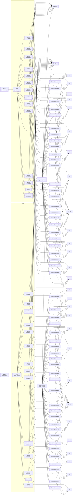

```mermaid
flowchart LR
  subgraph path3 [Path]
    3["Path<br>[206, 250, 0]"]
    5["Segment<br>[256, 290, 0]"]
    6["Segment<br>[296, 365, 0]"]
    7["Segment<br>[371, 398, 0]"]
    8["Segment<br>[404, 435, 0]"]
    9["Segment<br>[441, 476, 0]"]
    10["Segment<br>[482, 562, 0]"]
    11["Segment<br>[568, 599, 0]"]
    12["Segment<br>[605, 664, 0]"]
    13["Segment<br>[670, 697, 0]"]
    14["Segment<br>[703, 725, 0]"]
    15["Segment<br>[731, 766, 0]"]
    16["Segment<br>[772, 818, 0]"]
    17["Segment<br>[824, 832, 0]"]
    32[Solid2d]
  end
  subgraph path4 [Path]
    4["Path<br>[1000, 1044, 0]"]
    18["Segment<br>[1050, 1084, 0]"]
    19["Segment<br>[1090, 1159, 0]"]
    20["Segment<br>[1165, 1192, 0]"]
    21["Segment<br>[1198, 1229, 0]"]
    22["Segment<br>[1235, 1270, 0]"]
    23["Segment<br>[1276, 1356, 0]"]
    24["Segment<br>[1362, 1393, 0]"]
    25["Segment<br>[1399, 1458, 0]"]
    26["Segment<br>[1464, 1491, 0]"]
    27["Segment<br>[1497, 1519, 0]"]
    28["Segment<br>[1525, 1560, 0]"]
    29["Segment<br>[1566, 1612, 0]"]
    30["Segment<br>[1618, 1626, 0]"]
    31[Solid2d]
  end
  1["Plane<br>[182, 200, 0]"]
  2["Plane<br>[976, 994, 0]"]
  33["Sweep Revolve<br>[843, 962, 0]"]
  34["Sweep Extrusion<br>[1632, 1670, 0]"]
  35[Wall]
  36[Wall]
  37[Wall]
  38[Wall]
  39[Wall]
  40[Wall]
  41[Wall]
  42[Wall]
  43[Wall]
  44[Wall]
  45[Wall]
  46[Wall]
  47[Wall]
  48[Wall]
  49[Wall]
  50[Wall]
  51[Wall]
  52[Wall]
  53[Wall]
  54[Wall]
  55[Wall]
  56[Wall]
  57[Wall]
  58[Wall]
  59[Wall]
  60[Wall]
  61["Cap Start"]
  62["Cap Start"]
  63["Cap End"]
  64["Cap End"]
  65["SweepEdge Opposite"]
  66["SweepEdge Opposite"]
  67["SweepEdge Opposite"]
  68["SweepEdge Opposite"]
  69["SweepEdge Opposite"]
  70["SweepEdge Opposite"]
  71["SweepEdge Opposite"]
  72["SweepEdge Opposite"]
  73["SweepEdge Opposite"]
  74["SweepEdge Opposite"]
  75["SweepEdge Opposite"]
  76["SweepEdge Opposite"]
  77["SweepEdge Opposite"]
  78["SweepEdge Opposite"]
  79["SweepEdge Opposite"]
  80["SweepEdge Opposite"]
  81["SweepEdge Opposite"]
  82["SweepEdge Opposite"]
  83["SweepEdge Opposite"]
  84["SweepEdge Opposite"]
  85["SweepEdge Opposite"]
  86["SweepEdge Opposite"]
  87["SweepEdge Opposite"]
  88["SweepEdge Opposite"]
  89["SweepEdge Opposite"]
  90["SweepEdge Opposite"]
  91["SweepEdge Adjacent"]
  92["SweepEdge Adjacent"]
  93["SweepEdge Adjacent"]
  94["SweepEdge Adjacent"]
  95["SweepEdge Adjacent"]
  96["SweepEdge Adjacent"]
  97["SweepEdge Adjacent"]
  98["SweepEdge Adjacent"]
  99["SweepEdge Adjacent"]
  100["SweepEdge Adjacent"]
  101["SweepEdge Adjacent"]
  102["SweepEdge Adjacent"]
  103["SweepEdge Adjacent"]
  104["SweepEdge Adjacent"]
  105["SweepEdge Adjacent"]
  106["SweepEdge Adjacent"]
  107["SweepEdge Adjacent"]
  108["SweepEdge Adjacent"]
  109["SweepEdge Adjacent"]
  110["SweepEdge Adjacent"]
  111["SweepEdge Adjacent"]
  112["SweepEdge Adjacent"]
  113["SweepEdge Adjacent"]
  114["SweepEdge Adjacent"]
  115["SweepEdge Adjacent"]
  116["SweepEdge Adjacent"]
  1 --- 3
  2 --- 4
  3 --- 5
  3 --- 6
  3 --- 7
  3 --- 8
  3 --- 9
  3 --- 10
  3 --- 11
  3 --- 12
  3 --- 13
  3 --- 14
  3 --- 15
  3 --- 16
  3 --- 17
  3 --- 32
  3 ---- 33
  4 --- 18
  4 --- 19
  4 --- 20
  4 --- 21
  4 --- 22
  4 --- 23
  4 --- 24
  4 --- 25
  4 --- 26
  4 --- 27
  4 --- 28
  4 --- 29
  4 --- 30
  4 --- 31
  4 ---- 34
  5 --- 41
  5 x--> 61
  5 --- 76
  5 --- 94
  6 --- 40
  6 x--> 61
  6 --- 69
  6 --- 98
  7 --- 42
  7 x--> 61
  7 --- 75
  7 --- 93
  8 --- 38
  8 x--> 61
  8 --- 70
  8 --- 95
  9 --- 37
  9 x--> 61
  9 --- 68
  9 --- 101
  10 --- 44
  10 x--> 61
  10 --- 74
  10 --- 100
  11 --- 46
  11 x--> 61
  11 --- 66
  11 --- 97
  12 --- 45
  12 x--> 61
  12 --- 73
  12 --- 103
  13 --- 35
  13 x--> 61
  13 --- 71
  13 --- 102
  14 --- 36
  14 x--> 61
  14 --- 72
  14 --- 91
  15 --- 47
  15 x--> 61
  15 --- 65
  15 --- 99
  16 --- 43
  16 x--> 61
  16 --- 77
  16 --- 92
  17 --- 39
  17 x--> 61
  17 --- 67
  17 --- 96
  18 --- 55
  18 x--> 62
  18 --- 88
  18 --- 114
  19 --- 54
  19 x--> 62
  19 --- 85
  19 --- 113
  20 --- 50
  20 x--> 62
  20 --- 89
  20 --- 106
  21 --- 51
  21 x--> 62
  21 --- 79
  21 --- 110
  22 --- 49
  22 x--> 62
  22 --- 83
  22 --- 107
  23 --- 59
  23 x--> 62
  23 --- 84
  23 --- 108
  24 --- 52
  24 x--> 62
  24 --- 90
  24 --- 104
  25 --- 58
  25 x--> 62
  25 --- 81
  25 --- 116
  26 --- 60
  26 x--> 62
  26 --- 80
  26 --- 109
  27 --- 56
  27 x--> 62
  27 --- 82
  27 --- 115
  28 --- 48
  28 x--> 62
  28 --- 78
  28 --- 111
  29 --- 53
  29 x--> 62
  29 --- 86
  29 --- 105
  30 --- 57
  30 x--> 62
  30 --- 87
  30 --- 112
  33 --- 35
  33 --- 36
  33 --- 37
  33 --- 38
  33 --- 39
  33 --- 40
  33 --- 41
  33 --- 42
  33 --- 43
  33 --- 44
  33 --- 45
  33 --- 46
  33 --- 47
  33 --- 61
  33 --- 63
  33 --- 65
  33 --- 66
  33 --- 67
  33 --- 68
  33 --- 69
  33 --- 70
  33 --- 71
  33 --- 72
  33 --- 73
  33 --- 74
  33 --- 75
  33 --- 76
  33 --- 77
  33 --- 91
  33 --- 92
  33 --- 93
  33 --- 94
  33 --- 95
  33 --- 96
  33 --- 97
  33 --- 98
  33 --- 99
  33 --- 100
  33 --- 101
  33 --- 102
  33 --- 103
  34 --- 48
  34 --- 49
  34 --- 50
  34 --- 51
  34 --- 52
  34 --- 53
  34 --- 54
  34 --- 55
  34 --- 56
  34 --- 57
  34 --- 58
  34 --- 59
  34 --- 60
  34 --- 62
  34 --- 64
  34 --- 78
  34 --- 79
  34 --- 80
  34 --- 81
  34 --- 82
  34 --- 83
  34 --- 84
  34 --- 85
  34 --- 86
  34 --- 87
  34 --- 88
  34 --- 89
  34 --- 90
  34 --- 104
  34 --- 105
  34 --- 106
  34 --- 107
  34 --- 108
  34 --- 109
  34 --- 110
  34 --- 111
  34 --- 112
  34 --- 113
  34 --- 114
  34 --- 115
  34 --- 116
  71 <--x 35
  102 <--x 35
  103 <--x 35
  72 <--x 36
  91 <--x 36
  102 <--x 36
  68 <--x 37
  95 <--x 37
  101 <--x 37
  70 <--x 38
  93 <--x 38
  95 <--x 38
  67 <--x 39
  92 <--x 39
  96 <--x 39
  69 <--x 40
  94 <--x 40
  98 <--x 40
  76 <--x 41
  94 <--x 41
  96 <--x 41
  75 <--x 42
  93 <--x 42
  98 <--x 42
  77 <--x 43
  92 <--x 43
  99 <--x 43
  74 <--x 44
  100 <--x 44
  101 <--x 44
  73 <--x 45
  97 <--x 45
  103 <--x 45
  66 <--x 46
  97 <--x 46
  100 <--x 46
  65 <--x 47
  91 <--x 47
  99 <--x 47
  78 <--x 48
  111 <--x 48
  115 <--x 48
  83 <--x 49
  107 <--x 49
  110 <--x 49
  89 <--x 50
  106 <--x 50
  113 <--x 50
  79 <--x 51
  106 <--x 51
  110 <--x 51
  90 <--x 52
  104 <--x 52
  108 <--x 52
  86 <--x 53
  105 <--x 53
  111 <--x 53
  85 <--x 54
  113 <--x 54
  114 <--x 54
  88 <--x 55
  112 <--x 55
  114 <--x 55
  82 <--x 56
  109 <--x 56
  115 <--x 56
  87 <--x 57
  105 <--x 57
  112 <--x 57
  81 <--x 58
  104 <--x 58
  116 <--x 58
  84 <--x 59
  107 <--x 59
  108 <--x 59
  80 <--x 60
  109 <--x 60
  116 <--x 60
  65 <--x 63
  66 <--x 63
  67 <--x 63
  68 <--x 63
  69 <--x 63
  70 <--x 63
  71 <--x 63
  72 <--x 63
  73 <--x 63
  74 <--x 63
  75 <--x 63
  76 <--x 63
  77 <--x 63
  78 <--x 64
  79 <--x 64
  80 <--x 64
  81 <--x 64
  82 <--x 64
  83 <--x 64
  84 <--x 64
  85 <--x 64
  86 <--x 64
  87 <--x 64
  88 <--x 64
  89 <--x 64
  90 <--x 64
```
