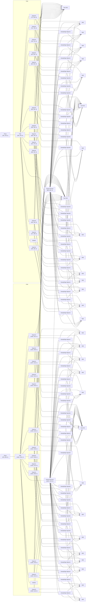

```mermaid
flowchart LR
  subgraph path2 [Path]
    2["Path<br>[206, 250, 0]"]
    3["Segment<br>[256, 290, 0]"]
    4["Segment<br>[296, 365, 0]"]
    5["Segment<br>[371, 398, 0]"]
    6["Segment<br>[404, 435, 0]"]
    7["Segment<br>[441, 476, 0]"]
    8["Segment<br>[482, 562, 0]"]
    9["Segment<br>[568, 599, 0]"]
    10["Segment<br>[605, 664, 0]"]
    11["Segment<br>[670, 697, 0]"]
    12["Segment<br>[703, 725, 0]"]
    13["Segment<br>[731, 766, 0]"]
    14["Segment<br>[772, 818, 0]"]
    15["Segment<br>[824, 832, 0]"]
    16[Solid2d]
  end
  subgraph path60 [Path]
    60["Path<br>[1000, 1044, 0]"]
    61["Segment<br>[1050, 1084, 0]"]
    62["Segment<br>[1090, 1159, 0]"]
    63["Segment<br>[1165, 1192, 0]"]
    64["Segment<br>[1198, 1229, 0]"]
    65["Segment<br>[1235, 1270, 0]"]
    66["Segment<br>[1276, 1356, 0]"]
    67["Segment<br>[1362, 1393, 0]"]
    68["Segment<br>[1399, 1458, 0]"]
    69["Segment<br>[1464, 1491, 0]"]
    70["Segment<br>[1497, 1519, 0]"]
    71["Segment<br>[1525, 1560, 0]"]
    72["Segment<br>[1566, 1612, 0]"]
    73["Segment<br>[1618, 1626, 0]"]
    74[Solid2d]
  end
  1["Plane<br>[182, 200, 0]"]
  17["Sweep Revolve<br>[843, 962, 0]"]
  18[Wall]
  19[Wall]
  20[Wall]
  21[Wall]
  22[Wall]
  23[Wall]
  24[Wall]
  25[Wall]
  26[Wall]
  27[Wall]
  28[Wall]
  29[Wall]
  30[Wall]
  31["Cap Start"]
  32["Cap End"]
  33["SweepEdge Opposite"]
  34["SweepEdge Adjacent"]
  35["SweepEdge Opposite"]
  36["SweepEdge Adjacent"]
  37["SweepEdge Opposite"]
  38["SweepEdge Adjacent"]
  39["SweepEdge Opposite"]
  40["SweepEdge Adjacent"]
  41["SweepEdge Opposite"]
  42["SweepEdge Adjacent"]
  43["SweepEdge Opposite"]
  44["SweepEdge Adjacent"]
  45["SweepEdge Opposite"]
  46["SweepEdge Adjacent"]
  47["SweepEdge Opposite"]
  48["SweepEdge Adjacent"]
  49["SweepEdge Opposite"]
  50["SweepEdge Adjacent"]
  51["SweepEdge Opposite"]
  52["SweepEdge Adjacent"]
  53["SweepEdge Opposite"]
  54["SweepEdge Adjacent"]
  55["SweepEdge Opposite"]
  56["SweepEdge Adjacent"]
  57["SweepEdge Opposite"]
  58["SweepEdge Adjacent"]
  59["Plane<br>[976, 994, 0]"]
  75["Sweep Extrusion<br>[1632, 1670, 0]"]
  76[Wall]
  77[Wall]
  78[Wall]
  79[Wall]
  80[Wall]
  81[Wall]
  82[Wall]
  83[Wall]
  84[Wall]
  85[Wall]
  86[Wall]
  87[Wall]
  88[Wall]
  89["Cap Start"]
  90["Cap End"]
  91["SweepEdge Opposite"]
  92["SweepEdge Adjacent"]
  93["SweepEdge Opposite"]
  94["SweepEdge Adjacent"]
  95["SweepEdge Opposite"]
  96["SweepEdge Adjacent"]
  97["SweepEdge Opposite"]
  98["SweepEdge Adjacent"]
  99["SweepEdge Opposite"]
  100["SweepEdge Adjacent"]
  101["SweepEdge Opposite"]
  102["SweepEdge Adjacent"]
  103["SweepEdge Opposite"]
  104["SweepEdge Adjacent"]
  105["SweepEdge Opposite"]
  106["SweepEdge Adjacent"]
  107["SweepEdge Opposite"]
  108["SweepEdge Adjacent"]
  109["SweepEdge Opposite"]
  110["SweepEdge Adjacent"]
  111["SweepEdge Opposite"]
  112["SweepEdge Adjacent"]
  113["SweepEdge Opposite"]
  114["SweepEdge Adjacent"]
  115["SweepEdge Opposite"]
  116["SweepEdge Adjacent"]
  1 --- 2
  2 --- 3
  2 --- 4
  2 --- 5
  2 --- 6
  2 --- 7
  2 --- 8
  2 --- 9
  2 --- 10
  2 --- 11
  2 --- 12
  2 --- 13
  2 --- 14
  2 --- 15
  2 ---- 17
  2 --- 16
  3 --- 18
  3 --- 33
  3 --- 34
  3 x--> 31
  4 --- 19
  4 --- 35
  4 --- 36
  4 x--> 31
  5 --- 20
  5 --- 37
  5 --- 38
  5 x--> 31
  6 --- 21
  6 --- 39
  6 --- 40
  6 x--> 31
  7 --- 22
  7 --- 41
  7 --- 42
  7 x--> 31
  8 --- 23
  8 --- 43
  8 --- 44
  8 x--> 31
  9 --- 24
  9 --- 45
  9 --- 46
  9 x--> 31
  10 --- 25
  10 --- 47
  10 --- 48
  10 x--> 31
  11 --- 26
  11 --- 49
  11 --- 50
  11 x--> 31
  12 --- 27
  12 --- 51
  12 --- 52
  12 x--> 31
  13 --- 28
  13 --- 53
  13 --- 54
  13 x--> 31
  14 --- 29
  14 --- 55
  14 --- 56
  14 x--> 31
  15 --- 30
  15 --- 57
  15 --- 58
  15 x--> 31
  17 --- 18
  17 --- 19
  17 --- 20
  17 --- 21
  17 --- 22
  17 --- 23
  17 --- 24
  17 --- 25
  17 --- 26
  17 --- 27
  17 --- 28
  17 --- 29
  17 --- 30
  17 --- 31
  17 --- 32
  17 --- 33
  17 --- 34
  17 --- 35
  17 --- 36
  17 --- 37
  17 --- 38
  17 --- 39
  17 --- 40
  17 --- 41
  17 --- 42
  17 --- 43
  17 --- 44
  17 --- 45
  17 --- 46
  17 --- 47
  17 --- 48
  17 --- 49
  17 --- 50
  17 --- 51
  17 --- 52
  17 --- 53
  17 --- 54
  17 --- 55
  17 --- 56
  17 --- 57
  17 --- 58
  33 <--x 18
  33 <--x 32
  34 <--x 18
  34 <--x 19
  35 <--x 19
  35 <--x 32
  36 <--x 19
  36 <--x 20
  37 <--x 20
  37 <--x 32
  38 <--x 20
  38 <--x 21
  39 <--x 21
  39 <--x 32
  40 <--x 21
  40 <--x 22
  41 <--x 22
  41 <--x 32
  42 <--x 22
  42 <--x 23
  43 <--x 23
  43 <--x 32
  44 <--x 23
  44 <--x 24
  45 <--x 24
  45 <--x 32
  46 <--x 24
  46 <--x 25
  47 <--x 25
  47 <--x 32
  48 <--x 25
  48 <--x 26
  49 <--x 26
  49 <--x 32
  50 <--x 26
  50 <--x 27
  51 <--x 27
  51 <--x 32
  52 <--x 27
  52 <--x 28
  53 <--x 28
  53 <--x 32
  54 <--x 28
  54 <--x 29
  55 <--x 29
  55 <--x 32
  56 <--x 29
  56 <--x 30
  57 <--x 30
  57 <--x 32
  58 <--x 30
  58 <--x 18
  59 --- 60
  60 --- 61
  60 --- 62
  60 --- 63
  60 --- 64
  60 --- 65
  60 --- 66
  60 --- 67
  60 --- 68
  60 --- 69
  60 --- 70
  60 --- 71
  60 --- 72
  60 --- 73
  60 ---- 75
  60 --- 74
  61 --- 76
  61 --- 91
  61 --- 92
  61 x--> 89
  62 --- 77
  62 --- 93
  62 --- 94
  62 x--> 89
  63 --- 78
  63 --- 95
  63 --- 96
  63 x--> 89
  64 --- 79
  64 --- 97
  64 --- 98
  64 x--> 89
  65 --- 80
  65 --- 99
  65 --- 100
  65 x--> 89
  66 --- 81
  66 --- 101
  66 --- 102
  66 x--> 89
  67 --- 82
  67 --- 103
  67 --- 104
  67 x--> 89
  68 --- 83
  68 --- 105
  68 --- 106
  68 x--> 89
  69 --- 84
  69 --- 107
  69 --- 108
  69 x--> 89
  70 --- 85
  70 --- 109
  70 --- 110
  70 x--> 89
  71 --- 86
  71 --- 111
  71 --- 112
  71 x--> 89
  72 --- 87
  72 --- 113
  72 --- 114
  72 x--> 89
  73 --- 88
  73 --- 115
  73 --- 116
  73 x--> 89
  75 --- 76
  75 --- 77
  75 --- 78
  75 --- 79
  75 --- 80
  75 --- 81
  75 --- 82
  75 --- 83
  75 --- 84
  75 --- 85
  75 --- 86
  75 --- 87
  75 --- 88
  75 --- 89
  75 --- 90
  75 --- 91
  75 --- 92
  75 --- 93
  75 --- 94
  75 --- 95
  75 --- 96
  75 --- 97
  75 --- 98
  75 --- 99
  75 --- 100
  75 --- 101
  75 --- 102
  75 --- 103
  75 --- 104
  75 --- 105
  75 --- 106
  75 --- 107
  75 --- 108
  75 --- 109
  75 --- 110
  75 --- 111
  75 --- 112
  75 --- 113
  75 --- 114
  75 --- 115
  75 --- 116
  91 <--x 76
  91 <--x 90
  92 <--x 76
  92 <--x 77
  93 <--x 77
  93 <--x 90
  94 <--x 77
  94 <--x 78
  95 <--x 78
  95 <--x 90
  96 <--x 78
  96 <--x 79
  97 <--x 79
  97 <--x 90
  98 <--x 79
  98 <--x 80
  99 <--x 80
  99 <--x 90
  100 <--x 80
  100 <--x 81
  101 <--x 81
  101 <--x 90
  102 <--x 81
  102 <--x 82
  103 <--x 82
  103 <--x 90
  104 <--x 82
  104 <--x 83
  105 <--x 83
  105 <--x 90
  106 <--x 83
  106 <--x 84
  107 <--x 84
  107 <--x 90
  108 <--x 84
  108 <--x 85
  109 <--x 85
  109 <--x 90
  110 <--x 85
  110 <--x 86
  111 <--x 86
  111 <--x 90
  112 <--x 86
  112 <--x 87
  113 <--x 87
  113 <--x 90
  114 <--x 87
  114 <--x 88
  115 <--x 88
  115 <--x 90
  116 <--x 76
  116 <--x 88
```
