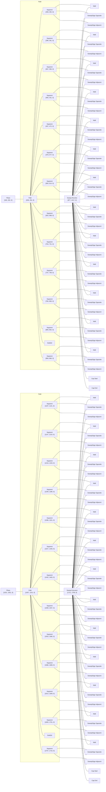

```mermaid
flowchart LR
  subgraph path2 [Path]
    2["Path<br>[208, 252, 0]"]
    3["Segment<br>[258, 292, 0]"]
    4["Segment<br>[298, 361, 0]"]
    5["Segment<br>[367, 394, 0]"]
    6["Segment<br>[400, 431, 0]"]
    7["Segment<br>[437, 472, 0]"]
    8["Segment<br>[478, 577, 0]"]
    9["Segment<br>[583, 614, 0]"]
    10["Segment<br>[620, 698, 0]"]
    11["Segment<br>[704, 731, 0]"]
    12["Segment<br>[737, 759, 0]"]
    13["Segment<br>[765, 800, 0]"]
    14["Segment<br>[806, 852, 0]"]
    15["Segment<br>[858, 866, 0]"]
    16[Solid2d]
  end
  subgraph path60 [Path]
    60["Path<br>[1057, 1101, 0]"]
    61["Segment<br>[1107, 1141, 0]"]
    62["Segment<br>[1147, 1210, 0]"]
    63["Segment<br>[1216, 1243, 0]"]
    64["Segment<br>[1249, 1280, 0]"]
    65["Segment<br>[1286, 1321, 0]"]
    66["Segment<br>[1327, 1426, 0]"]
    67["Segment<br>[1432, 1463, 0]"]
    68["Segment<br>[1469, 1547, 0]"]
    69["Segment<br>[1553, 1580, 0]"]
    70["Segment<br>[1586, 1608, 0]"]
    71["Segment<br>[1614, 1649, 0]"]
    72["Segment<br>[1655, 1701, 0]"]
    73["Segment<br>[1707, 1715, 0]"]
    74[Solid2d]
  end
  1["Plane<br>[182, 202, 0]"]
  17["Sweep Revolve<br>[877, 1017, 0]"]
  18[Wall]
  19[Wall]
  20[Wall]
  21[Wall]
  22[Wall]
  23[Wall]
  24[Wall]
  25[Wall]
  26[Wall]
  27[Wall]
  28[Wall]
  29[Wall]
  30[Wall]
  31["Cap Start"]
  32["Cap End"]
  33["SweepEdge Opposite"]
  34["SweepEdge Adjacent"]
  35["SweepEdge Opposite"]
  36["SweepEdge Adjacent"]
  37["SweepEdge Opposite"]
  38["SweepEdge Adjacent"]
  39["SweepEdge Opposite"]
  40["SweepEdge Adjacent"]
  41["SweepEdge Opposite"]
  42["SweepEdge Adjacent"]
  43["SweepEdge Opposite"]
  44["SweepEdge Adjacent"]
  45["SweepEdge Opposite"]
  46["SweepEdge Adjacent"]
  47["SweepEdge Opposite"]
  48["SweepEdge Adjacent"]
  49["SweepEdge Opposite"]
  50["SweepEdge Adjacent"]
  51["SweepEdge Opposite"]
  52["SweepEdge Adjacent"]
  53["SweepEdge Opposite"]
  54["SweepEdge Adjacent"]
  55["SweepEdge Opposite"]
  56["SweepEdge Adjacent"]
  57["SweepEdge Opposite"]
  58["SweepEdge Adjacent"]
  59["Plane<br>[1031, 1051, 0]"]
  75["Sweep Extrusion<br>[1721, 1759, 0]"]
  76[Wall]
  77[Wall]
  78[Wall]
  79[Wall]
  80[Wall]
  81[Wall]
  82[Wall]
  83[Wall]
  84[Wall]
  85[Wall]
  86[Wall]
  87[Wall]
  88[Wall]
  89["Cap Start"]
  90["Cap End"]
  91["SweepEdge Opposite"]
  92["SweepEdge Adjacent"]
  93["SweepEdge Opposite"]
  94["SweepEdge Adjacent"]
  95["SweepEdge Opposite"]
  96["SweepEdge Adjacent"]
  97["SweepEdge Opposite"]
  98["SweepEdge Adjacent"]
  99["SweepEdge Opposite"]
  100["SweepEdge Adjacent"]
  101["SweepEdge Opposite"]
  102["SweepEdge Adjacent"]
  103["SweepEdge Opposite"]
  104["SweepEdge Adjacent"]
  105["SweepEdge Opposite"]
  106["SweepEdge Adjacent"]
  107["SweepEdge Opposite"]
  108["SweepEdge Adjacent"]
  109["SweepEdge Opposite"]
  110["SweepEdge Adjacent"]
  111["SweepEdge Opposite"]
  112["SweepEdge Adjacent"]
  113["SweepEdge Opposite"]
  114["SweepEdge Adjacent"]
  115["SweepEdge Opposite"]
  116["SweepEdge Adjacent"]
  1 --- 2
  2 --- 3
  2 --- 4
  2 --- 5
  2 --- 6
  2 --- 7
  2 --- 8
  2 --- 9
  2 --- 10
  2 --- 11
  2 --- 12
  2 --- 13
  2 --- 14
  2 --- 15
  2 ---- 17
  2 --- 16
  3 --- 18
  3 --- 33
  3 --- 34
  4 --- 19
  4 --- 35
  4 --- 36
  5 --- 20
  5 --- 37
  5 --- 38
  6 --- 21
  6 --- 39
  6 --- 40
  7 --- 22
  7 --- 41
  7 --- 42
  8 --- 23
  8 --- 43
  8 --- 44
  9 --- 24
  9 --- 45
  9 --- 46
  10 --- 25
  10 --- 47
  10 --- 48
  11 --- 26
  11 --- 49
  11 --- 50
  12 --- 27
  12 --- 51
  12 --- 52
  13 --- 28
  13 --- 53
  13 --- 54
  14 --- 29
  14 --- 55
  14 --- 56
  15 --- 30
  15 --- 57
  15 --- 58
  17 --- 18
  17 --- 19
  17 --- 20
  17 --- 21
  17 --- 22
  17 --- 23
  17 --- 24
  17 --- 25
  17 --- 26
  17 --- 27
  17 --- 28
  17 --- 29
  17 --- 30
  17 --- 31
  17 --- 32
  17 --- 33
  17 --- 34
  17 --- 35
  17 --- 36
  17 --- 37
  17 --- 38
  17 --- 39
  17 --- 40
  17 --- 41
  17 --- 42
  17 --- 43
  17 --- 44
  17 --- 45
  17 --- 46
  17 --- 47
  17 --- 48
  17 --- 49
  17 --- 50
  17 --- 51
  17 --- 52
  17 --- 53
  17 --- 54
  17 --- 55
  17 --- 56
  17 --- 57
  17 --- 58
  59 --- 60
  60 --- 61
  60 --- 62
  60 --- 63
  60 --- 64
  60 --- 65
  60 --- 66
  60 --- 67
  60 --- 68
  60 --- 69
  60 --- 70
  60 --- 71
  60 --- 72
  60 --- 73
  60 ---- 75
  60 --- 74
  61 --- 76
  61 --- 91
  61 --- 92
  62 --- 77
  62 --- 93
  62 --- 94
  63 --- 78
  63 --- 95
  63 --- 96
  64 --- 79
  64 --- 97
  64 --- 98
  65 --- 80
  65 --- 99
  65 --- 100
  66 --- 81
  66 --- 101
  66 --- 102
  67 --- 82
  67 --- 103
  67 --- 104
  68 --- 83
  68 --- 105
  68 --- 106
  69 --- 84
  69 --- 107
  69 --- 108
  70 --- 85
  70 --- 109
  70 --- 110
  71 --- 86
  71 --- 111
  71 --- 112
  72 --- 87
  72 --- 113
  72 --- 114
  73 --- 88
  73 --- 115
  73 --- 116
  75 --- 76
  75 --- 77
  75 --- 78
  75 --- 79
  75 --- 80
  75 --- 81
  75 --- 82
  75 --- 83
  75 --- 84
  75 --- 85
  75 --- 86
  75 --- 87
  75 --- 88
  75 --- 89
  75 --- 90
  75 --- 91
  75 --- 92
  75 --- 93
  75 --- 94
  75 --- 95
  75 --- 96
  75 --- 97
  75 --- 98
  75 --- 99
  75 --- 100
  75 --- 101
  75 --- 102
  75 --- 103
  75 --- 104
  75 --- 105
  75 --- 106
  75 --- 107
  75 --- 108
  75 --- 109
  75 --- 110
  75 --- 111
  75 --- 112
  75 --- 113
  75 --- 114
  75 --- 115
  75 --- 116
```
