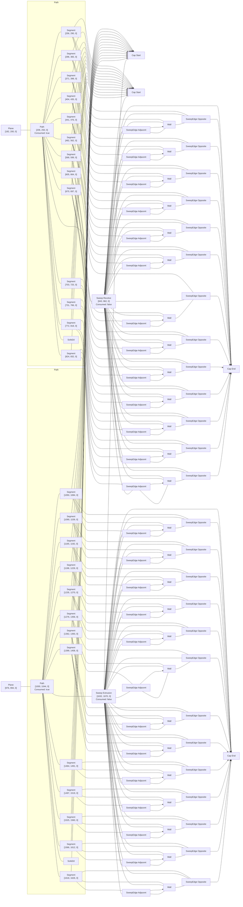

```mermaid
flowchart LR
  subgraph path6 [Path]
    6["Path<br>[206, 250, 0]<br>Consumed: true"]
      %% [ProgramBodyItem { index: 10 }, VariableDeclarationDeclaration, VariableDeclarationInit, PipeBodyItem { index: 1 }]
    22["Segment<br>[256, 290, 0]"]
      %% [ProgramBodyItem { index: 10 }, VariableDeclarationDeclaration, VariableDeclarationInit, PipeBodyItem { index: 2 }]
    23["Segment<br>[296, 365, 0]"]
      %% [ProgramBodyItem { index: 10 }, VariableDeclarationDeclaration, VariableDeclarationInit, PipeBodyItem { index: 3 }]
    24["Segment<br>[371, 398, 0]"]
      %% [ProgramBodyItem { index: 10 }, VariableDeclarationDeclaration, VariableDeclarationInit, PipeBodyItem { index: 4 }]
    25["Segment<br>[404, 435, 0]"]
      %% [ProgramBodyItem { index: 10 }, VariableDeclarationDeclaration, VariableDeclarationInit, PipeBodyItem { index: 5 }]
    26["Segment<br>[441, 476, 0]"]
      %% [ProgramBodyItem { index: 10 }, VariableDeclarationDeclaration, VariableDeclarationInit, PipeBodyItem { index: 6 }]
    27["Segment<br>[482, 562, 0]"]
      %% [ProgramBodyItem { index: 10 }, VariableDeclarationDeclaration, VariableDeclarationInit, PipeBodyItem { index: 7 }]
    28["Segment<br>[568, 599, 0]"]
      %% [ProgramBodyItem { index: 10 }, VariableDeclarationDeclaration, VariableDeclarationInit, PipeBodyItem { index: 8 }]
    29["Segment<br>[605, 664, 0]"]
      %% [ProgramBodyItem { index: 10 }, VariableDeclarationDeclaration, VariableDeclarationInit, PipeBodyItem { index: 9 }]
    30["Segment<br>[670, 697, 0]"]
      %% [ProgramBodyItem { index: 10 }, VariableDeclarationDeclaration, VariableDeclarationInit, PipeBodyItem { index: 10 }]
    31["Segment<br>[703, 725, 0]"]
      %% [ProgramBodyItem { index: 10 }, VariableDeclarationDeclaration, VariableDeclarationInit, PipeBodyItem { index: 11 }]
    32["Segment<br>[731, 766, 0]"]
      %% [ProgramBodyItem { index: 10 }, VariableDeclarationDeclaration, VariableDeclarationInit, PipeBodyItem { index: 12 }]
    33["Segment<br>[772, 818, 0]"]
      %% [ProgramBodyItem { index: 10 }, VariableDeclarationDeclaration, VariableDeclarationInit, PipeBodyItem { index: 13 }]
    34["Segment<br>[824, 832, 0]"]
      %% [ProgramBodyItem { index: 10 }, VariableDeclarationDeclaration, VariableDeclarationInit, PipeBodyItem { index: 14 }]
    36[Solid2d]
  end
  subgraph path5 [Path]
    5["Path<br>[1000, 1044, 0]<br>Consumed: true"]
      %% [ProgramBodyItem { index: 12 }, VariableDeclarationDeclaration, VariableDeclarationInit, PipeBodyItem { index: 1 }]
    9["Segment<br>[1050, 1084, 0]"]
      %% [ProgramBodyItem { index: 12 }, VariableDeclarationDeclaration, VariableDeclarationInit, PipeBodyItem { index: 2 }]
    10["Segment<br>[1090, 1159, 0]"]
      %% [ProgramBodyItem { index: 12 }, VariableDeclarationDeclaration, VariableDeclarationInit, PipeBodyItem { index: 3 }]
    11["Segment<br>[1165, 1192, 0]"]
      %% [ProgramBodyItem { index: 12 }, VariableDeclarationDeclaration, VariableDeclarationInit, PipeBodyItem { index: 4 }]
    12["Segment<br>[1198, 1229, 0]"]
      %% [ProgramBodyItem { index: 12 }, VariableDeclarationDeclaration, VariableDeclarationInit, PipeBodyItem { index: 5 }]
    13["Segment<br>[1235, 1270, 0]"]
      %% [ProgramBodyItem { index: 12 }, VariableDeclarationDeclaration, VariableDeclarationInit, PipeBodyItem { index: 6 }]
    14["Segment<br>[1276, 1356, 0]"]
      %% [ProgramBodyItem { index: 12 }, VariableDeclarationDeclaration, VariableDeclarationInit, PipeBodyItem { index: 7 }]
    15["Segment<br>[1362, 1393, 0]"]
      %% [ProgramBodyItem { index: 12 }, VariableDeclarationDeclaration, VariableDeclarationInit, PipeBodyItem { index: 8 }]
    16["Segment<br>[1399, 1458, 0]"]
      %% [ProgramBodyItem { index: 12 }, VariableDeclarationDeclaration, VariableDeclarationInit, PipeBodyItem { index: 9 }]
    17["Segment<br>[1464, 1491, 0]"]
      %% [ProgramBodyItem { index: 12 }, VariableDeclarationDeclaration, VariableDeclarationInit, PipeBodyItem { index: 10 }]
    18["Segment<br>[1497, 1519, 0]"]
      %% [ProgramBodyItem { index: 12 }, VariableDeclarationDeclaration, VariableDeclarationInit, PipeBodyItem { index: 11 }]
    19["Segment<br>[1525, 1560, 0]"]
      %% [ProgramBodyItem { index: 12 }, VariableDeclarationDeclaration, VariableDeclarationInit, PipeBodyItem { index: 12 }]
    20["Segment<br>[1566, 1612, 0]"]
      %% [ProgramBodyItem { index: 12 }, VariableDeclarationDeclaration, VariableDeclarationInit, PipeBodyItem { index: 13 }]
    21["Segment<br>[1618, 1626, 0]"]
      %% [ProgramBodyItem { index: 12 }, VariableDeclarationDeclaration, VariableDeclarationInit, PipeBodyItem { index: 14 }]
    35[Solid2d]
  end
  7["Plane<br>[182, 200, 0]"]
    %% [ProgramBodyItem { index: 10 }, VariableDeclarationDeclaration, VariableDeclarationInit, PipeBodyItem { index: 0 }]
  38["Sweep Revolve<br>[843, 962, 0]<br>Consumed: false"]
    %% [ProgramBodyItem { index: 11 }, VariableDeclarationDeclaration, VariableDeclarationInit]
  104[Wall]
    %% face_code_ref=Missing NodePath
  105[Wall]
    %% face_code_ref=Missing NodePath
  106[Wall]
    %% face_code_ref=Missing NodePath
  107[Wall]
    %% face_code_ref=Missing NodePath
  108[Wall]
    %% face_code_ref=Missing NodePath
  109[Wall]
    %% face_code_ref=Missing NodePath
  110[Wall]
    %% face_code_ref=Missing NodePath
  111[Wall]
    %% face_code_ref=Missing NodePath
  112[Wall]
    %% face_code_ref=Missing NodePath
  113[Wall]
    %% face_code_ref=Missing NodePath
  114[Wall]
    %% face_code_ref=Missing NodePath
  115[Wall]
    %% face_code_ref=Missing NodePath
  116[Wall]
    %% face_code_ref=Missing NodePath
  4["Cap Start"]
    %% face_code_ref=Missing NodePath
  2["Cap End"]
    %% face_code_ref=Missing NodePath
  78["SweepEdge Opposite"]
  52["SweepEdge Adjacent"]
  79["SweepEdge Opposite"]
  53["SweepEdge Adjacent"]
  80["SweepEdge Opposite"]
  54["SweepEdge Adjacent"]
  81["SweepEdge Opposite"]
  55["SweepEdge Adjacent"]
  82["SweepEdge Opposite"]
  56["SweepEdge Adjacent"]
  83["SweepEdge Opposite"]
  57["SweepEdge Adjacent"]
  84["SweepEdge Opposite"]
  58["SweepEdge Adjacent"]
  85["SweepEdge Opposite"]
  59["SweepEdge Adjacent"]
  86["SweepEdge Opposite"]
  60["SweepEdge Adjacent"]
  87["SweepEdge Opposite"]
  61["SweepEdge Adjacent"]
  88["SweepEdge Opposite"]
  62["SweepEdge Adjacent"]
  89["SweepEdge Opposite"]
  63["SweepEdge Adjacent"]
  90["SweepEdge Opposite"]
  64["SweepEdge Adjacent"]
  8["Plane<br>[976, 994, 0]"]
    %% [ProgramBodyItem { index: 12 }, VariableDeclarationDeclaration, VariableDeclarationInit, PipeBodyItem { index: 0 }]
  37["Sweep Extrusion<br>[1632, 1670, 0]<br>Consumed: false"]
    %% [ProgramBodyItem { index: 12 }, VariableDeclarationDeclaration, VariableDeclarationInit, PipeBodyItem { index: 15 }]
  91[Wall]
    %% face_code_ref=Missing NodePath
  92[Wall]
    %% face_code_ref=Missing NodePath
  93[Wall]
    %% face_code_ref=Missing NodePath
  94[Wall]
    %% face_code_ref=Missing NodePath
  95[Wall]
    %% face_code_ref=Missing NodePath
  96[Wall]
    %% face_code_ref=Missing NodePath
  97[Wall]
    %% face_code_ref=Missing NodePath
  98[Wall]
    %% face_code_ref=Missing NodePath
  99[Wall]
    %% face_code_ref=Missing NodePath
  100[Wall]
    %% face_code_ref=Missing NodePath
  101[Wall]
    %% face_code_ref=Missing NodePath
  102[Wall]
    %% face_code_ref=Missing NodePath
  103[Wall]
    %% face_code_ref=Missing NodePath
  3["Cap Start"]
    %% face_code_ref=Missing NodePath
  1["Cap End"]
    %% face_code_ref=Missing NodePath
  65["SweepEdge Opposite"]
  39["SweepEdge Adjacent"]
  66["SweepEdge Opposite"]
  40["SweepEdge Adjacent"]
  67["SweepEdge Opposite"]
  41["SweepEdge Adjacent"]
  68["SweepEdge Opposite"]
  42["SweepEdge Adjacent"]
  69["SweepEdge Opposite"]
  43["SweepEdge Adjacent"]
  70["SweepEdge Opposite"]
  44["SweepEdge Adjacent"]
  71["SweepEdge Opposite"]
  45["SweepEdge Adjacent"]
  72["SweepEdge Opposite"]
  46["SweepEdge Adjacent"]
  73["SweepEdge Opposite"]
  47["SweepEdge Adjacent"]
  74["SweepEdge Opposite"]
  48["SweepEdge Adjacent"]
  75["SweepEdge Opposite"]
  49["SweepEdge Adjacent"]
  76["SweepEdge Opposite"]
  50["SweepEdge Adjacent"]
  77["SweepEdge Opposite"]
  51["SweepEdge Adjacent"]
  37 --- 1
  65 <--x 1
  66 <--x 1
  67 <--x 1
  68 <--x 1
  69 <--x 1
  70 <--x 1
  71 <--x 1
  72 <--x 1
  73 <--x 1
  74 <--x 1
  75 <--x 1
  76 <--x 1
  77 <--x 1
  38 --- 2
  78 <--x 2
  79 <--x 2
  80 <--x 2
  81 <--x 2
  82 <--x 2
  83 <--x 2
  84 <--x 2
  85 <--x 2
  86 <--x 2
  87 <--x 2
  88 <--x 2
  89 <--x 2
  90 <--x 2
  9 <--x 3
  10 <--x 3
  11 <--x 3
  12 <--x 3
  13 <--x 3
  14 <--x 3
  15 <--x 3
  16 <--x 3
  17 <--x 3
  18 <--x 3
  19 <--x 3
  20 <--x 3
  21 <--x 3
  37 --- 3
  22 <--x 4
  23 <--x 4
  24 <--x 4
  25 <--x 4
  26 <--x 4
  27 <--x 4
  28 <--x 4
  29 <--x 4
  30 <--x 4
  31 <--x 4
  32 <--x 4
  33 <--x 4
  34 <--x 4
  38 --- 4
  8 --- 5
  5 --- 9
  5 --- 10
  5 --- 11
  5 --- 12
  5 --- 13
  5 --- 14
  5 --- 15
  5 --- 16
  5 --- 17
  5 --- 18
  5 --- 19
  5 --- 20
  5 --- 21
  5 --- 35
  5 ---- 37
  7 --- 6
  6 --- 22
  6 --- 23
  6 --- 24
  6 --- 25
  6 --- 26
  6 --- 27
  6 --- 28
  6 --- 29
  6 --- 30
  6 --- 31
  6 --- 32
  6 --- 33
  6 --- 34
  6 --- 36
  6 ---- 38
  9 --- 39
  9 --- 65
  9 --- 91
  10 --- 40
  10 --- 66
  10 --- 92
  11 --- 41
  11 --- 67
  11 --- 93
  12 --- 42
  12 --- 68
  12 --- 94
  13 --- 43
  13 --- 69
  13 --- 95
  14 --- 44
  14 --- 70
  14 --- 96
  15 --- 45
  15 --- 71
  15 --- 97
  16 --- 46
  16 --- 72
  16 --- 98
  17 --- 47
  17 --- 73
  17 --- 99
  18 --- 48
  18 --- 74
  18 --- 100
  19 --- 49
  19 --- 75
  19 --- 101
  20 --- 50
  20 --- 76
  20 --- 102
  21 --- 51
  21 --- 77
  21 --- 103
  22 --- 52
  22 --- 78
  22 --- 104
  23 --- 53
  23 --- 79
  23 --- 105
  24 --- 54
  24 --- 80
  24 --- 106
  25 --- 55
  25 --- 81
  25 --- 107
  26 --- 56
  26 --- 82
  26 --- 108
  27 --- 57
  27 --- 83
  27 --- 109
  28 --- 58
  28 --- 84
  28 --- 110
  29 --- 59
  29 --- 85
  29 --- 111
  30 --- 60
  30 --- 86
  30 --- 112
  31 --- 61
  31 --- 87
  31 --- 113
  32 --- 62
  32 --- 88
  32 --- 114
  33 --- 63
  33 --- 89
  33 --- 115
  34 --- 64
  34 --- 90
  34 --- 116
  37 --- 39
  37 --- 40
  37 --- 41
  37 --- 42
  37 --- 43
  37 --- 44
  37 --- 45
  37 --- 46
  37 --- 47
  37 --- 48
  37 --- 49
  37 --- 50
  37 --- 51
  37 --- 65
  37 --- 66
  37 --- 67
  37 --- 68
  37 --- 69
  37 --- 70
  37 --- 71
  37 --- 72
  37 --- 73
  37 --- 74
  37 --- 75
  37 --- 76
  37 --- 77
  37 --- 91
  37 --- 92
  37 --- 93
  37 --- 94
  37 --- 95
  37 --- 96
  37 --- 97
  37 --- 98
  37 --- 99
  37 --- 100
  37 --- 101
  37 --- 102
  37 --- 103
  38 --- 52
  38 --- 53
  38 --- 54
  38 --- 55
  38 --- 56
  38 --- 57
  38 --- 58
  38 --- 59
  38 --- 60
  38 --- 61
  38 --- 62
  38 --- 63
  38 --- 64
  38 --- 78
  38 --- 79
  38 --- 80
  38 --- 81
  38 --- 82
  38 --- 83
  38 --- 84
  38 --- 85
  38 --- 86
  38 --- 87
  38 --- 88
  38 --- 89
  38 --- 90
  38 --- 104
  38 --- 105
  38 --- 106
  38 --- 107
  38 --- 108
  38 --- 109
  38 --- 110
  38 --- 111
  38 --- 112
  38 --- 113
  38 --- 114
  38 --- 115
  38 --- 116
  91 --- 39
  39 x--> 91
  92 --- 40
  40 x--> 92
  93 --- 41
  41 x--> 93
  94 --- 42
  42 x--> 94
  95 --- 43
  43 x--> 95
  96 --- 44
  44 x--> 96
  97 --- 45
  45 x--> 97
  98 --- 46
  46 x--> 98
  99 --- 47
  47 x--> 99
  100 --- 48
  48 x--> 100
  101 --- 49
  49 x--> 101
  102 --- 50
  50 x--> 102
  103 --- 51
  51 x--> 103
  104 --- 52
  52 x--> 104
  105 --- 53
  53 x--> 105
  106 --- 54
  54 x--> 106
  107 --- 55
  55 x--> 107
  108 --- 56
  56 x--> 108
  109 --- 57
  57 x--> 109
  110 --- 58
  58 x--> 110
  111 --- 59
  59 x--> 111
  112 --- 60
  60 x--> 112
  113 --- 61
  61 x--> 113
  114 --- 62
  62 x--> 114
  115 --- 63
  63 x--> 115
  116 --- 64
  64 x--> 116
  91 --- 65
  92 --- 66
  93 --- 67
  94 --- 68
  95 --- 69
  96 --- 70
  97 --- 71
  98 --- 72
  99 --- 73
  100 --- 74
  101 --- 75
  102 --- 76
  103 --- 77
  104 --- 78
  105 --- 79
  106 --- 80
  107 --- 81
  108 --- 82
  109 --- 83
  110 --- 84
  111 --- 85
  112 --- 86
  113 --- 87
  114 --- 88
  115 --- 89
  116 --- 90
```
