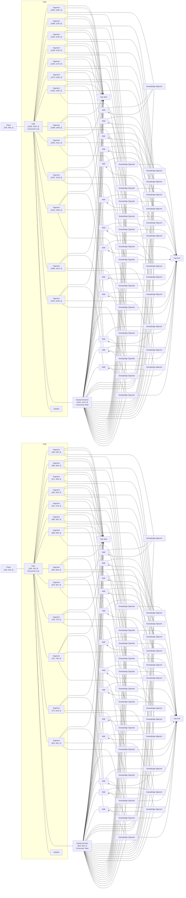

```mermaid
flowchart LR
  subgraph path32 [Path]
    32["Path<br>[206, 250, 0]<br>Consumed: true"]
      %% [ProgramBodyItem { index: 10 }, VariableDeclarationDeclaration, VariableDeclarationInit, PipeBodyItem { index: 1 }]
    33["Segment<br>[256, 290, 0]"]
      %% [ProgramBodyItem { index: 10 }, VariableDeclarationDeclaration, VariableDeclarationInit, PipeBodyItem { index: 2 }]
    34["Segment<br>[296, 365, 0]"]
      %% [ProgramBodyItem { index: 10 }, VariableDeclarationDeclaration, VariableDeclarationInit, PipeBodyItem { index: 3 }]
    35["Segment<br>[371, 398, 0]"]
      %% [ProgramBodyItem { index: 10 }, VariableDeclarationDeclaration, VariableDeclarationInit, PipeBodyItem { index: 4 }]
    36["Segment<br>[404, 435, 0]"]
      %% [ProgramBodyItem { index: 10 }, VariableDeclarationDeclaration, VariableDeclarationInit, PipeBodyItem { index: 5 }]
    37["Segment<br>[441, 476, 0]"]
      %% [ProgramBodyItem { index: 10 }, VariableDeclarationDeclaration, VariableDeclarationInit, PipeBodyItem { index: 6 }]
    38["Segment<br>[482, 562, 0]"]
      %% [ProgramBodyItem { index: 10 }, VariableDeclarationDeclaration, VariableDeclarationInit, PipeBodyItem { index: 7 }]
    39["Segment<br>[568, 599, 0]"]
      %% [ProgramBodyItem { index: 10 }, VariableDeclarationDeclaration, VariableDeclarationInit, PipeBodyItem { index: 8 }]
    40["Segment<br>[605, 664, 0]"]
      %% [ProgramBodyItem { index: 10 }, VariableDeclarationDeclaration, VariableDeclarationInit, PipeBodyItem { index: 9 }]
    41["Segment<br>[670, 697, 0]"]
      %% [ProgramBodyItem { index: 10 }, VariableDeclarationDeclaration, VariableDeclarationInit, PipeBodyItem { index: 10 }]
    42["Segment<br>[703, 725, 0]"]
      %% [ProgramBodyItem { index: 10 }, VariableDeclarationDeclaration, VariableDeclarationInit, PipeBodyItem { index: 11 }]
    43["Segment<br>[731, 766, 0]"]
      %% [ProgramBodyItem { index: 10 }, VariableDeclarationDeclaration, VariableDeclarationInit, PipeBodyItem { index: 12 }]
    44["Segment<br>[772, 818, 0]"]
      %% [ProgramBodyItem { index: 10 }, VariableDeclarationDeclaration, VariableDeclarationInit, PipeBodyItem { index: 13 }]
    45["Segment<br>[824, 832, 0]"]
      %% [ProgramBodyItem { index: 10 }, VariableDeclarationDeclaration, VariableDeclarationInit, PipeBodyItem { index: 14 }]
    64[Solid2d]
  end
  subgraph path48 [Path]
    48["Path<br>[1000, 1044, 0]<br>Consumed: true"]
      %% [ProgramBodyItem { index: 12 }, VariableDeclarationDeclaration, VariableDeclarationInit, PipeBodyItem { index: 1 }]
    49["Segment<br>[1050, 1084, 0]"]
      %% [ProgramBodyItem { index: 12 }, VariableDeclarationDeclaration, VariableDeclarationInit, PipeBodyItem { index: 2 }]
    50["Segment<br>[1090, 1159, 0]"]
      %% [ProgramBodyItem { index: 12 }, VariableDeclarationDeclaration, VariableDeclarationInit, PipeBodyItem { index: 3 }]
    51["Segment<br>[1165, 1192, 0]"]
      %% [ProgramBodyItem { index: 12 }, VariableDeclarationDeclaration, VariableDeclarationInit, PipeBodyItem { index: 4 }]
    52["Segment<br>[1198, 1229, 0]"]
      %% [ProgramBodyItem { index: 12 }, VariableDeclarationDeclaration, VariableDeclarationInit, PipeBodyItem { index: 5 }]
    53["Segment<br>[1235, 1270, 0]"]
      %% [ProgramBodyItem { index: 12 }, VariableDeclarationDeclaration, VariableDeclarationInit, PipeBodyItem { index: 6 }]
    54["Segment<br>[1276, 1356, 0]"]
      %% [ProgramBodyItem { index: 12 }, VariableDeclarationDeclaration, VariableDeclarationInit, PipeBodyItem { index: 7 }]
    55["Segment<br>[1362, 1393, 0]"]
      %% [ProgramBodyItem { index: 12 }, VariableDeclarationDeclaration, VariableDeclarationInit, PipeBodyItem { index: 8 }]
    56["Segment<br>[1399, 1458, 0]"]
      %% [ProgramBodyItem { index: 12 }, VariableDeclarationDeclaration, VariableDeclarationInit, PipeBodyItem { index: 9 }]
    57["Segment<br>[1464, 1491, 0]"]
      %% [ProgramBodyItem { index: 12 }, VariableDeclarationDeclaration, VariableDeclarationInit, PipeBodyItem { index: 10 }]
    58["Segment<br>[1497, 1519, 0]"]
      %% [ProgramBodyItem { index: 12 }, VariableDeclarationDeclaration, VariableDeclarationInit, PipeBodyItem { index: 11 }]
    59["Segment<br>[1525, 1560, 0]"]
      %% [ProgramBodyItem { index: 12 }, VariableDeclarationDeclaration, VariableDeclarationInit, PipeBodyItem { index: 12 }]
    60["Segment<br>[1566, 1612, 0]"]
      %% [ProgramBodyItem { index: 12 }, VariableDeclarationDeclaration, VariableDeclarationInit, PipeBodyItem { index: 13 }]
    61["Segment<br>[1618, 1626, 0]"]
      %% [ProgramBodyItem { index: 12 }, VariableDeclarationDeclaration, VariableDeclarationInit, PipeBodyItem { index: 14 }]
    63[Solid2d]
  end
  1["Cap End"]
    %% face_code_ref=Missing NodePath
  2["Cap End"]
    %% face_code_ref=Missing NodePath
  3["Cap Start"]
    %% face_code_ref=Missing NodePath
  4["Cap Start"]
    %% face_code_ref=Missing NodePath
  5[Wall]
    %% face_code_ref=Missing NodePath
  6[Wall]
    %% face_code_ref=Missing NodePath
  7[Wall]
    %% face_code_ref=Missing NodePath
  8[Wall]
    %% face_code_ref=Missing NodePath
  9[Wall]
    %% face_code_ref=Missing NodePath
  10[Wall]
    %% face_code_ref=Missing NodePath
  11[Wall]
    %% face_code_ref=Missing NodePath
  12[Wall]
    %% face_code_ref=Missing NodePath
  13[Wall]
    %% face_code_ref=Missing NodePath
  14[Wall]
    %% face_code_ref=Missing NodePath
  15[Wall]
    %% face_code_ref=Missing NodePath
  16[Wall]
    %% face_code_ref=Missing NodePath
  17[Wall]
    %% face_code_ref=Missing NodePath
  18[Wall]
    %% face_code_ref=Missing NodePath
  19[Wall]
    %% face_code_ref=Missing NodePath
  20[Wall]
    %% face_code_ref=Missing NodePath
  21[Wall]
    %% face_code_ref=Missing NodePath
  22[Wall]
    %% face_code_ref=Missing NodePath
  23[Wall]
    %% face_code_ref=Missing NodePath
  24[Wall]
    %% face_code_ref=Missing NodePath
  25[Wall]
    %% face_code_ref=Missing NodePath
  26[Wall]
    %% face_code_ref=Missing NodePath
  27[Wall]
    %% face_code_ref=Missing NodePath
  28[Wall]
    %% face_code_ref=Missing NodePath
  29[Wall]
    %% face_code_ref=Missing NodePath
  30[Wall]
    %% face_code_ref=Missing NodePath
  31["Plane<br>[182, 200, 0]"]
    %% [ProgramBodyItem { index: 10 }, VariableDeclarationDeclaration, VariableDeclarationInit, PipeBodyItem { index: 0 }]
  46["Sweep Revolve<br>[843, 962, 0]<br>Consumed: false"]
    %% [ProgramBodyItem { index: 11 }, VariableDeclarationDeclaration, VariableDeclarationInit]
  47["Plane<br>[976, 994, 0]"]
    %% [ProgramBodyItem { index: 12 }, VariableDeclarationDeclaration, VariableDeclarationInit, PipeBodyItem { index: 0 }]
  62["Sweep Extrusion<br>[1632, 1670, 0]<br>Consumed: false"]
    %% [ProgramBodyItem { index: 12 }, VariableDeclarationDeclaration, VariableDeclarationInit, PipeBodyItem { index: 15 }]
  65["SweepEdge Adjacent"]
  66["SweepEdge Adjacent"]
  67["SweepEdge Adjacent"]
  68["SweepEdge Adjacent"]
  69["SweepEdge Adjacent"]
  70["SweepEdge Adjacent"]
  71["SweepEdge Adjacent"]
  72["SweepEdge Adjacent"]
  73["SweepEdge Adjacent"]
  74["SweepEdge Adjacent"]
  75["SweepEdge Adjacent"]
  76["SweepEdge Adjacent"]
  77["SweepEdge Adjacent"]
  78["SweepEdge Adjacent"]
  79["SweepEdge Adjacent"]
  80["SweepEdge Adjacent"]
  81["SweepEdge Adjacent"]
  82["SweepEdge Adjacent"]
  83["SweepEdge Adjacent"]
  84["SweepEdge Adjacent"]
  85["SweepEdge Adjacent"]
  86["SweepEdge Adjacent"]
  87["SweepEdge Adjacent"]
  88["SweepEdge Adjacent"]
  89["SweepEdge Adjacent"]
  90["SweepEdge Adjacent"]
  91["SweepEdge Opposite"]
  92["SweepEdge Opposite"]
  93["SweepEdge Opposite"]
  94["SweepEdge Opposite"]
  95["SweepEdge Opposite"]
  96["SweepEdge Opposite"]
  97["SweepEdge Opposite"]
  98["SweepEdge Opposite"]
  99["SweepEdge Opposite"]
  100["SweepEdge Opposite"]
  101["SweepEdge Opposite"]
  102["SweepEdge Opposite"]
  103["SweepEdge Opposite"]
  104["SweepEdge Opposite"]
  105["SweepEdge Opposite"]
  106["SweepEdge Opposite"]
  107["SweepEdge Opposite"]
  108["SweepEdge Opposite"]
  109["SweepEdge Opposite"]
  110["SweepEdge Opposite"]
  111["SweepEdge Opposite"]
  112["SweepEdge Opposite"]
  113["SweepEdge Opposite"]
  114["SweepEdge Opposite"]
  115["SweepEdge Opposite"]
  116["SweepEdge Opposite"]
  62 --- 1
  91 <--x 1
  92 <--x 1
  93 <--x 1
  94 <--x 1
  95 <--x 1
  96 <--x 1
  97 <--x 1
  98 <--x 1
  99 <--x 1
  100 <--x 1
  101 <--x 1
  102 <--x 1
  103 <--x 1
  46 --- 2
  104 <--x 2
  105 <--x 2
  106 <--x 2
  107 <--x 2
  108 <--x 2
  109 <--x 2
  110 <--x 2
  111 <--x 2
  112 <--x 2
  113 <--x 2
  114 <--x 2
  115 <--x 2
  116 <--x 2
  49 <--x 3
  50 <--x 3
  51 <--x 3
  52 <--x 3
  53 <--x 3
  54 <--x 3
  55 <--x 3
  56 <--x 3
  57 <--x 3
  58 <--x 3
  59 <--x 3
  60 <--x 3
  61 <--x 3
  62 --- 3
  33 <--x 4
  34 <--x 4
  35 <--x 4
  36 <--x 4
  37 <--x 4
  38 <--x 4
  39 <--x 4
  40 <--x 4
  41 <--x 4
  42 <--x 4
  43 <--x 4
  44 <--x 4
  45 <--x 4
  46 --- 4
  49 --- 5
  62 --- 5
  5 --- 65
  65 <--x 5
  5 --- 91
  50 --- 6
  62 --- 6
  6 --- 66
  66 <--x 6
  6 --- 92
  51 --- 7
  62 --- 7
  7 --- 67
  67 <--x 7
  7 --- 93
  52 --- 8
  62 --- 8
  8 --- 68
  68 <--x 8
  8 --- 94
  53 --- 9
  62 --- 9
  9 --- 69
  69 <--x 9
  9 --- 95
  54 --- 10
  62 --- 10
  10 --- 70
  70 <--x 10
  10 --- 96
  55 --- 11
  62 --- 11
  11 --- 71
  71 <--x 11
  11 --- 97
  56 --- 12
  62 --- 12
  12 --- 72
  72 <--x 12
  12 --- 98
  57 --- 13
  62 --- 13
  13 --- 73
  73 <--x 13
  13 --- 99
  58 --- 14
  62 --- 14
  14 --- 74
  74 <--x 14
  14 --- 100
  59 --- 15
  62 --- 15
  15 --- 75
  75 <--x 15
  15 --- 101
  60 --- 16
  62 --- 16
  16 --- 76
  76 <--x 16
  16 --- 102
  61 --- 17
  62 --- 17
  17 --- 77
  77 <--x 17
  17 --- 103
  33 --- 18
  46 --- 18
  18 --- 78
  78 <--x 18
  18 --- 104
  34 --- 19
  46 --- 19
  19 --- 79
  79 <--x 19
  19 --- 105
  35 --- 20
  46 --- 20
  20 --- 80
  80 <--x 20
  20 --- 106
  36 --- 21
  46 --- 21
  21 --- 81
  81 <--x 21
  21 --- 107
  37 --- 22
  46 --- 22
  22 --- 82
  82 <--x 22
  22 --- 108
  38 --- 23
  46 --- 23
  23 --- 83
  83 <--x 23
  23 --- 109
  39 --- 24
  46 --- 24
  24 --- 84
  84 <--x 24
  24 --- 110
  40 --- 25
  46 --- 25
  25 --- 85
  85 <--x 25
  25 --- 111
  41 --- 26
  46 --- 26
  26 --- 86
  86 <--x 26
  26 --- 112
  42 --- 27
  46 --- 27
  27 --- 87
  87 <--x 27
  27 --- 113
  43 --- 28
  46 --- 28
  28 --- 88
  88 <--x 28
  28 --- 114
  44 --- 29
  46 --- 29
  29 --- 89
  89 <--x 29
  29 --- 115
  45 --- 30
  46 --- 30
  30 --- 90
  90 <--x 30
  30 --- 116
  31 --- 32
  32 --- 33
  32 --- 34
  32 --- 35
  32 --- 36
  32 --- 37
  32 --- 38
  32 --- 39
  32 --- 40
  32 --- 41
  32 --- 42
  32 --- 43
  32 --- 44
  32 --- 45
  32 ---- 46
  32 --- 64
  33 --- 78
  33 --- 104
  34 --- 79
  34 --- 105
  35 --- 80
  35 --- 106
  36 --- 81
  36 --- 107
  37 --- 82
  37 --- 108
  38 --- 83
  38 --- 109
  39 --- 84
  39 --- 110
  40 --- 85
  40 --- 111
  41 --- 86
  41 --- 112
  42 --- 87
  42 --- 113
  43 --- 88
  43 --- 114
  44 --- 89
  44 --- 115
  45 --- 90
  45 --- 116
  46 --- 78
  46 --- 79
  46 --- 80
  46 --- 81
  46 --- 82
  46 --- 83
  46 --- 84
  46 --- 85
  46 --- 86
  46 --- 87
  46 --- 88
  46 --- 89
  46 --- 90
  46 --- 104
  46 --- 105
  46 --- 106
  46 --- 107
  46 --- 108
  46 --- 109
  46 --- 110
  46 --- 111
  46 --- 112
  46 --- 113
  46 --- 114
  46 --- 115
  46 --- 116
  47 --- 48
  48 --- 49
  48 --- 50
  48 --- 51
  48 --- 52
  48 --- 53
  48 --- 54
  48 --- 55
  48 --- 56
  48 --- 57
  48 --- 58
  48 --- 59
  48 --- 60
  48 --- 61
  48 ---- 62
  48 --- 63
  49 --- 65
  49 --- 91
  50 --- 66
  50 --- 92
  51 --- 67
  51 --- 93
  52 --- 68
  52 --- 94
  53 --- 69
  53 --- 95
  54 --- 70
  54 --- 96
  55 --- 71
  55 --- 97
  56 --- 72
  56 --- 98
  57 --- 73
  57 --- 99
  58 --- 74
  58 --- 100
  59 --- 75
  59 --- 101
  60 --- 76
  60 --- 102
  61 --- 77
  61 --- 103
  62 --- 65
  62 --- 66
  62 --- 67
  62 --- 68
  62 --- 69
  62 --- 70
  62 --- 71
  62 --- 72
  62 --- 73
  62 --- 74
  62 --- 75
  62 --- 76
  62 --- 77
  62 --- 91
  62 --- 92
  62 --- 93
  62 --- 94
  62 --- 95
  62 --- 96
  62 --- 97
  62 --- 98
  62 --- 99
  62 --- 100
  62 --- 101
  62 --- 102
  62 --- 103
```
