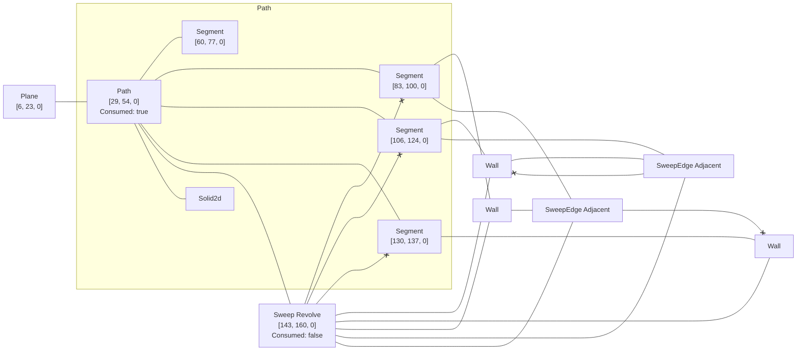

```mermaid
flowchart LR
  subgraph path5 [Path]
    5["Path<br>[29, 54, 0]<br>Consumed: true"]
      %% [ProgramBodyItem { index: 0 }, VariableDeclarationDeclaration, VariableDeclarationInit, PipeBodyItem { index: 1 }]
    6["Segment<br>[60, 77, 0]"]
      %% [ProgramBodyItem { index: 0 }, VariableDeclarationDeclaration, VariableDeclarationInit, PipeBodyItem { index: 2 }]
    7["Segment<br>[83, 100, 0]"]
      %% [ProgramBodyItem { index: 0 }, VariableDeclarationDeclaration, VariableDeclarationInit, PipeBodyItem { index: 3 }]
    8["Segment<br>[106, 124, 0]"]
      %% [ProgramBodyItem { index: 0 }, VariableDeclarationDeclaration, VariableDeclarationInit, PipeBodyItem { index: 4 }]
    9["Segment<br>[130, 137, 0]"]
      %% [ProgramBodyItem { index: 0 }, VariableDeclarationDeclaration, VariableDeclarationInit, PipeBodyItem { index: 5 }]
    11[Solid2d]
  end
  1[Wall]
    %% face_code_ref=Missing NodePath
  2[Wall]
    %% face_code_ref=Missing NodePath
  3[Wall]
    %% face_code_ref=Missing NodePath
  4["Plane<br>[6, 23, 0]"]
    %% [ProgramBodyItem { index: 0 }, VariableDeclarationDeclaration, VariableDeclarationInit, PipeBodyItem { index: 0 }]
  10["Sweep Revolve<br>[143, 160, 0]<br>Consumed: false"]
    %% [ProgramBodyItem { index: 0 }, VariableDeclarationDeclaration, VariableDeclarationInit, PipeBodyItem { index: 6 }]
  12["SweepEdge Adjacent"]
  13["SweepEdge Adjacent"]
  8 --- 1
  10 --- 1
  1 --- 12
  12 <--x 1
  9 --- 2
  10 --- 2
  13 <--x 2
  7 --- 3
  10 --- 3
  3 --- 13
  4 --- 5
  5 --- 6
  5 --- 7
  5 --- 8
  5 --- 9
  5 ---- 10
  5 --- 11
  10 <--x 7
  7 --- 13
  10 <--x 8
  8 --- 12
  10 <--x 9
  10 --- 12
  10 --- 13
```
