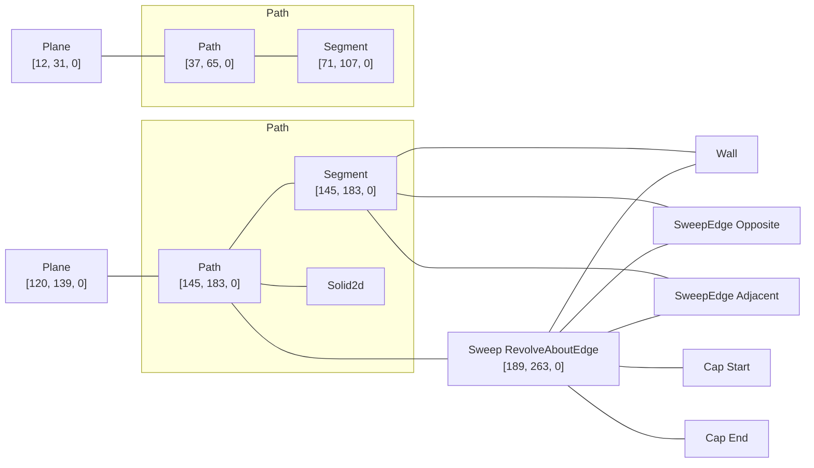

```mermaid
flowchart LR
  subgraph path2 [Path]
    2["Path<br>[37, 65, 0]"]
    3["Segment<br>[71, 107, 0]"]
  end
  subgraph path5 [Path]
    5["Path<br>[145, 183, 0]"]
    6["Segment<br>[145, 183, 0]"]
    7[Solid2d]
  end
  1["Plane<br>[12, 31, 0]"]
  4["Plane<br>[120, 139, 0]"]
  8["Sweep RevolveAboutEdge<br>[189, 263, 0]"]
  9[Wall]
  10["Cap Start"]
  11["Cap End"]
  12["SweepEdge Opposite"]
  13["SweepEdge Adjacent"]
  1 --- 2
  2 --- 3
  4 --- 5
  5 --- 6
  5 ---- 8
  5 --- 7
  6 --- 9
  6 --- 12
  6 --- 13
  8 --- 9
  8 --- 10
  8 --- 11
  8 --- 12
  8 --- 13
```
