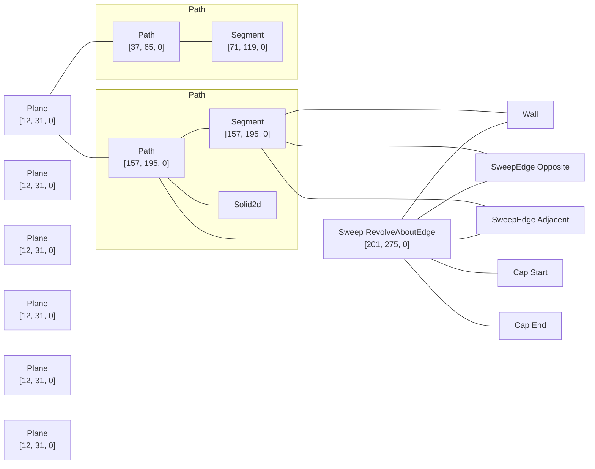

```mermaid
flowchart LR
  subgraph path7 [Path]
    7["Path<br>[37, 65, 0]"]
    8["Segment<br>[71, 119, 0]"]
  end
  subgraph path9 [Path]
    9["Path<br>[157, 195, 0]"]
    10["Segment<br>[157, 195, 0]"]
    11[Solid2d]
  end
  1["Plane<br>[12, 31, 0]"]
  2["Plane<br>[12, 31, 0]"]
  3["Plane<br>[12, 31, 0]"]
  4["Plane<br>[12, 31, 0]"]
  5["Plane<br>[12, 31, 0]"]
  6["Plane<br>[12, 31, 0]"]
  12["Sweep RevolveAboutEdge<br>[201, 275, 0]"]
  13[Wall]
  14["Cap Start"]
  15["Cap End"]
  16["SweepEdge Opposite"]
  17["SweepEdge Adjacent"]
  1 --- 7
  1 --- 9
  7 --- 8
  9 --- 10
  9 ---- 12
  9 --- 11
  10 --- 13
  10 --- 16
  10 --- 17
  12 --- 13
  12 --- 14
  12 --- 15
  12 --- 16
  12 --- 17
```
