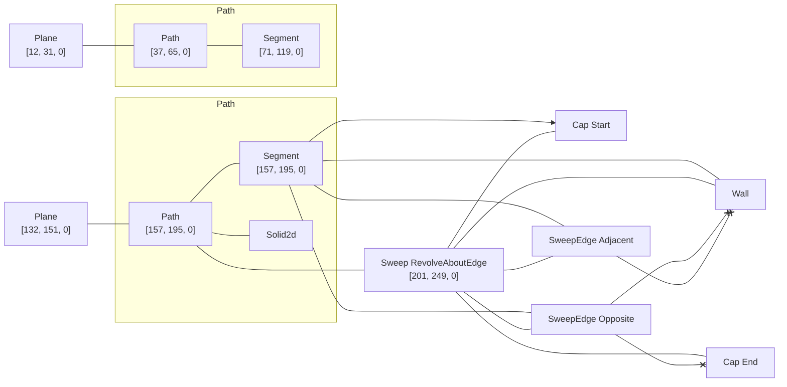

```mermaid
flowchart LR
  subgraph path3 [Path]
    3["Path<br>[37, 65, 0]"]
    5["Segment<br>[71, 119, 0]"]
  end
  subgraph path4 [Path]
    4["Path<br>[157, 195, 0]"]
    6["Segment<br>[157, 195, 0]"]
    7[Solid2d]
  end
  1["Plane<br>[12, 31, 0]"]
  2["Plane<br>[132, 151, 0]"]
  8["Sweep RevolveAboutEdge<br>[201, 249, 0]"]
  9[Wall]
  10["Cap Start"]
  11["Cap End"]
  12["SweepEdge Opposite"]
  13["SweepEdge Adjacent"]
  1 --- 3
  2 --- 4
  3 --- 5
  4 --- 6
  4 --- 7
  4 ---- 8
  6 --- 9
  6 x--> 10
  6 --- 12
  6 --- 13
  8 --- 9
  8 --- 10
  8 --- 11
  8 --- 12
  8 --- 13
  12 <--x 9
  13 <--x 9
  12 <--x 11
```
