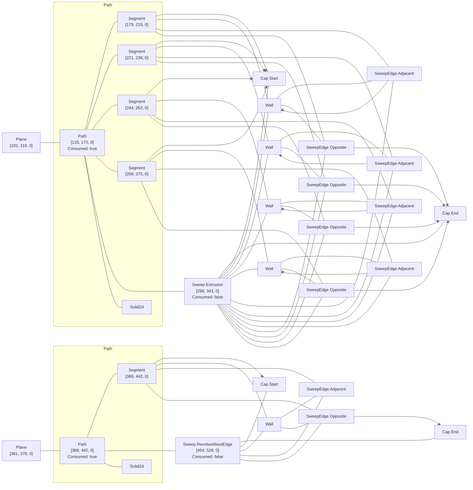

```mermaid
flowchart LR
  subgraph path11 [Path]
    11["Path<br>[133, 173, 0]<br>Consumed: true"]
      %% [ProgramBodyItem { index: 1 }, VariableDeclarationDeclaration, VariableDeclarationInit, PipeBodyItem { index: 0 }]
    12["Segment<br>[179, 215, 0]"]
      %% [ProgramBodyItem { index: 1 }, VariableDeclarationDeclaration, VariableDeclarationInit, PipeBodyItem { index: 1 }]
    13["Segment<br>[221, 238, 0]"]
      %% [ProgramBodyItem { index: 1 }, VariableDeclarationDeclaration, VariableDeclarationInit, PipeBodyItem { index: 2 }]
    14["Segment<br>[244, 262, 0]"]
      %% [ProgramBodyItem { index: 1 }, VariableDeclarationDeclaration, VariableDeclarationInit, PipeBodyItem { index: 3 }]
    15["Segment<br>[268, 275, 0]"]
      %% [ProgramBodyItem { index: 1 }, VariableDeclarationDeclaration, VariableDeclarationInit, PipeBodyItem { index: 4 }]
    21[Solid2d]
  end
  subgraph path18 [Path]
    18["Path<br>[389, 442, 0]<br>Consumed: true"]
      %% [ProgramBodyItem { index: 4 }, VariableDeclarationDeclaration, VariableDeclarationInit]
    19["Segment<br>[389, 442, 0]"]
      %% [ProgramBodyItem { index: 4 }, VariableDeclarationDeclaration, VariableDeclarationInit]
    22[Solid2d]
  end
  1["Cap End"]
    %% face_code_ref=Missing NodePath
  2["Cap End"]
    %% face_code_ref=Missing NodePath
  3["Cap Start"]
    %% face_code_ref=Missing NodePath
  4["Cap Start"]
    %% face_code_ref=Missing NodePath
  5[Wall]
    %% face_code_ref=Missing NodePath
  6[Wall]
    %% face_code_ref=Missing NodePath
  7[Wall]
    %% face_code_ref=Missing NodePath
  8[Wall]
    %% face_code_ref=Missing NodePath
  9[Wall]
    %% face_code_ref=Missing NodePath
  10["Plane<br>[101, 118, 0]"]
    %% [ProgramBodyItem { index: 0 }, VariableDeclarationDeclaration, VariableDeclarationInit]
  16["Sweep Extrusion<br>[288, 343, 0]<br>Consumed: false"]
    %% [ProgramBodyItem { index: 2 }, VariableDeclarationDeclaration, VariableDeclarationInit]
  17["Plane<br>[361, 378, 0]"]
    %% [ProgramBodyItem { index: 3 }, VariableDeclarationDeclaration, VariableDeclarationInit]
  20["Sweep RevolveAboutEdge<br>[454, 528, 0]<br>Consumed: false"]
    %% [ProgramBodyItem { index: 5 }, VariableDeclarationDeclaration, VariableDeclarationInit]
  23["SweepEdge Adjacent"]
  24["SweepEdge Adjacent"]
  25["SweepEdge Adjacent"]
  26["SweepEdge Adjacent"]
  27["SweepEdge Adjacent"]
  28["SweepEdge Opposite"]
  29["SweepEdge Opposite"]
  30["SweepEdge Opposite"]
  31["SweepEdge Opposite"]
  32["SweepEdge Opposite"]
  16 --- 1
  28 <--x 1
  29 <--x 1
  30 <--x 1
  31 <--x 1
  20 --- 2
  32 <--x 2
  12 <--x 3
  13 <--x 3
  14 <--x 3
  15 <--x 3
  16 --- 3
  19 <--x 4
  20 --- 4
  12 --- 5
  16 --- 5
  5 --- 23
  23 <--x 5
  5 --- 28
  13 --- 6
  16 --- 6
  6 --- 24
  24 <--x 6
  6 --- 29
  14 --- 7
  16 --- 7
  7 --- 25
  25 <--x 7
  7 --- 30
  15 --- 8
  16 --- 8
  8 --- 26
  26 <--x 8
  8 --- 31
  19 --- 9
  20 --- 9
  9 --- 27
  9 --- 32
  10 --- 11
  11 --- 12
  11 --- 13
  11 --- 14
  11 --- 15
  11 ---- 16
  11 --- 21
  12 --- 23
  12 --- 28
  13 --- 24
  13 --- 29
  14 --- 25
  14 --- 30
  15 --- 26
  15 --- 31
  16 --- 23
  16 --- 24
  16 --- 25
  16 --- 26
  16 --- 28
  16 --- 29
  16 --- 30
  16 --- 31
  17 --- 18
  18 --- 19
  18 ---- 20
  18 --- 22
  19 --- 27
  19 --- 32
  20 --- 27
  20 --- 32
```
