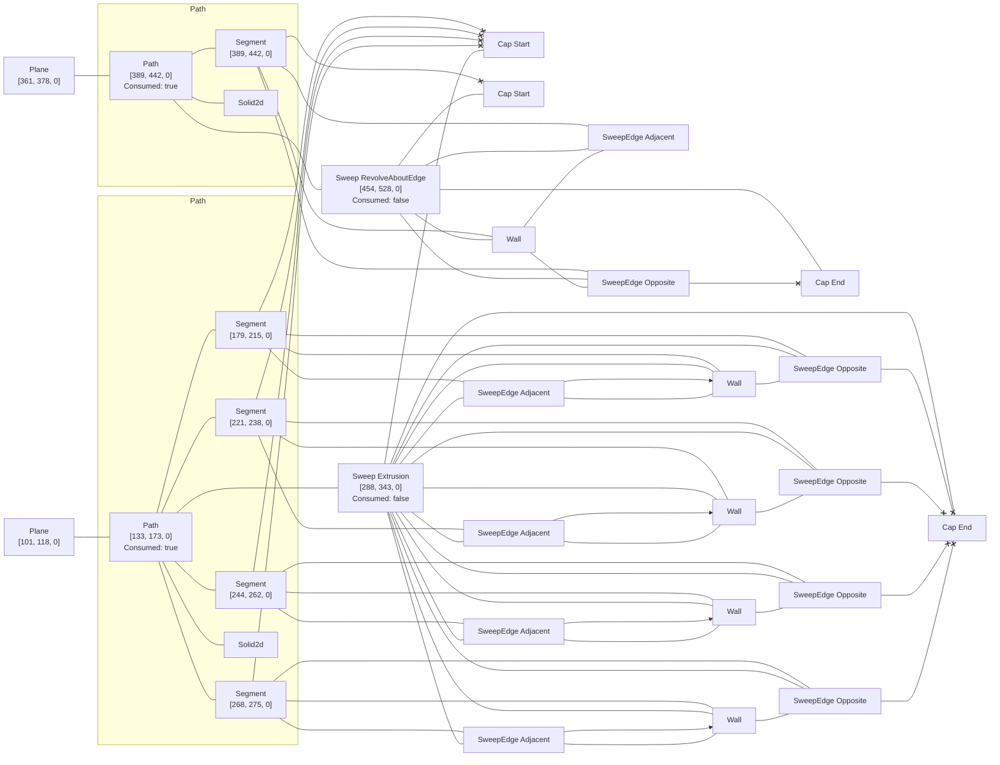

```mermaid
flowchart LR
  subgraph path5 [Path]
    5["Path<br>[133, 173, 0]<br>Consumed: true"]
      %% [ProgramBodyItem { index: 1 }, VariableDeclarationDeclaration, VariableDeclarationInit, PipeBodyItem { index: 0 }]
    9["Segment<br>[179, 215, 0]"]
      %% [ProgramBodyItem { index: 1 }, VariableDeclarationDeclaration, VariableDeclarationInit, PipeBodyItem { index: 1 }]
    10["Segment<br>[221, 238, 0]"]
      %% [ProgramBodyItem { index: 1 }, VariableDeclarationDeclaration, VariableDeclarationInit, PipeBodyItem { index: 2 }]
    11["Segment<br>[244, 262, 0]"]
      %% [ProgramBodyItem { index: 1 }, VariableDeclarationDeclaration, VariableDeclarationInit, PipeBodyItem { index: 3 }]
    12["Segment<br>[268, 275, 0]"]
      %% [ProgramBodyItem { index: 1 }, VariableDeclarationDeclaration, VariableDeclarationInit, PipeBodyItem { index: 4 }]
    14[Solid2d]
  end
  subgraph path6 [Path]
    6["Path<br>[389, 442, 0]<br>Consumed: true"]
      %% [ProgramBodyItem { index: 4 }, VariableDeclarationDeclaration, VariableDeclarationInit]
    13["Segment<br>[389, 442, 0]"]
      %% [ProgramBodyItem { index: 4 }, VariableDeclarationDeclaration, VariableDeclarationInit]
    15[Solid2d]
  end
  7["Plane<br>[101, 118, 0]"]
    %% [ProgramBodyItem { index: 0 }, VariableDeclarationDeclaration, VariableDeclarationInit]
  16["Sweep Extrusion<br>[288, 343, 0]<br>Consumed: false"]
    %% [ProgramBodyItem { index: 2 }, VariableDeclarationDeclaration, VariableDeclarationInit]
  28[Wall]
    %% face_code_ref=Missing NodePath
  29[Wall]
    %% face_code_ref=Missing NodePath
  30[Wall]
    %% face_code_ref=Missing NodePath
  31[Wall]
    %% face_code_ref=Missing NodePath
  3["Cap Start"]
    %% face_code_ref=Missing NodePath
  1["Cap End"]
    %% face_code_ref=Missing NodePath
  23["SweepEdge Opposite"]
  18["SweepEdge Adjacent"]
  24["SweepEdge Opposite"]
  19["SweepEdge Adjacent"]
  25["SweepEdge Opposite"]
  20["SweepEdge Adjacent"]
  26["SweepEdge Opposite"]
  21["SweepEdge Adjacent"]
  8["Plane<br>[361, 378, 0]"]
    %% [ProgramBodyItem { index: 3 }, VariableDeclarationDeclaration, VariableDeclarationInit]
  17["Sweep RevolveAboutEdge<br>[454, 528, 0]<br>Consumed: false"]
    %% [ProgramBodyItem { index: 5 }, VariableDeclarationDeclaration, VariableDeclarationInit]
  32[Wall]
    %% face_code_ref=Missing NodePath
  4["Cap Start"]
    %% face_code_ref=Missing NodePath
  2["Cap End"]
    %% face_code_ref=Missing NodePath
  27["SweepEdge Opposite"]
  22["SweepEdge Adjacent"]
  16 --- 1
  23 <--x 1
  24 <--x 1
  25 <--x 1
  26 <--x 1
  17 --- 2
  27 <--x 2
  9 <--x 3
  10 <--x 3
  11 <--x 3
  12 <--x 3
  16 --- 3
  13 <--x 4
  17 --- 4
  7 --- 5
  5 --- 9
  5 --- 10
  5 --- 11
  5 --- 12
  5 --- 14
  5 ---- 16
  8 --- 6
  6 --- 13
  6 --- 15
  6 ---- 17
  9 --- 18
  9 --- 23
  9 --- 28
  10 --- 19
  10 --- 24
  10 --- 29
  11 --- 20
  11 --- 25
  11 --- 30
  12 --- 21
  12 --- 26
  12 --- 31
  13 --- 22
  13 --- 27
  13 --- 32
  16 --- 18
  16 --- 19
  16 --- 20
  16 --- 21
  16 --- 23
  16 --- 24
  16 --- 25
  16 --- 26
  16 --- 28
  16 --- 29
  16 --- 30
  16 --- 31
  17 --- 22
  17 --- 27
  17 --- 32
  28 --- 18
  18 x--> 28
  29 --- 19
  19 x--> 29
  30 --- 20
  20 x--> 30
  31 --- 21
  21 x--> 31
  32 --- 22
  28 --- 23
  29 --- 24
  30 --- 25
  31 --- 26
  32 --- 27
```
