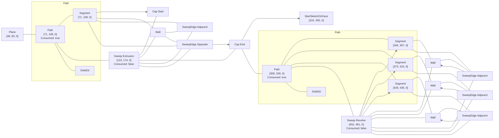

```mermaid
flowchart LR
  subgraph path7 [Path]
    7["Path<br>[71, 108, 0]<br>Consumed: true"]
      %% [ProgramBodyItem { index: 0 }, VariableDeclarationDeclaration, VariableDeclarationInit, PipeBodyItem { index: 1 }]
    8["Segment<br>[71, 108, 0]"]
      %% [ProgramBodyItem { index: 0 }, VariableDeclarationDeclaration, VariableDeclarationInit, PipeBodyItem { index: 1 }]
    18[Solid2d]
  end
  subgraph path12 [Path]
    12["Path<br>[308, 339, 0]<br>Consumed: true"]
      %% [ProgramBodyItem { index: 2 }, VariableDeclarationDeclaration, VariableDeclarationInit, PipeBodyItem { index: 1 }]
    13["Segment<br>[345, 367, 0]"]
      %% [ProgramBodyItem { index: 2 }, VariableDeclarationDeclaration, VariableDeclarationInit, PipeBodyItem { index: 2 }]
    14["Segment<br>[373, 423, 0]"]
      %% [ProgramBodyItem { index: 2 }, VariableDeclarationDeclaration, VariableDeclarationInit, PipeBodyItem { index: 3 }]
    15["Segment<br>[429, 436, 0]"]
      %% [ProgramBodyItem { index: 2 }, VariableDeclarationDeclaration, VariableDeclarationInit, PipeBodyItem { index: 4 }]
    17[Solid2d]
  end
  1["Cap Start"]
    %% face_code_ref=Missing NodePath
  2[Wall]
    %% face_code_ref=Missing NodePath
  3[Wall]
    %% face_code_ref=Missing NodePath
  4[Wall]
    %% face_code_ref=Missing NodePath
  5[Wall]
    %% face_code_ref=Missing NodePath
  6["Plane<br>[48, 65, 0]"]
    %% [ProgramBodyItem { index: 0 }, VariableDeclarationDeclaration, VariableDeclarationInit, PipeBodyItem { index: 0 }]
  9["Sweep Extrusion<br>[123, 174, 0]<br>Consumed: false"]
    %% [ProgramBodyItem { index: 1 }, VariableDeclarationDeclaration, VariableDeclarationInit, PipeBodyItem { index: 0 }]
  10["Cap End"]
    %% face_code_ref=[ProgramBodyItem { index: 2 }, VariableDeclarationDeclaration, VariableDeclarationInit, PipeBodyItem { index: 0 }]
  11["StartSketchOnFace<br>[224, 265, 0]"]
    %% [ProgramBodyItem { index: 2 }, VariableDeclarationDeclaration, VariableDeclarationInit, PipeBodyItem { index: 0 }]
  16["Sweep Revolve<br>[452, 481, 0]<br>Consumed: false"]
    %% [ProgramBodyItem { index: 3 }, VariableDeclarationDeclaration, VariableDeclarationInit, PipeBodyItem { index: 0 }]
  19["SweepEdge Adjacent"]
  20["SweepEdge Adjacent"]
  21["SweepEdge Adjacent"]
  22["SweepEdge Adjacent"]
  23["SweepEdge Opposite"]
  8 <--x 1
  9 --- 1
  13 --- 2
  16 --- 2
  2 --- 19
  19 <--x 2
  14 --- 3
  16 --- 3
  3 --- 20
  20 <--x 3
  15 --- 4
  16 --- 4
  4 --- 21
  21 <--x 4
  8 --- 5
  9 --- 5
  5 --- 22
  5 --- 23
  6 --- 7
  7 --- 8
  7 ---- 9
  7 --- 18
  8 --- 22
  8 --- 23
  9 --- 10
  9 --- 22
  9 --- 23
  10 <--x 11
  10 --- 12
  23 <--x 10
  12 --- 13
  12 --- 14
  12 --- 15
  12 ---- 16
  12 --- 17
  16 <--x 13
  13 --- 19
  16 <--x 14
  14 --- 20
  16 <--x 15
  15 --- 21
  16 --- 19
  16 --- 20
  16 --- 21
```
