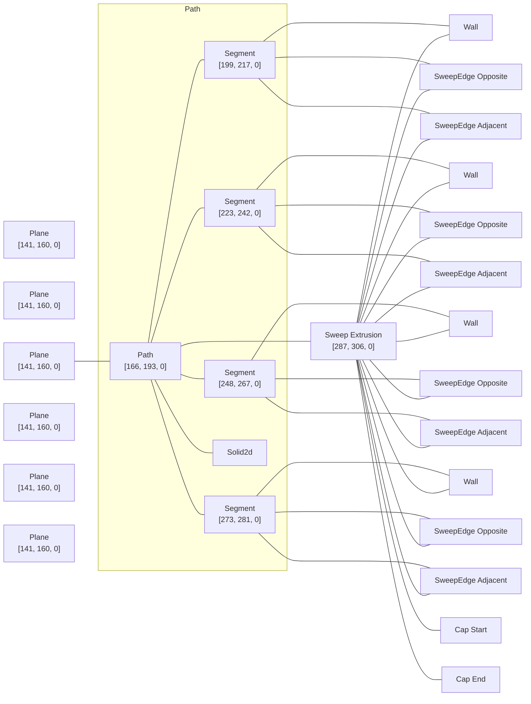

```mermaid
flowchart LR
  subgraph path7 [Path]
    7["Path<br>[166, 193, 0]"]
    8["Segment<br>[199, 217, 0]"]
    9["Segment<br>[223, 242, 0]"]
    10["Segment<br>[248, 267, 0]"]
    11["Segment<br>[273, 281, 0]"]
    12[Solid2d]
  end
  1["Plane<br>[141, 160, 0]"]
  2["Plane<br>[141, 160, 0]"]
  3["Plane<br>[141, 160, 0]"]
  4["Plane<br>[141, 160, 0]"]
  5["Plane<br>[141, 160, 0]"]
  6["Plane<br>[141, 160, 0]"]
  13["Sweep Extrusion<br>[287, 306, 0]"]
  14[Wall]
  15[Wall]
  16[Wall]
  17[Wall]
  18["Cap Start"]
  19["Cap End"]
  20["SweepEdge Opposite"]
  21["SweepEdge Adjacent"]
  22["SweepEdge Opposite"]
  23["SweepEdge Adjacent"]
  24["SweepEdge Opposite"]
  25["SweepEdge Adjacent"]
  26["SweepEdge Opposite"]
  27["SweepEdge Adjacent"]
  3 --- 7
  7 --- 8
  7 --- 9
  7 --- 10
  7 --- 11
  7 ---- 13
  7 --- 12
  8 --- 17
  8 --- 26
  8 --- 27
  9 --- 16
  9 --- 24
  9 --- 25
  10 --- 15
  10 --- 22
  10 --- 23
  11 --- 14
  11 --- 20
  11 --- 21
  13 --- 14
  13 --- 15
  13 --- 16
  13 --- 17
  13 --- 18
  13 --- 19
  13 --- 20
  13 --- 21
  13 --- 22
  13 --- 23
  13 --- 24
  13 --- 25
  13 --- 26
  13 --- 27
```
