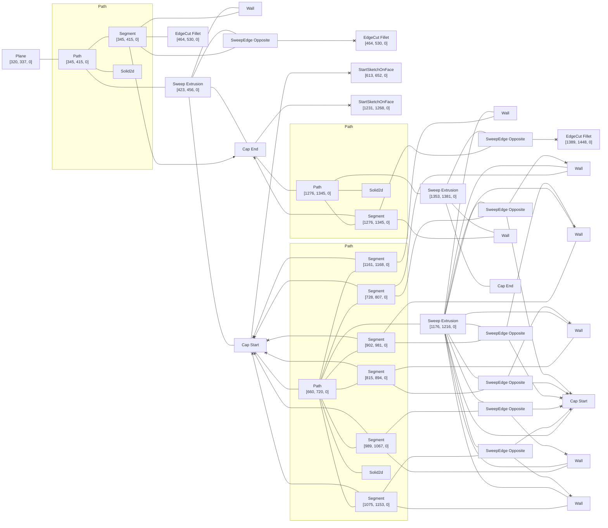

```mermaid
flowchart LR
  subgraph path2 [Path]
    2["Path<br>[345, 415, 0]"]
    3["Segment<br>[345, 415, 0]"]
    4[Solid2d]
  end
  subgraph path12 [Path]
    12["Path<br>[660, 720, 0]"]
    13["Segment<br>[728, 807, 0]"]
    14["Segment<br>[815, 894, 0]"]
    15["Segment<br>[902, 981, 0]"]
    16["Segment<br>[989, 1067, 0]"]
    17["Segment<br>[1075, 1153, 0]"]
    18["Segment<br>[1161, 1168, 0]"]
    19[Solid2d]
  end
  subgraph path33 [Path]
    33["Path<br>[1276, 1345, 0]"]
    34["Segment<br>[1276, 1345, 0]"]
    35[Solid2d]
  end
  1["Plane<br>[320, 337, 0]"]
  5["Sweep Extrusion<br>[423, 456, 0]"]
  6[Wall]
  7["Cap Start"]
  8["Cap End"]
  9["SweepEdge Opposite"]
  10["EdgeCut Fillet<br>[464, 530, 0]"]
  11["EdgeCut Fillet<br>[464, 530, 0]"]
  20["Sweep Extrusion<br>[1176, 1216, 0]"]
  21[Wall]
  22[Wall]
  23[Wall]
  24[Wall]
  25[Wall]
  26[Wall]
  27["Cap Start"]
  28["SweepEdge Opposite"]
  29["SweepEdge Opposite"]
  30["SweepEdge Opposite"]
  31["SweepEdge Opposite"]
  32["SweepEdge Opposite"]
  36["Sweep Extrusion<br>[1353, 1381, 0]"]
  37[Wall]
  38["Cap End"]
  39["SweepEdge Opposite"]
  40["EdgeCut Fillet<br>[1389, 1448, 0]"]
  41["StartSketchOnFace<br>[613, 652, 0]"]
  42["StartSketchOnFace<br>[1231, 1268, 0]"]
  1 --- 2
  2 --- 3
  2 ---- 5
  2 --- 4
  3 --- 6
  3 --- 9
  3 --- 10
  3 x--> 8
  5 --- 6
  5 --- 7
  5 --- 8
  5 --- 9
  7 --- 12
  8 --- 33
  9 <--x 11
  12 --- 13
  12 --- 14
  12 --- 15
  12 --- 16
  12 --- 17
  12 --- 18
  12 ---- 20
  12 --- 19
  13 --- 26
  13 --- 32
  13 <--x 7
  14 --- 25
  14 --- 31
  14 <--x 7
  15 --- 24
  15 --- 30
  15 <--x 7
  16 --- 23
  16 --- 29
  16 <--x 7
  17 --- 22
  17 --- 28
  17 <--x 7
  18 --- 21
  18 <--x 7
  20 --- 21
  20 --- 22
  20 --- 23
  20 --- 24
  20 --- 25
  20 --- 26
  20 --- 27
  20 --- 28
  20 --- 29
  20 --- 30
  20 --- 31
  20 --- 32
  28 <--x 22
  28 <--x 27
  29 <--x 23
  29 <--x 27
  30 <--x 24
  30 <--x 27
  31 <--x 25
  31 <--x 27
  32 <--x 26
  32 <--x 27
  33 --- 34
  33 ---- 36
  33 --- 35
  34 --- 37
  34 --- 39
  34 <--x 8
  36 --- 37
  36 --- 38
  36 --- 39
  39 <--x 40
  7 <--x 41
  8 <--x 42
```
