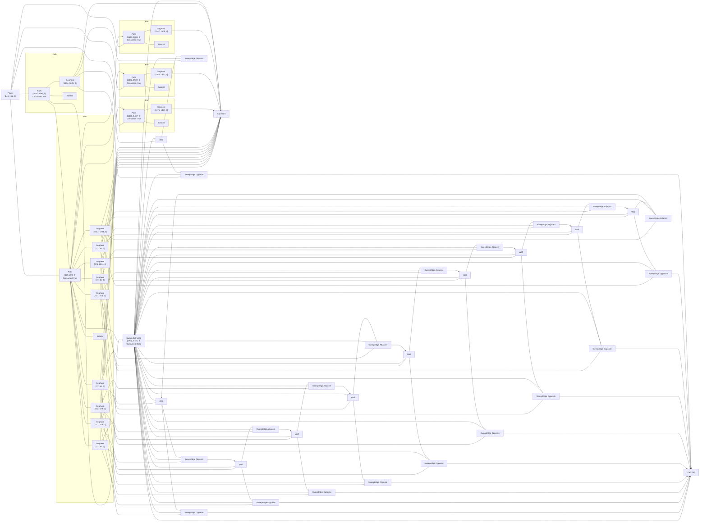

```mermaid
flowchart LR
  subgraph path2 [Path]
    2["Path<br>[169, 209, 0]<br>Consumed: true"]
      %% [ProgramBodyItem { index: 1 }, VariableDeclarationDeclaration, VariableDeclarationInit, FunctionExpressionBody, FunctionExpressionBodyItem { index: 0 }, VariableDeclarationDeclaration, VariableDeclarationInit, PipeBodyItem { index: 1 }]
    3["Segment<br>[217, 315, 0]"]
      %% [ProgramBodyItem { index: 1 }, VariableDeclarationDeclaration, VariableDeclarationInit, FunctionExpressionBody, FunctionExpressionBodyItem { index: 0 }, VariableDeclarationDeclaration, VariableDeclarationInit, PipeBodyItem { index: 2 }]
    4["Segment<br>[37, 86, 0]"]
      %% [ProgramBodyItem { index: 0 }, VariableDeclarationDeclaration, VariableDeclarationInit, FunctionExpressionBody, FunctionExpressionBodyItem { index: 0 }, ReturnStatementArg]
    5["Segment<br>[482, 578, 0]"]
      %% [ProgramBodyItem { index: 1 }, VariableDeclarationDeclaration, VariableDeclarationInit, FunctionExpressionBody, FunctionExpressionBodyItem { index: 0 }, VariableDeclarationDeclaration, VariableDeclarationInit, PipeBodyItem { index: 4 }]
    6["Segment<br>[37, 86, 0]"]
      %% [ProgramBodyItem { index: 0 }, VariableDeclarationDeclaration, VariableDeclarationInit, FunctionExpressionBody, FunctionExpressionBodyItem { index: 0 }, ReturnStatementArg]
    7["Segment<br>[721, 815, 0]"]
      %% [ProgramBodyItem { index: 1 }, VariableDeclarationDeclaration, VariableDeclarationInit, FunctionExpressionBody, FunctionExpressionBodyItem { index: 0 }, VariableDeclarationDeclaration, VariableDeclarationInit, PipeBodyItem { index: 6 }]
    8["Segment<br>[37, 86, 0]"]
      %% [ProgramBodyItem { index: 0 }, VariableDeclarationDeclaration, VariableDeclarationInit, FunctionExpressionBody, FunctionExpressionBodyItem { index: 0 }, ReturnStatementArg]
    9["Segment<br>[978, 1074, 0]"]
      %% [ProgramBodyItem { index: 1 }, VariableDeclarationDeclaration, VariableDeclarationInit, FunctionExpressionBody, FunctionExpressionBodyItem { index: 0 }, VariableDeclarationDeclaration, VariableDeclarationInit, PipeBodyItem { index: 8 }]
    10["Segment<br>[37, 86, 0]"]
      %% [ProgramBodyItem { index: 0 }, VariableDeclarationDeclaration, VariableDeclarationInit, FunctionExpressionBody, FunctionExpressionBodyItem { index: 0 }, ReturnStatementArg]
    11["Segment<br>[1217, 1224, 0]"]
      %% [ProgramBodyItem { index: 1 }, VariableDeclarationDeclaration, VariableDeclarationInit, FunctionExpressionBody, FunctionExpressionBodyItem { index: 0 }, VariableDeclarationDeclaration, VariableDeclarationInit, PipeBodyItem { index: 10 }]
    12[Solid2d]
  end
  subgraph path13 [Path]
    13["Path<br>[1376, 1437, 0]<br>Consumed: true"]
      %% [ProgramBodyItem { index: 4 }, VariableDeclarationDeclaration, VariableDeclarationInit, PipeBodyItem { index: 1 }, CallKwArg { index: 0 }]
    14["Segment<br>[1376, 1437, 0]"]
      %% [ProgramBodyItem { index: 4 }, VariableDeclarationDeclaration, VariableDeclarationInit, PipeBodyItem { index: 1 }, CallKwArg { index: 0 }]
    15[Solid2d]
  end
  subgraph path16 [Path]
    16["Path<br>[1462, 1522, 0]<br>Consumed: true"]
      %% [ProgramBodyItem { index: 4 }, VariableDeclarationDeclaration, VariableDeclarationInit, PipeBodyItem { index: 2 }, CallKwArg { index: 0 }]
    17["Segment<br>[1462, 1522, 0]"]
      %% [ProgramBodyItem { index: 4 }, VariableDeclarationDeclaration, VariableDeclarationInit, PipeBodyItem { index: 2 }, CallKwArg { index: 0 }]
    18[Solid2d]
  end
  subgraph path19 [Path]
    19["Path<br>[1547, 1609, 0]<br>Consumed: true"]
      %% [ProgramBodyItem { index: 4 }, VariableDeclarationDeclaration, VariableDeclarationInit, PipeBodyItem { index: 3 }, CallKwArg { index: 0 }]
    20["Segment<br>[1547, 1609, 0]"]
      %% [ProgramBodyItem { index: 4 }, VariableDeclarationDeclaration, VariableDeclarationInit, PipeBodyItem { index: 3 }, CallKwArg { index: 0 }]
    21[Solid2d]
  end
  subgraph path22 [Path]
    22["Path<br>[1634, 1695, 0]<br>Consumed: true"]
      %% [ProgramBodyItem { index: 4 }, VariableDeclarationDeclaration, VariableDeclarationInit, PipeBodyItem { index: 4 }, CallKwArg { index: 0 }]
    23["Segment<br>[1634, 1695, 0]"]
      %% [ProgramBodyItem { index: 4 }, VariableDeclarationDeclaration, VariableDeclarationInit, PipeBodyItem { index: 4 }, CallKwArg { index: 0 }]
    24[Solid2d]
  end
  1["Plane<br>[144, 161, 0]"]
    %% [ProgramBodyItem { index: 1 }, VariableDeclarationDeclaration, VariableDeclarationInit, FunctionExpressionBody, FunctionExpressionBodyItem { index: 0 }, VariableDeclarationDeclaration, VariableDeclarationInit, PipeBodyItem { index: 0 }]
  25["Sweep Extrusion<br>[1702, 1721, 0]<br>Consumed: false"]
    %% [ProgramBodyItem { index: 4 }, VariableDeclarationDeclaration, VariableDeclarationInit, PipeBodyItem { index: 5 }]
  26[Wall]
    %% face_code_ref=Missing NodePath
  27[Wall]
    %% face_code_ref=Missing NodePath
  28[Wall]
    %% face_code_ref=Missing NodePath
  29[Wall]
    %% face_code_ref=Missing NodePath
  30[Wall]
    %% face_code_ref=Missing NodePath
  31[Wall]
    %% face_code_ref=Missing NodePath
  32[Wall]
    %% face_code_ref=Missing NodePath
  33[Wall]
    %% face_code_ref=Missing NodePath
  34[Wall]
    %% face_code_ref=Missing NodePath
  35[Wall]
    %% face_code_ref=Missing NodePath
  36["Cap Start"]
    %% face_code_ref=Missing NodePath
  37["Cap End"]
    %% face_code_ref=Missing NodePath
  38["SweepEdge Opposite"]
  39["SweepEdge Adjacent"]
  40["SweepEdge Opposite"]
  41["SweepEdge Adjacent"]
  42["SweepEdge Opposite"]
  43["SweepEdge Adjacent"]
  44["SweepEdge Opposite"]
  45["SweepEdge Adjacent"]
  46["SweepEdge Opposite"]
  47["SweepEdge Adjacent"]
  48["SweepEdge Opposite"]
  49["SweepEdge Adjacent"]
  50["SweepEdge Opposite"]
  51["SweepEdge Adjacent"]
  52["SweepEdge Opposite"]
  53["SweepEdge Adjacent"]
  54["SweepEdge Opposite"]
  55["SweepEdge Adjacent"]
  56["SweepEdge Opposite"]
  57["SweepEdge Adjacent"]
  1 --- 2
  1 --- 13
  1 --- 16
  1 --- 19
  1 --- 22
  2 --- 3
  2 --- 4
  2 --- 5
  2 --- 6
  2 --- 7
  2 --- 8
  2 --- 9
  2 --- 10
  2 --- 11
  2 --- 12
  2 <--x 13
  2 <--x 16
  2 <--x 19
  22 --- 2
  2 ---- 25
  3 --- 26
  3 x--> 36
  3 --- 38
  3 --- 39
  4 --- 27
  4 x--> 36
  4 --- 40
  4 --- 41
  5 --- 28
  5 x--> 36
  5 --- 42
  5 --- 43
  6 --- 29
  6 x--> 36
  6 --- 44
  6 --- 45
  7 --- 30
  7 x--> 36
  7 --- 46
  7 --- 47
  8 --- 31
  8 x--> 36
  8 --- 48
  8 --- 49
  9 --- 32
  9 x--> 36
  9 --- 50
  9 --- 51
  10 --- 33
  10 x--> 36
  10 --- 52
  10 --- 53
  11 --- 34
  11 x--> 36
  11 --- 54
  11 --- 55
  13 --- 14
  13 --- 15
  14 x--> 36
  16 --- 17
  16 --- 18
  17 x--> 36
  19 --- 20
  19 --- 21
  20 x--> 36
  22 --- 23
  22 --- 24
  22 x---> 25
  23 --- 35
  23 x--> 36
  23 --- 56
  23 --- 57
  25 --- 26
  25 --- 27
  25 --- 28
  25 --- 29
  25 --- 30
  25 --- 31
  25 --- 32
  25 --- 33
  25 --- 34
  25 --- 35
  25 --- 36
  25 --- 37
  25 --- 38
  25 --- 39
  25 --- 40
  25 --- 41
  25 --- 42
  25 --- 43
  25 --- 44
  25 --- 45
  25 --- 46
  25 --- 47
  25 --- 48
  25 --- 49
  25 --- 50
  25 --- 51
  25 --- 52
  25 --- 53
  25 --- 54
  25 --- 55
  25 --- 56
  25 --- 57
  26 --- 38
  26 --- 39
  55 <--x 26
  39 <--x 27
  27 --- 40
  27 --- 41
  41 <--x 28
  28 --- 42
  28 --- 43
  43 <--x 29
  29 --- 44
  29 --- 45
  45 <--x 30
  30 --- 46
  30 --- 47
  47 <--x 31
  31 --- 48
  31 --- 49
  49 <--x 32
  32 --- 50
  32 --- 51
  51 <--x 33
  33 --- 52
  33 --- 53
  53 <--x 34
  34 --- 54
  34 --- 55
  35 --- 56
  35 --- 57
  38 <--x 37
  40 <--x 37
  42 <--x 37
  44 <--x 37
  46 <--x 37
  48 <--x 37
  50 <--x 37
  52 <--x 37
  54 <--x 37
  56 <--x 37
```
