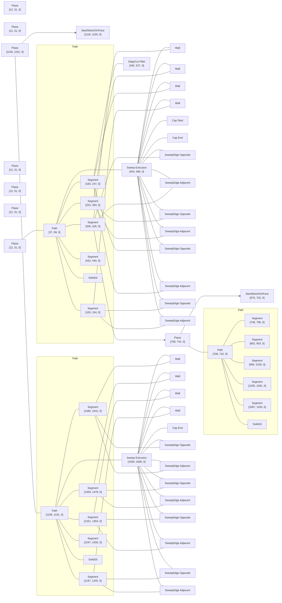

```mermaid
flowchart LR
  subgraph path7 [Path]
    7["Path<br>[37, 69, 0]"]
    8["Segment<br>[105, 154, 0]"]
    9["Segment<br>[160, 247, 0]"]
    10["Segment<br>[253, 350, 0]"]
    11["Segment<br>[356, 426, 0]"]
    12["Segment<br>[432, 440, 0]"]
    13[Solid2d]
  end
  subgraph path32 [Path]
    32["Path<br>[708, 742, 0]"]
    33["Segment<br>[748, 796, 0]"]
    34["Segment<br>[802, 903, 0]"]
    35["Segment<br>[909, 1029, 0]"]
    36["Segment<br>[1035, 1091, 0]"]
    37["Segment<br>[1097, 1105, 0]"]
    38[Solid2d]
  end
  subgraph path39 [Path]
    39["Path<br>[1156, 1191, 0]"]
    40["Segment<br>[1197, 1245, 0]"]
    41["Segment<br>[1251, 1353, 0]"]
    42["Segment<br>[1359, 1479, 0]"]
    43["Segment<br>[1485, 1541, 0]"]
    44["Segment<br>[1547, 1555, 0]"]
    45[Solid2d]
  end
  1["Plane<br>[12, 31, 0]"]
  2["Plane<br>[12, 31, 0]"]
  3["Plane<br>[12, 31, 0]"]
  4["Plane<br>[12, 31, 0]"]
  5["Plane<br>[12, 31, 0]"]
  6["Plane<br>[12, 31, 0]"]
  14["Sweep Extrusion<br>[454, 486, 0]"]
  15[Wall]
  16[Wall]
  17[Wall]
  18[Wall]
  19["Cap Start"]
  20["Cap End"]
  21["SweepEdge Opposite"]
  22["SweepEdge Adjacent"]
  23["SweepEdge Opposite"]
  24["SweepEdge Adjacent"]
  25["SweepEdge Opposite"]
  26["SweepEdge Adjacent"]
  27["SweepEdge Opposite"]
  28["SweepEdge Adjacent"]
  29["EdgeCut Fillet<br>[492, 527, 0]"]
  30["Plane<br>[1156, 1191, 0]"]
  31["Plane<br>[708, 742, 0]"]
  46["Sweep Extrusion<br>[1569, 1600, 0]"]
  47[Wall]
  48[Wall]
  49[Wall]
  50[Wall]
  51["Cap End"]
  52["SweepEdge Opposite"]
  53["SweepEdge Adjacent"]
  54["SweepEdge Opposite"]
  55["SweepEdge Adjacent"]
  56["SweepEdge Opposite"]
  57["SweepEdge Adjacent"]
  58["SweepEdge Opposite"]
  59["SweepEdge Adjacent"]
  60["StartSketchOnFace<br>[670, 702, 0]"]
  61["StartSketchOnFace<br>[1118, 1150, 0]"]
  3 --- 7
  7 --- 8
  7 --- 9
  7 --- 10
  7 --- 11
  7 --- 12
  7 ---- 14
  7 --- 13
  8 --- 18
  8 --- 27
  8 --- 28
  9 --- 17
  9 --- 25
  9 --- 26
  9 --- 29
  10 --- 16
  10 --- 23
  10 --- 24
  11 --- 15
  11 --- 21
  11 --- 22
  11 x--> 31
  14 --- 15
  14 --- 16
  14 --- 17
  14 --- 18
  14 --- 19
  14 --- 20
  14 --- 21
  14 --- 22
  14 --- 23
  14 --- 24
  14 --- 25
  14 --- 26
  14 --- 27
  14 --- 28
  30 --- 39
  31 --- 32
  32 --- 33
  32 --- 34
  32 --- 35
  32 --- 36
  32 --- 37
  32 --- 38
  39 --- 40
  39 --- 41
  39 --- 42
  39 --- 43
  39 --- 44
  39 ---- 46
  39 --- 45
  40 --- 50
  40 --- 58
  40 --- 59
  41 --- 49
  41 --- 56
  41 --- 57
  42 --- 48
  42 --- 54
  42 --- 55
  43 --- 47
  43 --- 52
  43 --- 53
  46 --- 47
  46 --- 48
  46 --- 49
  46 --- 50
  46 --- 51
  46 --- 52
  46 --- 53
  46 --- 54
  46 --- 55
  46 --- 56
  46 --- 57
  46 --- 58
  46 --- 59
  31 <--x 60
  30 <--x 61
```
