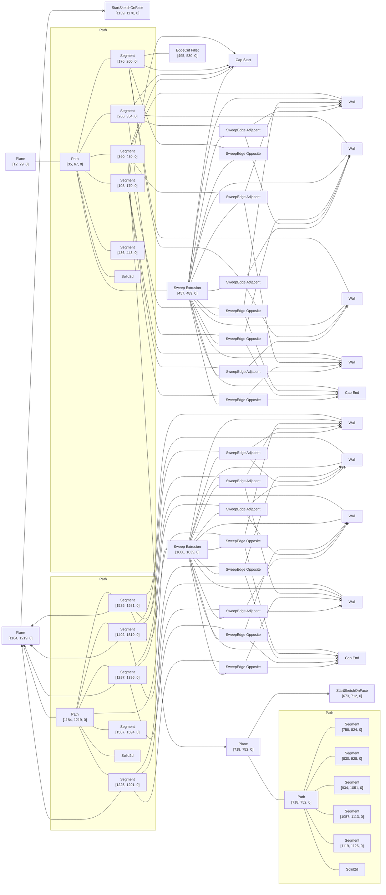

```mermaid
flowchart LR
  subgraph path2 [Path]
    2["Path<br>[35, 67, 0]"]
    3["Segment<br>[103, 170, 0]"]
    4["Segment<br>[176, 260, 0]"]
    5["Segment<br>[266, 354, 0]"]
    6["Segment<br>[360, 430, 0]"]
    7["Segment<br>[436, 443, 0]"]
    8[Solid2d]
  end
  subgraph path27 [Path]
    27["Path<br>[718, 752, 0]"]
    28["Segment<br>[758, 824, 0]"]
    29["Segment<br>[830, 928, 0]"]
    30["Segment<br>[934, 1051, 0]"]
    31["Segment<br>[1057, 1113, 0]"]
    32["Segment<br>[1119, 1126, 0]"]
    33[Solid2d]
  end
  subgraph path34 [Path]
    34["Path<br>[1184, 1219, 0]"]
    35["Segment<br>[1225, 1291, 0]"]
    36["Segment<br>[1297, 1396, 0]"]
    37["Segment<br>[1402, 1519, 0]"]
    38["Segment<br>[1525, 1581, 0]"]
    39["Segment<br>[1587, 1594, 0]"]
    40[Solid2d]
  end
  1["Plane<br>[12, 29, 0]"]
  9["Sweep Extrusion<br>[457, 489, 0]"]
  10[Wall]
  11[Wall]
  12[Wall]
  13[Wall]
  14["Cap Start"]
  15["Cap End"]
  16["SweepEdge Opposite"]
  17["SweepEdge Adjacent"]
  18["SweepEdge Opposite"]
  19["SweepEdge Adjacent"]
  20["SweepEdge Opposite"]
  21["SweepEdge Adjacent"]
  22["SweepEdge Opposite"]
  23["SweepEdge Adjacent"]
  24["EdgeCut Fillet<br>[495, 530, 0]"]
  25["Plane<br>[1184, 1219, 0]"]
  26["Plane<br>[718, 752, 0]"]
  41["Sweep Extrusion<br>[1608, 1639, 0]"]
  42[Wall]
  43[Wall]
  44[Wall]
  45[Wall]
  46["Cap End"]
  47["SweepEdge Opposite"]
  48["SweepEdge Adjacent"]
  49["SweepEdge Opposite"]
  50["SweepEdge Adjacent"]
  51["SweepEdge Opposite"]
  52["SweepEdge Adjacent"]
  53["SweepEdge Opposite"]
  54["SweepEdge Adjacent"]
  55["StartSketchOnFace<br>[673, 712, 0]"]
  56["StartSketchOnFace<br>[1139, 1178, 0]"]
  1 --- 2
  2 --- 3
  2 --- 4
  2 --- 5
  2 --- 6
  2 --- 7
  2 ---- 9
  2 --- 8
  3 --- 13
  3 --- 22
  3 --- 23
  3 x--> 14
  4 --- 12
  4 --- 20
  4 --- 21
  4 --- 24
  4 x--> 14
  5 --- 11
  5 --- 18
  5 --- 19
  5 x--> 14
  6 --- 10
  6 --- 16
  6 --- 17
  6 x--> 26
  6 x--> 14
  9 --- 10
  9 --- 11
  9 --- 12
  9 --- 13
  9 --- 14
  9 --- 15
  9 --- 16
  9 --- 17
  9 --- 18
  9 --- 19
  9 --- 20
  9 --- 21
  9 --- 22
  9 --- 23
  16 <--x 10
  16 <--x 15
  17 <--x 10
  17 <--x 13
  18 <--x 11
  18 <--x 15
  19 <--x 10
  19 <--x 11
  21 <--x 11
  21 <--x 12
  22 <--x 13
  22 <--x 15
  23 <--x 12
  23 <--x 13
  25 --- 34
  26 --- 27
  27 --- 28
  27 --- 29
  27 --- 30
  27 --- 31
  27 --- 32
  27 --- 33
  34 --- 35
  34 --- 36
  34 --- 37
  34 --- 38
  34 --- 39
  34 ---- 41
  34 --- 40
  35 --- 45
  35 --- 53
  35 --- 54
  35 <--x 25
  36 --- 44
  36 --- 51
  36 --- 52
  36 <--x 25
  37 --- 43
  37 --- 49
  37 --- 50
  37 <--x 25
  38 --- 42
  38 --- 47
  38 --- 48
  38 <--x 25
  41 --- 42
  41 --- 43
  41 --- 44
  41 --- 45
  41 --- 46
  41 --- 47
  41 --- 48
  41 --- 49
  41 --- 50
  41 --- 51
  41 --- 52
  41 --- 53
  41 --- 54
  47 <--x 42
  47 <--x 46
  48 <--x 42
  48 <--x 45
  49 <--x 43
  49 <--x 46
  50 <--x 42
  50 <--x 43
  51 <--x 44
  51 <--x 46
  52 <--x 43
  52 <--x 44
  53 <--x 45
  53 <--x 46
  54 <--x 44
  54 <--x 45
  26 <--x 55
  25 <--x 56
```
