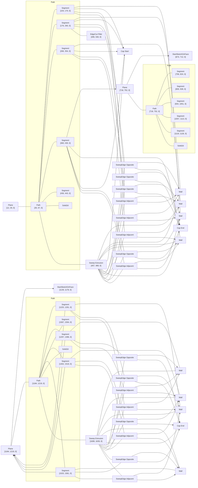

```mermaid
flowchart LR
  subgraph path6 [Path]
    6["Path<br>[35, 67, 0]"]
    9["Segment<br>[103, 170, 0]"]
    10["Segment<br>[176, 260, 0]"]
    11["Segment<br>[266, 354, 0]"]
    12["Segment<br>[360, 430, 0]"]
    13["Segment<br>[436, 443, 0]"]
    24[Solid2d]
  end
  subgraph path7 [Path]
    7["Path<br>[718, 752, 0]"]
    14["Segment<br>[758, 824, 0]"]
    15["Segment<br>[830, 928, 0]"]
    16["Segment<br>[934, 1051, 0]"]
    17["Segment<br>[1057, 1113, 0]"]
    18["Segment<br>[1119, 1126, 0]"]
    25[Solid2d]
  end
  subgraph path8 [Path]
    8["Path<br>[1184, 1219, 0]"]
    19["Segment<br>[1225, 1291, 0]"]
    20["Segment<br>[1297, 1396, 0]"]
    21["Segment<br>[1402, 1519, 0]"]
    22["Segment<br>[1525, 1581, 0]"]
    23["Segment<br>[1587, 1594, 0]"]
    26[Solid2d]
  end
  1["Plane<br>[12, 29, 0]"]
  2["Plane<br>[718, 752, 0]"]
  3["Plane<br>[1184, 1219, 0]"]
  4["StartSketchOnFace<br>[1139, 1178, 0]"]
  5["StartSketchOnFace<br>[673, 712, 0]"]
  27["Sweep Extrusion<br>[457, 489, 0]"]
  28["Sweep Extrusion<br>[1608, 1639, 0]"]
  29[Wall]
  30[Wall]
  31[Wall]
  32[Wall]
  33[Wall]
  34[Wall]
  35[Wall]
  36[Wall]
  37["Cap Start"]
  38["Cap End"]
  39["Cap End"]
  40["SweepEdge Opposite"]
  41["SweepEdge Adjacent"]
  42["SweepEdge Opposite"]
  43["SweepEdge Adjacent"]
  44["SweepEdge Opposite"]
  45["SweepEdge Adjacent"]
  46["SweepEdge Opposite"]
  47["SweepEdge Adjacent"]
  48["SweepEdge Opposite"]
  49["SweepEdge Adjacent"]
  50["SweepEdge Opposite"]
  51["SweepEdge Adjacent"]
  52["SweepEdge Opposite"]
  53["SweepEdge Adjacent"]
  54["SweepEdge Opposite"]
  55["SweepEdge Adjacent"]
  56["EdgeCut Fillet<br>[495, 530, 0]"]
  1 --- 6
  2 <--x 5
  2 --- 7
  12 <--x 2
  3 <--x 4
  3 --- 8
  19 <--x 3
  20 <--x 3
  21 <--x 3
  22 <--x 3
  6 --- 9
  6 --- 10
  6 --- 11
  6 --- 12
  6 --- 13
  6 --- 24
  6 ---- 27
  7 --- 14
  7 --- 15
  7 --- 16
  7 --- 17
  7 --- 18
  7 --- 25
  8 --- 19
  8 --- 20
  8 --- 21
  8 --- 22
  8 --- 23
  8 --- 26
  8 ---- 28
  9 --- 32
  9 x--> 37
  9 --- 46
  9 --- 47
  10 --- 30
  10 x--> 37
  10 --- 42
  10 --- 43
  10 --- 56
  11 --- 29
  11 x--> 37
  11 --- 40
  11 --- 41
  12 --- 31
  12 x--> 37
  12 --- 44
  12 --- 45
  19 --- 35
  19 --- 52
  19 --- 53
  20 --- 33
  20 --- 48
  20 --- 49
  21 --- 34
  21 --- 50
  21 --- 51
  22 --- 36
  22 --- 54
  22 --- 55
  27 --- 29
  27 --- 30
  27 --- 31
  27 --- 32
  27 --- 37
  27 --- 38
  27 --- 40
  27 --- 41
  27 --- 42
  27 --- 43
  27 --- 44
  27 --- 45
  27 --- 46
  27 --- 47
  28 --- 33
  28 --- 34
  28 --- 35
  28 --- 36
  28 --- 39
  28 --- 48
  28 --- 49
  28 --- 50
  28 --- 51
  28 --- 52
  28 --- 53
  28 --- 54
  28 --- 55
  40 <--x 29
  41 <--x 29
  43 <--x 29
  42 <--x 30
  43 <--x 30
  47 <--x 30
  41 <--x 31
  44 <--x 31
  45 <--x 31
  45 <--x 32
  46 <--x 32
  47 <--x 32
  48 <--x 33
  49 <--x 33
  53 <--x 33
  49 <--x 34
  50 <--x 34
  51 <--x 34
  52 <--x 35
  53 <--x 35
  55 <--x 35
  51 <--x 36
  54 <--x 36
  55 <--x 36
  40 <--x 38
  42 <--x 38
  44 <--x 38
  46 <--x 38
  48 <--x 39
  50 <--x 39
  52 <--x 39
  54 <--x 39
```
