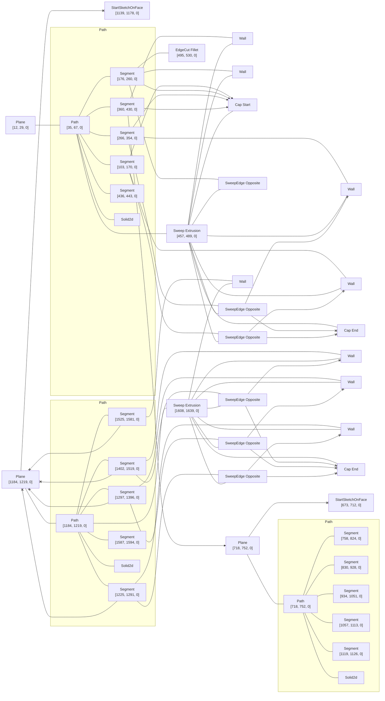

```mermaid
flowchart LR
  subgraph path2 [Path]
    2["Path<br>[35, 67, 0]"]
    3["Segment<br>[103, 170, 0]"]
    4["Segment<br>[176, 260, 0]"]
    5["Segment<br>[266, 354, 0]"]
    6["Segment<br>[360, 430, 0]"]
    7["Segment<br>[436, 443, 0]"]
    8[Solid2d]
  end
  subgraph path22 [Path]
    22["Path<br>[718, 752, 0]"]
    23["Segment<br>[758, 824, 0]"]
    24["Segment<br>[830, 928, 0]"]
    25["Segment<br>[934, 1051, 0]"]
    26["Segment<br>[1057, 1113, 0]"]
    27["Segment<br>[1119, 1126, 0]"]
    28[Solid2d]
  end
  subgraph path29 [Path]
    29["Path<br>[1184, 1219, 0]"]
    30["Segment<br>[1225, 1291, 0]"]
    31["Segment<br>[1297, 1396, 0]"]
    32["Segment<br>[1402, 1519, 0]"]
    33["Segment<br>[1525, 1581, 0]"]
    34["Segment<br>[1587, 1594, 0]"]
    35[Solid2d]
  end
  1["Plane<br>[12, 29, 0]"]
  9["Sweep Extrusion<br>[457, 489, 0]"]
  10[Wall]
  11[Wall]
  12[Wall]
  13[Wall]
  14["Cap Start"]
  15["Cap End"]
  16["SweepEdge Opposite"]
  17["SweepEdge Opposite"]
  18["SweepEdge Opposite"]
  19["EdgeCut Fillet<br>[495, 530, 0]"]
  20["Plane<br>[1184, 1219, 0]"]
  21["Plane<br>[718, 752, 0]"]
  36["Sweep Extrusion<br>[1608, 1639, 0]"]
  37[Wall]
  38[Wall]
  39[Wall]
  40[Wall]
  41["Cap End"]
  42["SweepEdge Opposite"]
  43["SweepEdge Opposite"]
  44["SweepEdge Opposite"]
  45["StartSketchOnFace<br>[673, 712, 0]"]
  46["StartSketchOnFace<br>[1139, 1178, 0]"]
  1 --- 2
  2 --- 3
  2 --- 4
  2 --- 5
  2 --- 6
  2 --- 7
  2 ---- 9
  2 --- 8
  3 --- 13
  3 --- 18
  3 x--> 14
  4 --- 12
  4 --- 17
  4 --- 19
  4 x--> 14
  5 --- 11
  5 --- 16
  5 x--> 14
  6 --- 10
  6 x--> 21
  6 x--> 14
  9 --- 10
  9 --- 11
  9 --- 12
  9 --- 13
  9 --- 14
  9 --- 15
  9 --- 16
  9 --- 17
  9 --- 18
  16 <--x 11
  16 <--x 15
  18 <--x 13
  18 <--x 15
  20 --- 29
  21 --- 22
  22 --- 23
  22 --- 24
  22 --- 25
  22 --- 26
  22 --- 27
  22 --- 28
  29 --- 30
  29 --- 31
  29 --- 32
  29 --- 33
  29 --- 34
  29 ---- 36
  29 --- 35
  30 --- 40
  30 --- 44
  30 <--x 20
  31 --- 39
  31 --- 43
  31 <--x 20
  32 --- 38
  32 --- 42
  32 <--x 20
  33 --- 37
  33 <--x 20
  36 --- 37
  36 --- 38
  36 --- 39
  36 --- 40
  36 --- 41
  36 --- 42
  36 --- 43
  36 --- 44
  42 <--x 38
  42 <--x 41
  43 <--x 39
  43 <--x 41
  44 <--x 40
  44 <--x 41
  21 <--x 45
  20 <--x 46
```
