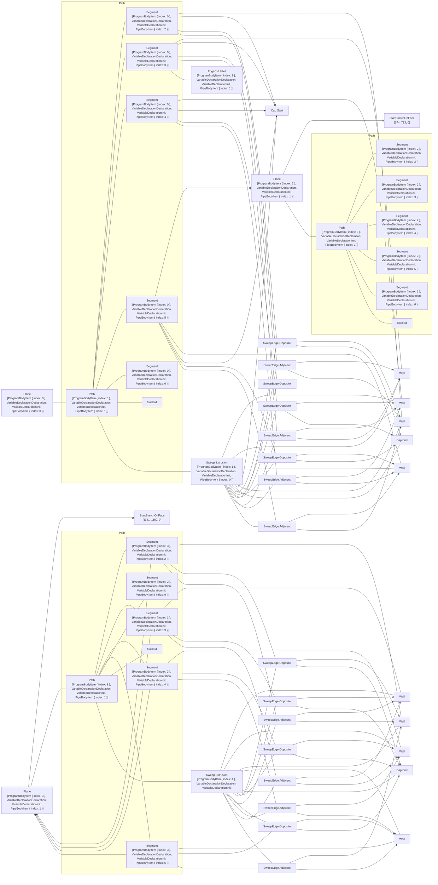

```mermaid
flowchart LR
  subgraph path6 [Path]
    6["Path<br>[ProgramBodyItem { index: 0 }, VariableDeclarationDeclaration, VariableDeclarationInit, PipeBodyItem { index: 1 }]"]
    9["Segment<br>[ProgramBodyItem { index: 0 }, VariableDeclarationDeclaration, VariableDeclarationInit, PipeBodyItem { index: 2 }]"]
    10["Segment<br>[ProgramBodyItem { index: 0 }, VariableDeclarationDeclaration, VariableDeclarationInit, PipeBodyItem { index: 3 }]"]
    11["Segment<br>[ProgramBodyItem { index: 0 }, VariableDeclarationDeclaration, VariableDeclarationInit, PipeBodyItem { index: 4 }]"]
    12["Segment<br>[ProgramBodyItem { index: 0 }, VariableDeclarationDeclaration, VariableDeclarationInit, PipeBodyItem { index: 5 }]"]
    13["Segment<br>[ProgramBodyItem { index: 0 }, VariableDeclarationDeclaration, VariableDeclarationInit, PipeBodyItem { index: 6 }]"]
    24[Solid2d]
  end
  subgraph path7 [Path]
    7["Path<br>[ProgramBodyItem { index: 2 }, VariableDeclarationDeclaration, VariableDeclarationInit, PipeBodyItem { index: 1 }]"]
    14["Segment<br>[ProgramBodyItem { index: 2 }, VariableDeclarationDeclaration, VariableDeclarationInit, PipeBodyItem { index: 2 }]"]
    15["Segment<br>[ProgramBodyItem { index: 2 }, VariableDeclarationDeclaration, VariableDeclarationInit, PipeBodyItem { index: 3 }]"]
    16["Segment<br>[ProgramBodyItem { index: 2 }, VariableDeclarationDeclaration, VariableDeclarationInit, PipeBodyItem { index: 4 }]"]
    17["Segment<br>[ProgramBodyItem { index: 2 }, VariableDeclarationDeclaration, VariableDeclarationInit, PipeBodyItem { index: 5 }]"]
    18["Segment<br>[ProgramBodyItem { index: 2 }, VariableDeclarationDeclaration, VariableDeclarationInit, PipeBodyItem { index: 6 }]"]
    25[Solid2d]
  end
  subgraph path8 [Path]
    8["Path<br>[ProgramBodyItem { index: 3 }, VariableDeclarationDeclaration, VariableDeclarationInit, PipeBodyItem { index: 1 }]"]
    19["Segment<br>[ProgramBodyItem { index: 3 }, VariableDeclarationDeclaration, VariableDeclarationInit, PipeBodyItem { index: 2 }]"]
    20["Segment<br>[ProgramBodyItem { index: 3 }, VariableDeclarationDeclaration, VariableDeclarationInit, PipeBodyItem { index: 3 }]"]
    21["Segment<br>[ProgramBodyItem { index: 3 }, VariableDeclarationDeclaration, VariableDeclarationInit, PipeBodyItem { index: 4 }]"]
    22["Segment<br>[ProgramBodyItem { index: 3 }, VariableDeclarationDeclaration, VariableDeclarationInit, PipeBodyItem { index: 5 }]"]
    23["Segment<br>[ProgramBodyItem { index: 3 }, VariableDeclarationDeclaration, VariableDeclarationInit, PipeBodyItem { index: 6 }]"]
    26[Solid2d]
  end
  1["Plane<br>[ProgramBodyItem { index: 0 }, VariableDeclarationDeclaration, VariableDeclarationInit, PipeBodyItem { index: 0 }]"]
  2["Plane<br>[ProgramBodyItem { index: 2 }, VariableDeclarationDeclaration, VariableDeclarationInit, PipeBodyItem { index: 1 }]"]
  3["Plane<br>[ProgramBodyItem { index: 3 }, VariableDeclarationDeclaration, VariableDeclarationInit, PipeBodyItem { index: 1 }]"]
  4["StartSketchOnFace<br>[1141, 1180, 0]"]
  5["StartSketchOnFace<br>[674, 713, 0]"]
  27["Sweep Extrusion<br>[ProgramBodyItem { index: 1 }, VariableDeclarationDeclaration, VariableDeclarationInit, PipeBodyItem { index: 0 }]"]
  28["Sweep Extrusion<br>[ProgramBodyItem { index: 4 }, VariableDeclarationDeclaration, VariableDeclarationInit]"]
  29[Wall]
  30[Wall]
  31[Wall]
  32[Wall]
  33[Wall]
  34[Wall]
  35[Wall]
  36[Wall]
  37["Cap Start"]
  38["Cap End"]
  39["Cap End"]
  40["SweepEdge Opposite"]
  41["SweepEdge Opposite"]
  42["SweepEdge Opposite"]
  43["SweepEdge Opposite"]
  44["SweepEdge Opposite"]
  45["SweepEdge Opposite"]
  46["SweepEdge Opposite"]
  47["SweepEdge Opposite"]
  48["SweepEdge Adjacent"]
  49["SweepEdge Adjacent"]
  50["SweepEdge Adjacent"]
  51["SweepEdge Adjacent"]
  52["SweepEdge Adjacent"]
  53["SweepEdge Adjacent"]
  54["SweepEdge Adjacent"]
  55["SweepEdge Adjacent"]
  56["EdgeCut Fillet<br>[ProgramBodyItem { index: 1 }, VariableDeclarationDeclaration, VariableDeclarationInit, PipeBodyItem { index: 1 }]"]
  1 --- 6
  2 <--x 5
  2 --- 7
  12 <--x 2
  3 <--x 4
  3 --- 8
  19 <--x 3
  20 <--x 3
  21 <--x 3
  22 <--x 3
  6 --- 9
  6 --- 10
  6 --- 11
  6 --- 12
  6 --- 13
  6 --- 24
  6 ---- 27
  7 --- 14
  7 --- 15
  7 --- 16
  7 --- 17
  7 --- 18
  7 --- 25
  8 --- 19
  8 --- 20
  8 --- 21
  8 --- 22
  8 --- 23
  8 --- 26
  8 ---- 28
  9 --- 32
  9 x--> 37
  9 --- 41
  9 --- 48
  10 --- 30
  10 x--> 37
  10 --- 42
  10 --- 50
  10 --- 56
  11 --- 29
  11 x--> 37
  11 --- 43
  11 --- 49
  12 --- 31
  12 x--> 37
  12 --- 40
  12 --- 51
  19 --- 35
  19 --- 44
  19 --- 52
  20 --- 33
  20 --- 46
  20 --- 54
  21 --- 34
  21 --- 45
  21 --- 53
  22 --- 36
  22 --- 47
  22 --- 55
  27 --- 29
  27 --- 30
  27 --- 31
  27 --- 32
  27 --- 37
  27 --- 38
  27 --- 40
  27 --- 41
  27 --- 42
  27 --- 43
  27 --- 48
  27 --- 49
  27 --- 50
  27 --- 51
  28 --- 33
  28 --- 34
  28 --- 35
  28 --- 36
  28 --- 39
  28 --- 44
  28 --- 45
  28 --- 46
  28 --- 47
  28 --- 52
  28 --- 53
  28 --- 54
  28 --- 55
  43 <--x 29
  49 <--x 29
  50 <--x 29
  48 <--x 30
  50 <--x 30
  40 <--x 31
  49 <--x 31
  51 <--x 31
  41 <--x 32
  48 <--x 32
  51 <--x 32
  46 <--x 33
  52 <--x 33
  54 <--x 33
  45 <--x 34
  53 <--x 34
  54 <--x 34
  44 <--x 35
  52 <--x 35
  55 <--x 35
  47 <--x 36
  53 <--x 36
  55 <--x 36
  40 <--x 38
  41 <--x 38
  43 <--x 38
  44 <--x 39
  45 <--x 39
  46 <--x 39
  47 <--x 39
```
