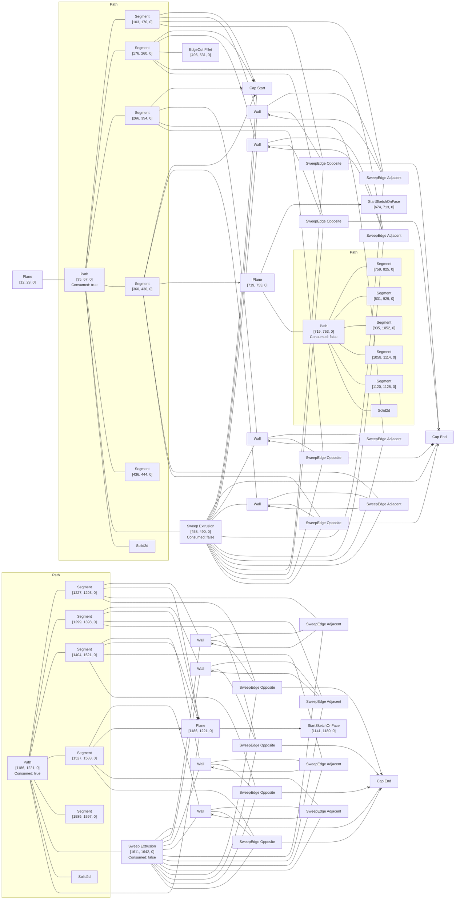

```mermaid
flowchart LR
  subgraph path13 [Path]
    13["Path<br>[35, 67, 0]<br>Consumed: true"]
      %% [ProgramBodyItem { index: 0 }, VariableDeclarationDeclaration, VariableDeclarationInit, PipeBodyItem { index: 1 }]
    14["Segment<br>[103, 170, 0]"]
      %% [ProgramBodyItem { index: 0 }, VariableDeclarationDeclaration, VariableDeclarationInit, PipeBodyItem { index: 2 }]
    15["Segment<br>[176, 260, 0]"]
      %% [ProgramBodyItem { index: 0 }, VariableDeclarationDeclaration, VariableDeclarationInit, PipeBodyItem { index: 3 }]
    16["Segment<br>[266, 354, 0]"]
      %% [ProgramBodyItem { index: 0 }, VariableDeclarationDeclaration, VariableDeclarationInit, PipeBodyItem { index: 4 }]
    17["Segment<br>[360, 430, 0]"]
      %% [ProgramBodyItem { index: 0 }, VariableDeclarationDeclaration, VariableDeclarationInit, PipeBodyItem { index: 5 }]
    18["Segment<br>[436, 444, 0]"]
      %% [ProgramBodyItem { index: 0 }, VariableDeclarationDeclaration, VariableDeclarationInit, PipeBodyItem { index: 6 }]
    39[Solid2d]
  end
  subgraph path22 [Path]
    22["Path<br>[719, 753, 0]<br>Consumed: false"]
      %% [ProgramBodyItem { index: 2 }, VariableDeclarationDeclaration, VariableDeclarationInit, PipeBodyItem { index: 1 }]
    24["Segment<br>[759, 825, 0]"]
      %% [ProgramBodyItem { index: 2 }, VariableDeclarationDeclaration, VariableDeclarationInit, PipeBodyItem { index: 2 }]
    25["Segment<br>[831, 929, 0]"]
      %% [ProgramBodyItem { index: 2 }, VariableDeclarationDeclaration, VariableDeclarationInit, PipeBodyItem { index: 3 }]
    26["Segment<br>[935, 1052, 0]"]
      %% [ProgramBodyItem { index: 2 }, VariableDeclarationDeclaration, VariableDeclarationInit, PipeBodyItem { index: 4 }]
    27["Segment<br>[1058, 1114, 0]"]
      %% [ProgramBodyItem { index: 2 }, VariableDeclarationDeclaration, VariableDeclarationInit, PipeBodyItem { index: 5 }]
    28["Segment<br>[1120, 1128, 0]"]
      %% [ProgramBodyItem { index: 2 }, VariableDeclarationDeclaration, VariableDeclarationInit, PipeBodyItem { index: 6 }]
    40[Solid2d]
  end
  subgraph path30 [Path]
    30["Path<br>[1186, 1221, 0]<br>Consumed: true"]
      %% [ProgramBodyItem { index: 3 }, VariableDeclarationDeclaration, VariableDeclarationInit, PipeBodyItem { index: 1 }]
    32["Segment<br>[1227, 1293, 0]"]
      %% [ProgramBodyItem { index: 3 }, VariableDeclarationDeclaration, VariableDeclarationInit, PipeBodyItem { index: 2 }]
    33["Segment<br>[1299, 1398, 0]"]
      %% [ProgramBodyItem { index: 3 }, VariableDeclarationDeclaration, VariableDeclarationInit, PipeBodyItem { index: 3 }]
    34["Segment<br>[1404, 1521, 0]"]
      %% [ProgramBodyItem { index: 3 }, VariableDeclarationDeclaration, VariableDeclarationInit, PipeBodyItem { index: 4 }]
    35["Segment<br>[1527, 1583, 0]"]
      %% [ProgramBodyItem { index: 3 }, VariableDeclarationDeclaration, VariableDeclarationInit, PipeBodyItem { index: 5 }]
    36["Segment<br>[1589, 1597, 0]"]
      %% [ProgramBodyItem { index: 3 }, VariableDeclarationDeclaration, VariableDeclarationInit, PipeBodyItem { index: 6 }]
    38[Solid2d]
  end
  1["Cap End"]
    %% face_code_ref=Missing NodePath
  2["Cap End"]
    %% face_code_ref=Missing NodePath
  3["Cap Start"]
    %% face_code_ref=Missing NodePath
  4[Wall]
    %% face_code_ref=Missing NodePath
  5[Wall]
    %% face_code_ref=Missing NodePath
  6[Wall]
    %% face_code_ref=Missing NodePath
  7[Wall]
    %% face_code_ref=Missing NodePath
  8[Wall]
    %% face_code_ref=Missing NodePath
  9[Wall]
    %% face_code_ref=Missing NodePath
  10[Wall]
    %% face_code_ref=Missing NodePath
  11[Wall]
    %% face_code_ref=Missing NodePath
  12["Plane<br>[12, 29, 0]"]
    %% [ProgramBodyItem { index: 0 }, VariableDeclarationDeclaration, VariableDeclarationInit, PipeBodyItem { index: 0 }]
  19["Sweep Extrusion<br>[458, 490, 0]<br>Consumed: false"]
    %% [ProgramBodyItem { index: 1 }, VariableDeclarationDeclaration, VariableDeclarationInit, PipeBodyItem { index: 0 }]
  20["EdgeCut Fillet<br>[496, 531, 0]"]
    %% [ProgramBodyItem { index: 1 }, VariableDeclarationDeclaration, VariableDeclarationInit, PipeBodyItem { index: 1 }]
  21["StartSketchOnFace<br>[674, 713, 0]"]
    %% [ProgramBodyItem { index: 2 }, VariableDeclarationDeclaration, VariableDeclarationInit, PipeBodyItem { index: 0 }]
  23["Plane<br>[719, 753, 0]"]
    %% [ProgramBodyItem { index: 2 }, VariableDeclarationDeclaration, VariableDeclarationInit, PipeBodyItem { index: 1 }]
  29["StartSketchOnFace<br>[1141, 1180, 0]"]
    %% [ProgramBodyItem { index: 3 }, VariableDeclarationDeclaration, VariableDeclarationInit, PipeBodyItem { index: 0 }]
  31["Plane<br>[1186, 1221, 0]"]
    %% [ProgramBodyItem { index: 3 }, VariableDeclarationDeclaration, VariableDeclarationInit, PipeBodyItem { index: 1 }]
  37["Sweep Extrusion<br>[1611, 1642, 0]<br>Consumed: false"]
    %% [ProgramBodyItem { index: 4 }, VariableDeclarationDeclaration, VariableDeclarationInit]
  41["SweepEdge Adjacent"]
  42["SweepEdge Adjacent"]
  43["SweepEdge Adjacent"]
  44["SweepEdge Adjacent"]
  45["SweepEdge Adjacent"]
  46["SweepEdge Adjacent"]
  47["SweepEdge Adjacent"]
  48["SweepEdge Adjacent"]
  49["SweepEdge Opposite"]
  50["SweepEdge Opposite"]
  51["SweepEdge Opposite"]
  52["SweepEdge Opposite"]
  53["SweepEdge Opposite"]
  54["SweepEdge Opposite"]
  55["SweepEdge Opposite"]
  56["SweepEdge Opposite"]
  37 --- 1
  50 <--x 1
  51 <--x 1
  52 <--x 1
  53 <--x 1
  19 --- 2
  49 <--x 2
  54 <--x 2
  55 <--x 2
  56 <--x 2
  14 <--x 3
  15 <--x 3
  16 <--x 3
  17 <--x 3
  19 --- 3
  14 --- 4
  19 --- 4
  4 --- 41
  41 <--x 4
  4 --- 49
  32 --- 5
  37 --- 5
  5 --- 42
  42 <--x 5
  5 --- 50
  33 --- 6
  37 --- 6
  6 --- 43
  43 <--x 6
  6 --- 51
  34 --- 7
  37 --- 7
  7 --- 44
  44 <--x 7
  7 --- 52
  35 --- 8
  37 --- 8
  8 --- 45
  45 <--x 8
  8 --- 53
  15 --- 9
  19 --- 9
  9 --- 46
  46 <--x 9
  9 --- 54
  16 --- 10
  19 --- 10
  10 --- 47
  47 <--x 10
  10 --- 55
  17 --- 11
  19 --- 11
  11 --- 48
  48 <--x 11
  11 --- 56
  12 --- 13
  13 --- 14
  13 --- 15
  13 --- 16
  13 --- 17
  13 --- 18
  13 ---- 19
  13 --- 39
  14 --- 41
  14 --- 49
  15 --- 20
  15 --- 46
  15 --- 54
  16 --- 47
  16 --- 55
  17 x--> 23
  17 --- 48
  17 --- 56
  19 --- 41
  19 --- 46
  19 --- 47
  19 --- 48
  19 --- 49
  19 --- 54
  19 --- 55
  19 --- 56
  23 x--> 21
  23 --- 22
  22 --- 24
  22 --- 25
  22 --- 26
  22 --- 27
  22 --- 28
  22 --- 40
  31 x--> 29
  31 --- 30
  30 --- 32
  30 --- 33
  30 --- 34
  30 --- 35
  30 --- 36
  30 ---- 37
  30 --- 38
  32 <--x 31
  33 <--x 31
  34 <--x 31
  35 <--x 31
  32 --- 42
  32 --- 50
  33 --- 43
  33 --- 51
  34 --- 44
  34 --- 52
  35 --- 45
  35 --- 53
  37 --- 42
  37 --- 43
  37 --- 44
  37 --- 45
  37 --- 50
  37 --- 51
  37 --- 52
  37 --- 53
```
