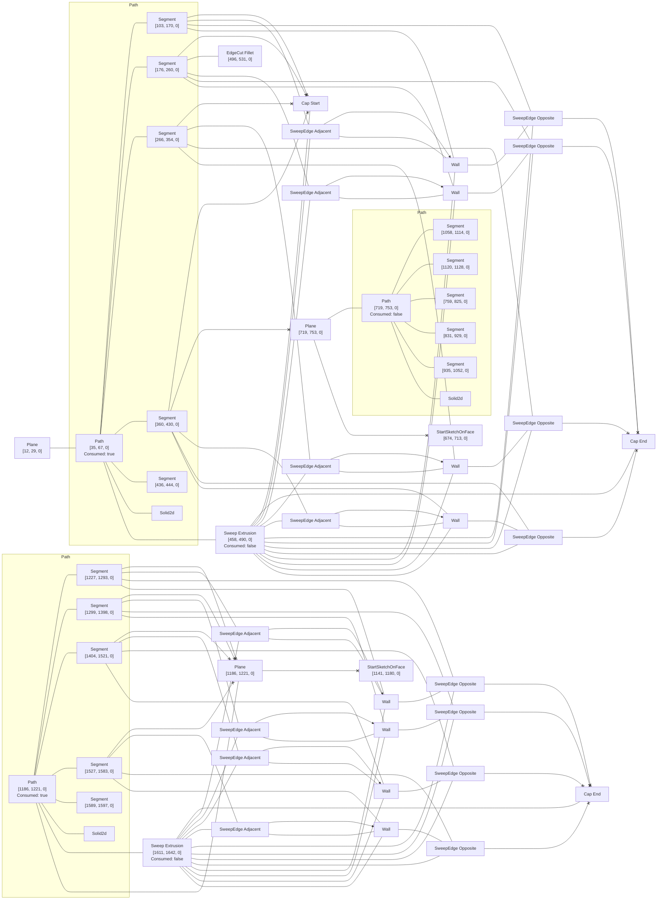

```mermaid
flowchart LR
  subgraph path5 [Path]
    5["Path<br>[1186, 1221, 0]<br>Consumed: true"]
      %% [ProgramBodyItem { index: 3 }, VariableDeclarationDeclaration, VariableDeclarationInit, PipeBodyItem { index: 1 }]
    14["Segment<br>[1227, 1293, 0]"]
      %% [ProgramBodyItem { index: 3 }, VariableDeclarationDeclaration, VariableDeclarationInit, PipeBodyItem { index: 2 }]
    15["Segment<br>[1299, 1398, 0]"]
      %% [ProgramBodyItem { index: 3 }, VariableDeclarationDeclaration, VariableDeclarationInit, PipeBodyItem { index: 3 }]
    16["Segment<br>[1404, 1521, 0]"]
      %% [ProgramBodyItem { index: 3 }, VariableDeclarationDeclaration, VariableDeclarationInit, PipeBodyItem { index: 4 }]
    17["Segment<br>[1527, 1583, 0]"]
      %% [ProgramBodyItem { index: 3 }, VariableDeclarationDeclaration, VariableDeclarationInit, PipeBodyItem { index: 5 }]
    18["Segment<br>[1589, 1597, 0]"]
      %% [ProgramBodyItem { index: 3 }, VariableDeclarationDeclaration, VariableDeclarationInit, PipeBodyItem { index: 6 }]
    26[Solid2d]
  end
  subgraph path6 [Path]
    6["Path<br>[35, 67, 0]<br>Consumed: true"]
      %% [ProgramBodyItem { index: 0 }, VariableDeclarationDeclaration, VariableDeclarationInit, PipeBodyItem { index: 1 }]
    11["Segment<br>[103, 170, 0]"]
      %% [ProgramBodyItem { index: 0 }, VariableDeclarationDeclaration, VariableDeclarationInit, PipeBodyItem { index: 2 }]
    19["Segment<br>[176, 260, 0]"]
      %% [ProgramBodyItem { index: 0 }, VariableDeclarationDeclaration, VariableDeclarationInit, PipeBodyItem { index: 3 }]
    20["Segment<br>[266, 354, 0]"]
      %% [ProgramBodyItem { index: 0 }, VariableDeclarationDeclaration, VariableDeclarationInit, PipeBodyItem { index: 4 }]
    21["Segment<br>[360, 430, 0]"]
      %% [ProgramBodyItem { index: 0 }, VariableDeclarationDeclaration, VariableDeclarationInit, PipeBodyItem { index: 5 }]
    22["Segment<br>[436, 444, 0]"]
      %% [ProgramBodyItem { index: 0 }, VariableDeclarationDeclaration, VariableDeclarationInit, PipeBodyItem { index: 6 }]
    27[Solid2d]
  end
  subgraph path7 [Path]
    7["Path<br>[719, 753, 0]<br>Consumed: false"]
      %% [ProgramBodyItem { index: 2 }, VariableDeclarationDeclaration, VariableDeclarationInit, PipeBodyItem { index: 1 }]
    12["Segment<br>[1058, 1114, 0]"]
      %% [ProgramBodyItem { index: 2 }, VariableDeclarationDeclaration, VariableDeclarationInit, PipeBodyItem { index: 5 }]
    13["Segment<br>[1120, 1128, 0]"]
      %% [ProgramBodyItem { index: 2 }, VariableDeclarationDeclaration, VariableDeclarationInit, PipeBodyItem { index: 6 }]
    23["Segment<br>[759, 825, 0]"]
      %% [ProgramBodyItem { index: 2 }, VariableDeclarationDeclaration, VariableDeclarationInit, PipeBodyItem { index: 2 }]
    24["Segment<br>[831, 929, 0]"]
      %% [ProgramBodyItem { index: 2 }, VariableDeclarationDeclaration, VariableDeclarationInit, PipeBodyItem { index: 3 }]
    25["Segment<br>[935, 1052, 0]"]
      %% [ProgramBodyItem { index: 2 }, VariableDeclarationDeclaration, VariableDeclarationInit, PipeBodyItem { index: 4 }]
    28[Solid2d]
  end
  1["Cap End"]
    %% face_code_ref=Missing NodePath
  2["Cap End"]
    %% face_code_ref=Missing NodePath
  3["Cap Start"]
    %% face_code_ref=Missing NodePath
  4["EdgeCut Fillet<br>[496, 531, 0]"]
    %% [ProgramBodyItem { index: 1 }, VariableDeclarationDeclaration, VariableDeclarationInit, PipeBodyItem { index: 1 }]
  8["Plane<br>[1186, 1221, 0]"]
    %% [ProgramBodyItem { index: 3 }, VariableDeclarationDeclaration, VariableDeclarationInit, PipeBodyItem { index: 1 }]
  9["Plane<br>[12, 29, 0]"]
    %% [ProgramBodyItem { index: 0 }, VariableDeclarationDeclaration, VariableDeclarationInit, PipeBodyItem { index: 0 }]
  10["Plane<br>[719, 753, 0]"]
    %% [ProgramBodyItem { index: 2 }, VariableDeclarationDeclaration, VariableDeclarationInit, PipeBodyItem { index: 1 }]
  29["StartSketchOnFace<br>[1141, 1180, 0]"]
    %% [ProgramBodyItem { index: 3 }, VariableDeclarationDeclaration, VariableDeclarationInit, PipeBodyItem { index: 0 }]
  30["StartSketchOnFace<br>[674, 713, 0]"]
    %% [ProgramBodyItem { index: 2 }, VariableDeclarationDeclaration, VariableDeclarationInit, PipeBodyItem { index: 0 }]
  31["Sweep Extrusion<br>[1611, 1642, 0]<br>Consumed: false"]
    %% [ProgramBodyItem { index: 4 }, VariableDeclarationDeclaration, VariableDeclarationInit]
  32["Sweep Extrusion<br>[458, 490, 0]<br>Consumed: false"]
    %% [ProgramBodyItem { index: 1 }, VariableDeclarationDeclaration, VariableDeclarationInit, PipeBodyItem { index: 0 }]
  33["SweepEdge Adjacent"]
  34["SweepEdge Adjacent"]
  35["SweepEdge Adjacent"]
  36["SweepEdge Adjacent"]
  37["SweepEdge Adjacent"]
  38["SweepEdge Adjacent"]
  39["SweepEdge Adjacent"]
  40["SweepEdge Adjacent"]
  41["SweepEdge Opposite"]
  42["SweepEdge Opposite"]
  43["SweepEdge Opposite"]
  44["SweepEdge Opposite"]
  45["SweepEdge Opposite"]
  46["SweepEdge Opposite"]
  47["SweepEdge Opposite"]
  48["SweepEdge Opposite"]
  49[Wall]
    %% face_code_ref=Missing NodePath
  50[Wall]
    %% face_code_ref=Missing NodePath
  51[Wall]
    %% face_code_ref=Missing NodePath
  52[Wall]
    %% face_code_ref=Missing NodePath
  53[Wall]
    %% face_code_ref=Missing NodePath
  54[Wall]
    %% face_code_ref=Missing NodePath
  55[Wall]
    %% face_code_ref=Missing NodePath
  56[Wall]
    %% face_code_ref=Missing NodePath
  31 --- 1
  42 <--x 1
  43 <--x 1
  44 <--x 1
  45 <--x 1
  32 --- 2
  41 <--x 2
  46 <--x 2
  47 <--x 2
  48 <--x 2
  11 <--x 3
  19 <--x 3
  20 <--x 3
  21 <--x 3
  32 --- 3
  19 --- 4
  8 --- 5
  5 --- 14
  5 --- 15
  5 --- 16
  5 --- 17
  5 --- 18
  5 --- 26
  5 ---- 31
  9 --- 6
  6 --- 11
  6 --- 19
  6 --- 20
  6 --- 21
  6 --- 22
  6 --- 27
  6 ---- 32
  10 --- 7
  7 --- 12
  7 --- 13
  7 --- 23
  7 --- 24
  7 --- 25
  7 --- 28
  14 <--x 8
  15 <--x 8
  16 <--x 8
  17 <--x 8
  8 <--x 29
  21 <--x 10
  10 <--x 30
  11 --- 33
  11 --- 41
  11 --- 49
  14 --- 34
  14 --- 42
  14 --- 50
  15 --- 35
  15 --- 43
  15 --- 51
  16 --- 36
  16 --- 44
  16 --- 52
  17 --- 37
  17 --- 45
  17 --- 53
  19 --- 38
  19 --- 46
  19 --- 54
  20 --- 39
  20 --- 47
  20 --- 55
  21 --- 40
  21 --- 48
  21 --- 56
  31 --- 34
  31 --- 35
  31 --- 36
  31 --- 37
  31 --- 42
  31 --- 43
  31 --- 44
  31 --- 45
  31 --- 50
  31 --- 51
  31 --- 52
  31 --- 53
  32 --- 33
  32 --- 38
  32 --- 39
  32 --- 40
  32 --- 41
  32 --- 46
  32 --- 47
  32 --- 48
  32 --- 49
  32 --- 54
  32 --- 55
  32 --- 56
  49 --- 33
  33 x--> 49
  50 --- 34
  34 x--> 50
  51 --- 35
  35 x--> 51
  52 --- 36
  36 x--> 52
  37 x--> 53
  53 --- 37
  54 --- 38
  38 x--> 54
  55 --- 39
  39 x--> 55
  40 x--> 56
  56 --- 40
  49 --- 41
  50 --- 42
  51 --- 43
  52 --- 44
  53 --- 45
  54 --- 46
  55 --- 47
  56 --- 48
```
