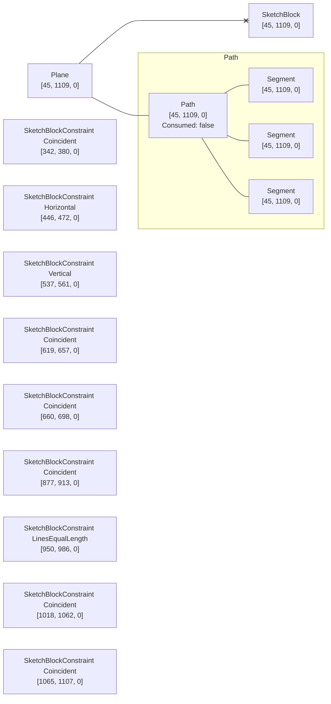

```mermaid
flowchart LR
  subgraph path2 [Path]
    2["Path<br>[45, 1109, 0]<br>Consumed: false"]
      %% [ProgramBodyItem { index: 0 }, VariableDeclarationDeclaration, VariableDeclarationInit, SketchBlock]
    3["Segment<br>[45, 1109, 0]"]
      %% [ProgramBodyItem { index: 0 }, VariableDeclarationDeclaration, VariableDeclarationInit, SketchBlock]
    4["Segment<br>[45, 1109, 0]"]
      %% [ProgramBodyItem { index: 0 }, VariableDeclarationDeclaration, VariableDeclarationInit, SketchBlock]
    5["Segment<br>[45, 1109, 0]"]
      %% [ProgramBodyItem { index: 0 }, VariableDeclarationDeclaration, VariableDeclarationInit, SketchBlock]
  end
  1["Plane<br>[45, 1109, 0]"]
    %% [ProgramBodyItem { index: 0 }, VariableDeclarationDeclaration, VariableDeclarationInit, SketchBlock]
  6["SketchBlock<br>[45, 1109, 0]"]
    %% [ProgramBodyItem { index: 0 }, VariableDeclarationDeclaration, VariableDeclarationInit, SketchBlock]
  7["SketchBlockConstraint Coincident<br>[342, 380, 0]"]
    %% [ProgramBodyItem { index: 0 }, VariableDeclarationDeclaration, VariableDeclarationInit, SketchBlock]
  8["SketchBlockConstraint Horizontal<br>[446, 472, 0]"]
    %% [ProgramBodyItem { index: 0 }, VariableDeclarationDeclaration, VariableDeclarationInit, SketchBlock]
  9["SketchBlockConstraint Vertical<br>[537, 561, 0]"]
    %% [ProgramBodyItem { index: 0 }, VariableDeclarationDeclaration, VariableDeclarationInit, SketchBlock]
  10["SketchBlockConstraint Coincident<br>[619, 657, 0]"]
    %% [ProgramBodyItem { index: 0 }, VariableDeclarationDeclaration, VariableDeclarationInit, SketchBlock]
  11["SketchBlockConstraint Coincident<br>[660, 698, 0]"]
    %% [ProgramBodyItem { index: 0 }, VariableDeclarationDeclaration, VariableDeclarationInit, SketchBlock]
  12["SketchBlockConstraint Coincident<br>[877, 913, 0]"]
    %% [ProgramBodyItem { index: 0 }, VariableDeclarationDeclaration, VariableDeclarationInit, SketchBlock]
  13["SketchBlockConstraint LinesEqualLength<br>[950, 986, 0]"]
    %% [ProgramBodyItem { index: 0 }, VariableDeclarationDeclaration, VariableDeclarationInit, SketchBlock]
  14["SketchBlockConstraint Coincident<br>[1018, 1062, 0]"]
    %% [ProgramBodyItem { index: 0 }, VariableDeclarationDeclaration, VariableDeclarationInit, SketchBlock]
  15["SketchBlockConstraint Coincident<br>[1065, 1107, 0]"]
    %% [ProgramBodyItem { index: 0 }, VariableDeclarationDeclaration, VariableDeclarationInit, SketchBlock]
  1 --- 2
  1 <--x 6
  2 --- 3
  2 --- 4
  2 --- 5
```
