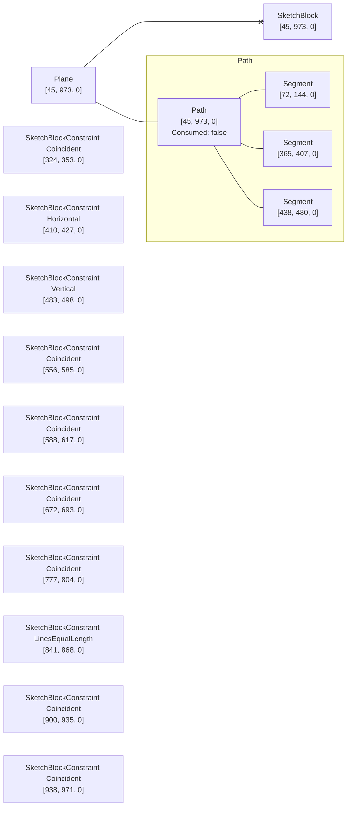

```mermaid
flowchart LR
  subgraph path2 [Path]
    2["Path<br>[45, 973, 0]<br>Consumed: false"]
      %% [ProgramBodyItem { index: 0 }, VariableDeclarationDeclaration, VariableDeclarationInit, SketchBlock]
    3["Segment<br>[72, 144, 0]"]
      %% [ProgramBodyItem { index: 0 }, VariableDeclarationDeclaration, VariableDeclarationInit, SketchBlock]
    4["Segment<br>[365, 407, 0]"]
      %% [ProgramBodyItem { index: 0 }, VariableDeclarationDeclaration, VariableDeclarationInit, SketchBlock]
    5["Segment<br>[438, 480, 0]"]
      %% [ProgramBodyItem { index: 0 }, VariableDeclarationDeclaration, VariableDeclarationInit, SketchBlock]
  end
  1["Plane<br>[45, 973, 0]"]
    %% [ProgramBodyItem { index: 0 }, VariableDeclarationDeclaration, VariableDeclarationInit, SketchBlock]
  6["SketchBlock<br>[45, 973, 0]"]
    %% [ProgramBodyItem { index: 0 }, VariableDeclarationDeclaration, VariableDeclarationInit, SketchBlock]
  7["SketchBlockConstraint Coincident<br>[324, 353, 0]"]
    %% [ProgramBodyItem { index: 0 }, VariableDeclarationDeclaration, VariableDeclarationInit, SketchBlock]
  8["SketchBlockConstraint Horizontal<br>[410, 427, 0]"]
    %% [ProgramBodyItem { index: 0 }, VariableDeclarationDeclaration, VariableDeclarationInit, SketchBlock]
  9["SketchBlockConstraint Vertical<br>[483, 498, 0]"]
    %% [ProgramBodyItem { index: 0 }, VariableDeclarationDeclaration, VariableDeclarationInit, SketchBlock]
  10["SketchBlockConstraint Coincident<br>[556, 585, 0]"]
    %% [ProgramBodyItem { index: 0 }, VariableDeclarationDeclaration, VariableDeclarationInit, SketchBlock]
  11["SketchBlockConstraint Coincident<br>[588, 617, 0]"]
    %% [ProgramBodyItem { index: 0 }, VariableDeclarationDeclaration, VariableDeclarationInit, SketchBlock]
  12["SketchBlockConstraint Coincident<br>[672, 693, 0]"]
    %% [ProgramBodyItem { index: 0 }, VariableDeclarationDeclaration, VariableDeclarationInit, SketchBlock]
  13["SketchBlockConstraint Coincident<br>[777, 804, 0]"]
    %% [ProgramBodyItem { index: 0 }, VariableDeclarationDeclaration, VariableDeclarationInit, SketchBlock]
  14["SketchBlockConstraint LinesEqualLength<br>[841, 868, 0]"]
    %% [ProgramBodyItem { index: 0 }, VariableDeclarationDeclaration, VariableDeclarationInit, SketchBlock]
  15["SketchBlockConstraint Coincident<br>[900, 935, 0]"]
    %% [ProgramBodyItem { index: 0 }, VariableDeclarationDeclaration, VariableDeclarationInit, SketchBlock]
  16["SketchBlockConstraint Coincident<br>[938, 971, 0]"]
    %% [ProgramBodyItem { index: 0 }, VariableDeclarationDeclaration, VariableDeclarationInit, SketchBlock]
  1 --- 2
  1 <--x 6
  2 --- 3
  2 --- 4
  2 --- 5
```
