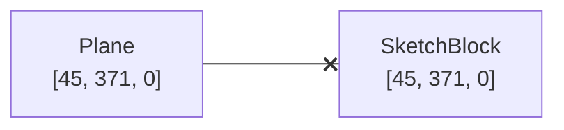

```mermaid
flowchart LR
  1["Plane<br>[45, 371, 0]"]
    %% [ProgramBodyItem { index: 0 }, VariableDeclarationDeclaration, VariableDeclarationInit, SketchBlock]
  2["SketchBlock<br>[45, 371, 0]"]
    %% [ProgramBodyItem { index: 0 }, VariableDeclarationDeclaration, VariableDeclarationInit, SketchBlock]
  1 <--x 2
```
