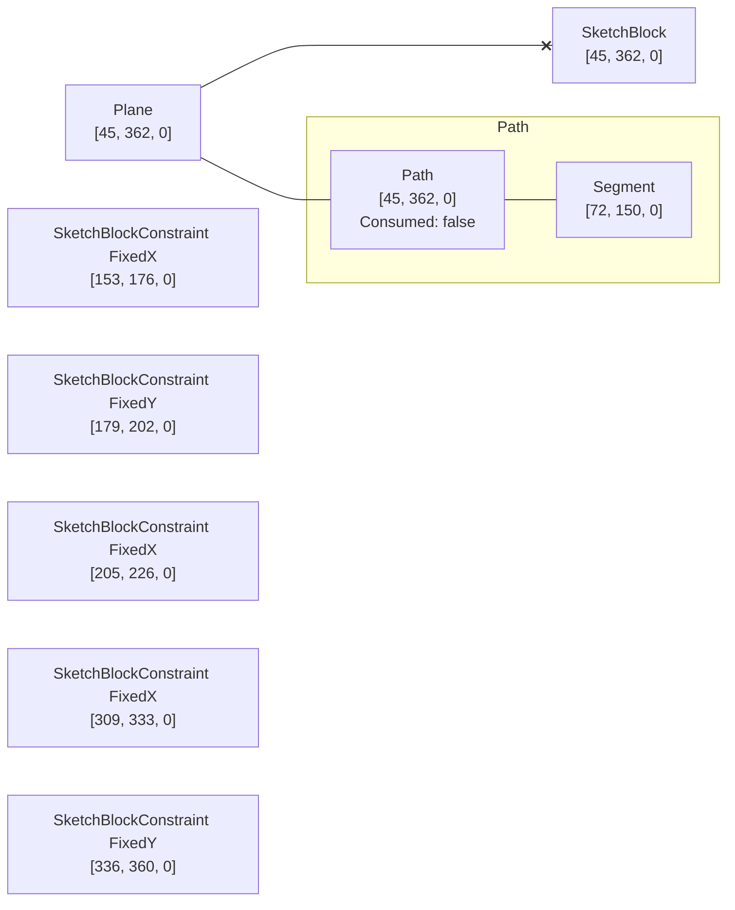

```mermaid
flowchart LR
  subgraph path2 [Path]
    2["Path<br>[45, 362, 0]<br>Consumed: false"]
      %% [ProgramBodyItem { index: 0 }, VariableDeclarationDeclaration, VariableDeclarationInit, SketchBlock]
    3["Segment<br>[72, 150, 0]"]
      %% [ProgramBodyItem { index: 0 }, VariableDeclarationDeclaration, VariableDeclarationInit, SketchBlock]
  end
  1["Plane<br>[45, 362, 0]"]
    %% [ProgramBodyItem { index: 0 }, VariableDeclarationDeclaration, VariableDeclarationInit, SketchBlock]
  4["SketchBlock<br>[45, 362, 0]"]
    %% [ProgramBodyItem { index: 0 }, VariableDeclarationDeclaration, VariableDeclarationInit, SketchBlock]
  5["SketchBlockConstraint FixedX<br>[153, 176, 0]"]
    %% [ProgramBodyItem { index: 0 }, VariableDeclarationDeclaration, VariableDeclarationInit, SketchBlock]
  6["SketchBlockConstraint FixedY<br>[179, 202, 0]"]
    %% [ProgramBodyItem { index: 0 }, VariableDeclarationDeclaration, VariableDeclarationInit, SketchBlock]
  7["SketchBlockConstraint FixedX<br>[205, 226, 0]"]
    %% [ProgramBodyItem { index: 0 }, VariableDeclarationDeclaration, VariableDeclarationInit, SketchBlock]
  8["SketchBlockConstraint FixedX<br>[309, 333, 0]"]
    %% [ProgramBodyItem { index: 0 }, VariableDeclarationDeclaration, VariableDeclarationInit, SketchBlock]
  9["SketchBlockConstraint FixedY<br>[336, 360, 0]"]
    %% [ProgramBodyItem { index: 0 }, VariableDeclarationDeclaration, VariableDeclarationInit, SketchBlock]
  1 --- 2
  1 <--x 4
  2 --- 3
```
