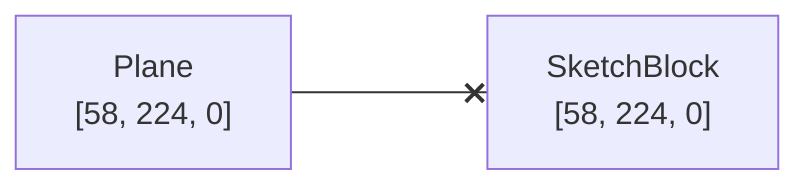

```mermaid
flowchart LR
  1["Plane<br>[58, 224, 0]"]
    %% [ProgramBodyItem { index: 1 }, VariableDeclarationDeclaration, VariableDeclarationInit]
  2["SketchBlock<br>[58, 224, 0]"]
    %% [ProgramBodyItem { index: 1 }, VariableDeclarationDeclaration, VariableDeclarationInit]
  1 <--x 2
```
