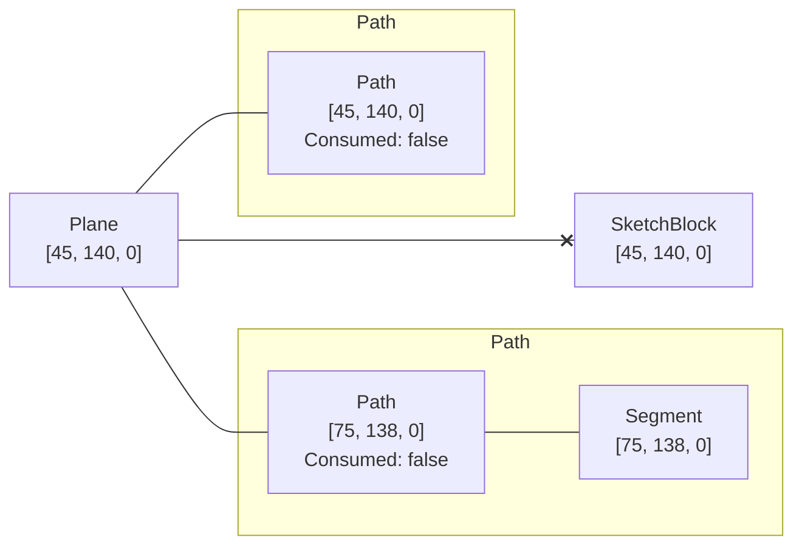

```mermaid
flowchart LR
  subgraph path2 [Path]
    2["Path<br>[45, 140, 0]<br>Consumed: false"]
      %% [ProgramBodyItem { index: 0 }, VariableDeclarationDeclaration, VariableDeclarationInit, SketchBlock]
  end
  subgraph path3 [Path]
    3["Path<br>[75, 138, 0]<br>Consumed: false"]
      %% [ProgramBodyItem { index: 0 }, VariableDeclarationDeclaration, VariableDeclarationInit, SketchBlock]
    4["Segment<br>[75, 138, 0]"]
      %% [ProgramBodyItem { index: 0 }, VariableDeclarationDeclaration, VariableDeclarationInit, SketchBlock]
  end
  1["Plane<br>[45, 140, 0]"]
    %% [ProgramBodyItem { index: 0 }, VariableDeclarationDeclaration, VariableDeclarationInit, SketchBlock]
  5["SketchBlock<br>[45, 140, 0]"]
    %% [ProgramBodyItem { index: 0 }, VariableDeclarationDeclaration, VariableDeclarationInit, SketchBlock]
  1 --- 2
  1 --- 3
  1 <--x 5
  3 --- 4
```
