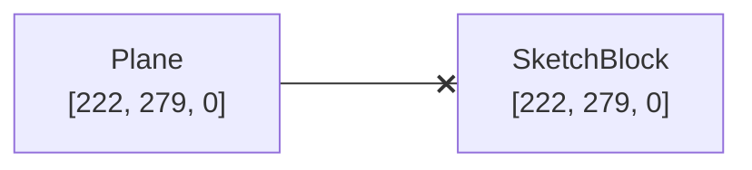

```mermaid
flowchart LR
  1["Plane<br>[222, 279, 0]"]
    %% [ProgramBodyItem { index: 2 }, VariableDeclarationDeclaration, VariableDeclarationInit]
  2["SketchBlock<br>[222, 279, 0]"]
    %% [ProgramBodyItem { index: 2 }, VariableDeclarationDeclaration, VariableDeclarationInit]
  1 <--x 2
```
