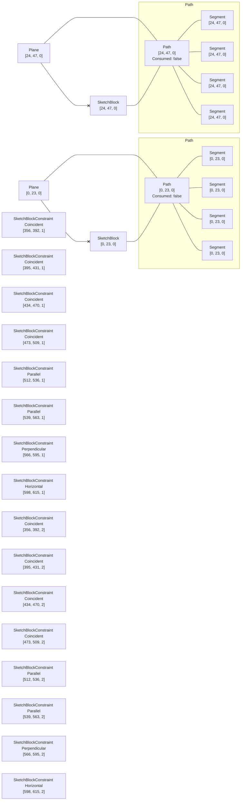

```mermaid
flowchart LR
  subgraph path1 [Path]
    1["Path<br>[0, 23, 0]<br>Consumed: false"]
      %% [ProgramBodyItem { index: 0 }]
    3["Segment<br>[0, 23, 0]"]
      %% [ProgramBodyItem { index: 0 }]
    4["Segment<br>[0, 23, 0]"]
      %% [ProgramBodyItem { index: 0 }]
    5["Segment<br>[0, 23, 0]"]
      %% [ProgramBodyItem { index: 0 }]
    6["Segment<br>[0, 23, 0]"]
      %% [ProgramBodyItem { index: 0 }]
  end
  subgraph path8 [Path]
    8["Path<br>[24, 47, 0]<br>Consumed: false"]
      %% [ProgramBodyItem { index: 1 }]
    10["Segment<br>[24, 47, 0]"]
      %% [ProgramBodyItem { index: 1 }]
    11["Segment<br>[24, 47, 0]"]
      %% [ProgramBodyItem { index: 1 }]
    12["Segment<br>[24, 47, 0]"]
      %% [ProgramBodyItem { index: 1 }]
    13["Segment<br>[24, 47, 0]"]
      %% [ProgramBodyItem { index: 1 }]
  end
  2["Plane<br>[0, 23, 0]"]
    %% [ProgramBodyItem { index: 0 }]
  7["SketchBlock<br>[0, 23, 0]"]
    %% [ProgramBodyItem { index: 0 }]
  9["Plane<br>[24, 47, 0]"]
    %% [ProgramBodyItem { index: 1 }]
  14["SketchBlock<br>[24, 47, 0]"]
    %% [ProgramBodyItem { index: 1 }]
  15["SketchBlockConstraint Coincident<br>[356, 392, 1]"]
    %% [ProgramBodyItem { index: 0 }, VariableDeclarationDeclaration, VariableDeclarationInit, SketchBlockBody, SketchBlockBodyItem { index: 4 }, ExpressionStatementExpr]
  16["SketchBlockConstraint Coincident<br>[395, 431, 1]"]
    %% [ProgramBodyItem { index: 0 }, VariableDeclarationDeclaration, VariableDeclarationInit, SketchBlockBody, SketchBlockBodyItem { index: 5 }, ExpressionStatementExpr]
  17["SketchBlockConstraint Coincident<br>[434, 470, 1]"]
    %% [ProgramBodyItem { index: 0 }, VariableDeclarationDeclaration, VariableDeclarationInit, SketchBlockBody, SketchBlockBodyItem { index: 6 }, ExpressionStatementExpr]
  18["SketchBlockConstraint Coincident<br>[473, 509, 1]"]
    %% [ProgramBodyItem { index: 0 }, VariableDeclarationDeclaration, VariableDeclarationInit, SketchBlockBody, SketchBlockBodyItem { index: 7 }, ExpressionStatementExpr]
  19["SketchBlockConstraint Parallel<br>[512, 536, 1]"]
    %% [ProgramBodyItem { index: 0 }, VariableDeclarationDeclaration, VariableDeclarationInit, SketchBlockBody, SketchBlockBodyItem { index: 8 }, ExpressionStatementExpr]
  20["SketchBlockConstraint Parallel<br>[539, 563, 1]"]
    %% [ProgramBodyItem { index: 0 }, VariableDeclarationDeclaration, VariableDeclarationInit, SketchBlockBody, SketchBlockBodyItem { index: 9 }, ExpressionStatementExpr]
  21["SketchBlockConstraint Perpendicular<br>[566, 595, 1]"]
    %% [ProgramBodyItem { index: 0 }, VariableDeclarationDeclaration, VariableDeclarationInit, SketchBlockBody, SketchBlockBodyItem { index: 10 }, ExpressionStatementExpr]
  22["SketchBlockConstraint Horizontal<br>[598, 615, 1]"]
    %% [ProgramBodyItem { index: 0 }, VariableDeclarationDeclaration, VariableDeclarationInit, SketchBlockBody, SketchBlockBodyItem { index: 11 }, ExpressionStatementExpr]
  23["SketchBlockConstraint Coincident<br>[356, 392, 2]"]
    %% [ProgramBodyItem { index: 0 }, VariableDeclarationDeclaration, VariableDeclarationInit, SketchBlockBody, SketchBlockBodyItem { index: 4 }, ExpressionStatementExpr]
  24["SketchBlockConstraint Coincident<br>[395, 431, 2]"]
    %% [ProgramBodyItem { index: 0 }, VariableDeclarationDeclaration, VariableDeclarationInit, SketchBlockBody, SketchBlockBodyItem { index: 5 }, ExpressionStatementExpr]
  25["SketchBlockConstraint Coincident<br>[434, 470, 2]"]
    %% [ProgramBodyItem { index: 0 }, VariableDeclarationDeclaration, VariableDeclarationInit, SketchBlockBody, SketchBlockBodyItem { index: 6 }, ExpressionStatementExpr]
  26["SketchBlockConstraint Coincident<br>[473, 509, 2]"]
    %% [ProgramBodyItem { index: 0 }, VariableDeclarationDeclaration, VariableDeclarationInit, SketchBlockBody, SketchBlockBodyItem { index: 7 }, ExpressionStatementExpr]
  27["SketchBlockConstraint Parallel<br>[512, 536, 2]"]
    %% [ProgramBodyItem { index: 0 }, VariableDeclarationDeclaration, VariableDeclarationInit, SketchBlockBody, SketchBlockBodyItem { index: 8 }, ExpressionStatementExpr]
  28["SketchBlockConstraint Parallel<br>[539, 563, 2]"]
    %% [ProgramBodyItem { index: 0 }, VariableDeclarationDeclaration, VariableDeclarationInit, SketchBlockBody, SketchBlockBodyItem { index: 9 }, ExpressionStatementExpr]
  29["SketchBlockConstraint Perpendicular<br>[566, 595, 2]"]
    %% [ProgramBodyItem { index: 0 }, VariableDeclarationDeclaration, VariableDeclarationInit, SketchBlockBody, SketchBlockBodyItem { index: 10 }, ExpressionStatementExpr]
  30["SketchBlockConstraint Horizontal<br>[598, 615, 2]"]
    %% [ProgramBodyItem { index: 0 }, VariableDeclarationDeclaration, VariableDeclarationInit, SketchBlockBody, SketchBlockBodyItem { index: 11 }, ExpressionStatementExpr]
  2 --- 1
  1 --- 3
  1 --- 4
  1 --- 5
  1 --- 6
  7 --- 1
  2 <--x 7
  9 --- 8
  8 --- 10
  8 --- 11
  8 --- 12
  8 --- 13
  14 --- 8
  9 <--x 14
```
