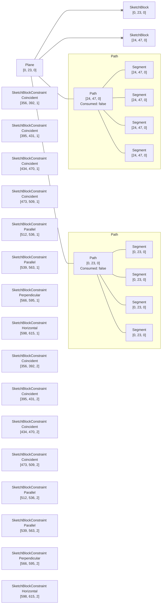

```mermaid
flowchart LR
  subgraph path2 [Path]
    2["Path<br>[0, 23, 0]<br>Consumed: false"]
      %% [ProgramBodyItem { index: 0 }]
    3["Segment<br>[0, 23, 0]"]
      %% [ProgramBodyItem { index: 0 }]
    4["Segment<br>[0, 23, 0]"]
      %% [ProgramBodyItem { index: 0 }]
    5["Segment<br>[0, 23, 0]"]
      %% [ProgramBodyItem { index: 0 }]
    6["Segment<br>[0, 23, 0]"]
      %% [ProgramBodyItem { index: 0 }]
  end
  subgraph path7 [Path]
    7["Path<br>[24, 47, 0]<br>Consumed: false"]
      %% [ProgramBodyItem { index: 1 }]
    8["Segment<br>[24, 47, 0]"]
      %% [ProgramBodyItem { index: 1 }]
    9["Segment<br>[24, 47, 0]"]
      %% [ProgramBodyItem { index: 1 }]
    10["Segment<br>[24, 47, 0]"]
      %% [ProgramBodyItem { index: 1 }]
    11["Segment<br>[24, 47, 0]"]
      %% [ProgramBodyItem { index: 1 }]
  end
  1["Plane<br>[0, 23, 0]"]
    %% [ProgramBodyItem { index: 0 }]
  12["SketchBlock<br>[0, 23, 0]"]
    %% [ProgramBodyItem { index: 0 }]
  13["SketchBlockConstraint Coincident<br>[356, 392, 1]"]
    %% [ProgramBodyItem { index: 0 }, VariableDeclarationDeclaration, VariableDeclarationInit, SketchBlockBody, SketchBlockBodyItem { index: 4 }, ExpressionStatementExpr]
  14["SketchBlockConstraint Coincident<br>[395, 431, 1]"]
    %% [ProgramBodyItem { index: 0 }, VariableDeclarationDeclaration, VariableDeclarationInit, SketchBlockBody, SketchBlockBodyItem { index: 5 }, ExpressionStatementExpr]
  15["SketchBlockConstraint Coincident<br>[434, 470, 1]"]
    %% [ProgramBodyItem { index: 0 }, VariableDeclarationDeclaration, VariableDeclarationInit, SketchBlockBody, SketchBlockBodyItem { index: 6 }, ExpressionStatementExpr]
  16["SketchBlockConstraint Coincident<br>[473, 509, 1]"]
    %% [ProgramBodyItem { index: 0 }, VariableDeclarationDeclaration, VariableDeclarationInit, SketchBlockBody, SketchBlockBodyItem { index: 7 }, ExpressionStatementExpr]
  17["SketchBlockConstraint Parallel<br>[512, 536, 1]"]
    %% [ProgramBodyItem { index: 0 }, VariableDeclarationDeclaration, VariableDeclarationInit, SketchBlockBody, SketchBlockBodyItem { index: 8 }, ExpressionStatementExpr]
  18["SketchBlockConstraint Parallel<br>[539, 563, 1]"]
    %% [ProgramBodyItem { index: 0 }, VariableDeclarationDeclaration, VariableDeclarationInit, SketchBlockBody, SketchBlockBodyItem { index: 9 }, ExpressionStatementExpr]
  19["SketchBlockConstraint Perpendicular<br>[566, 595, 1]"]
    %% [ProgramBodyItem { index: 0 }, VariableDeclarationDeclaration, VariableDeclarationInit, SketchBlockBody, SketchBlockBodyItem { index: 10 }, ExpressionStatementExpr]
  20["SketchBlockConstraint Horizontal<br>[598, 615, 1]"]
    %% [ProgramBodyItem { index: 0 }, VariableDeclarationDeclaration, VariableDeclarationInit, SketchBlockBody, SketchBlockBodyItem { index: 11 }, ExpressionStatementExpr]
  21["SketchBlock<br>[24, 47, 0]"]
    %% [ProgramBodyItem { index: 1 }]
  22["SketchBlockConstraint Coincident<br>[356, 392, 2]"]
    %% [ProgramBodyItem { index: 0 }, VariableDeclarationDeclaration, VariableDeclarationInit, SketchBlockBody, SketchBlockBodyItem { index: 4 }, ExpressionStatementExpr]
  23["SketchBlockConstraint Coincident<br>[395, 431, 2]"]
    %% [ProgramBodyItem { index: 0 }, VariableDeclarationDeclaration, VariableDeclarationInit, SketchBlockBody, SketchBlockBodyItem { index: 5 }, ExpressionStatementExpr]
  24["SketchBlockConstraint Coincident<br>[434, 470, 2]"]
    %% [ProgramBodyItem { index: 0 }, VariableDeclarationDeclaration, VariableDeclarationInit, SketchBlockBody, SketchBlockBodyItem { index: 6 }, ExpressionStatementExpr]
  25["SketchBlockConstraint Coincident<br>[473, 509, 2]"]
    %% [ProgramBodyItem { index: 0 }, VariableDeclarationDeclaration, VariableDeclarationInit, SketchBlockBody, SketchBlockBodyItem { index: 7 }, ExpressionStatementExpr]
  26["SketchBlockConstraint Parallel<br>[512, 536, 2]"]
    %% [ProgramBodyItem { index: 0 }, VariableDeclarationDeclaration, VariableDeclarationInit, SketchBlockBody, SketchBlockBodyItem { index: 8 }, ExpressionStatementExpr]
  27["SketchBlockConstraint Parallel<br>[539, 563, 2]"]
    %% [ProgramBodyItem { index: 0 }, VariableDeclarationDeclaration, VariableDeclarationInit, SketchBlockBody, SketchBlockBodyItem { index: 9 }, ExpressionStatementExpr]
  28["SketchBlockConstraint Perpendicular<br>[566, 595, 2]"]
    %% [ProgramBodyItem { index: 0 }, VariableDeclarationDeclaration, VariableDeclarationInit, SketchBlockBody, SketchBlockBodyItem { index: 10 }, ExpressionStatementExpr]
  29["SketchBlockConstraint Horizontal<br>[598, 615, 2]"]
    %% [ProgramBodyItem { index: 0 }, VariableDeclarationDeclaration, VariableDeclarationInit, SketchBlockBody, SketchBlockBodyItem { index: 11 }, ExpressionStatementExpr]
  1 --- 2
  1 --- 7
  1 <--x 12
  1 <--x 21
  2 --- 3
  2 --- 4
  2 --- 5
  2 --- 6
  7 --- 8
  7 --- 9
  7 --- 10
  7 --- 11
```
