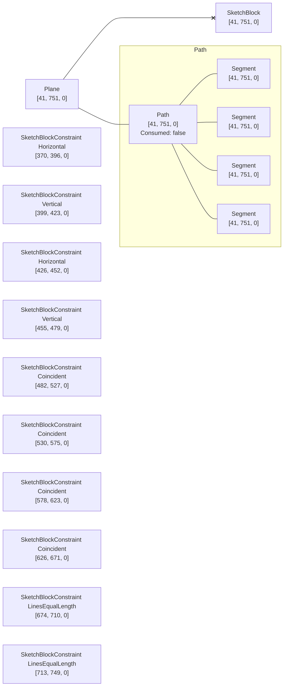

```mermaid
flowchart LR
  subgraph path2 [Path]
    2["Path<br>[41, 751, 0]<br>Consumed: false"]
      %% [ProgramBodyItem { index: 0 }, ExpressionStatementExpr, SketchBlock]
    3["Segment<br>[41, 751, 0]"]
      %% [ProgramBodyItem { index: 0 }, ExpressionStatementExpr, SketchBlock]
    4["Segment<br>[41, 751, 0]"]
      %% [ProgramBodyItem { index: 0 }, ExpressionStatementExpr, SketchBlock]
    5["Segment<br>[41, 751, 0]"]
      %% [ProgramBodyItem { index: 0 }, ExpressionStatementExpr, SketchBlock]
    6["Segment<br>[41, 751, 0]"]
      %% [ProgramBodyItem { index: 0 }, ExpressionStatementExpr, SketchBlock]
  end
  1["Plane<br>[41, 751, 0]"]
    %% [ProgramBodyItem { index: 0 }, ExpressionStatementExpr, SketchBlock]
  7["SketchBlock<br>[41, 751, 0]"]
    %% [ProgramBodyItem { index: 0 }, ExpressionStatementExpr, SketchBlock]
  8["SketchBlockConstraint Horizontal<br>[370, 396, 0]"]
    %% [ProgramBodyItem { index: 0 }, ExpressionStatementExpr, SketchBlock]
  9["SketchBlockConstraint Vertical<br>[399, 423, 0]"]
    %% [ProgramBodyItem { index: 0 }, ExpressionStatementExpr, SketchBlock]
  10["SketchBlockConstraint Horizontal<br>[426, 452, 0]"]
    %% [ProgramBodyItem { index: 0 }, ExpressionStatementExpr, SketchBlock]
  11["SketchBlockConstraint Vertical<br>[455, 479, 0]"]
    %% [ProgramBodyItem { index: 0 }, ExpressionStatementExpr, SketchBlock]
  12["SketchBlockConstraint Coincident<br>[482, 527, 0]"]
    %% [ProgramBodyItem { index: 0 }, ExpressionStatementExpr, SketchBlock]
  13["SketchBlockConstraint Coincident<br>[530, 575, 0]"]
    %% [ProgramBodyItem { index: 0 }, ExpressionStatementExpr, SketchBlock]
  14["SketchBlockConstraint Coincident<br>[578, 623, 0]"]
    %% [ProgramBodyItem { index: 0 }, ExpressionStatementExpr, SketchBlock]
  15["SketchBlockConstraint Coincident<br>[626, 671, 0]"]
    %% [ProgramBodyItem { index: 0 }, ExpressionStatementExpr, SketchBlock]
  16["SketchBlockConstraint LinesEqualLength<br>[674, 710, 0]"]
    %% [ProgramBodyItem { index: 0 }, ExpressionStatementExpr, SketchBlock]
  17["SketchBlockConstraint LinesEqualLength<br>[713, 749, 0]"]
    %% [ProgramBodyItem { index: 0 }, ExpressionStatementExpr, SketchBlock]
  1 --- 2
  1 <--x 7
  2 --- 3
  2 --- 4
  2 --- 5
  2 --- 6
```
