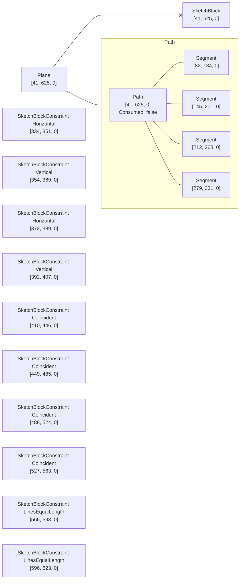

```mermaid
flowchart LR
  subgraph path2 [Path]
    2["Path<br>[41, 625, 0]<br>Consumed: false"]
      %% [ProgramBodyItem { index: 0 }, ExpressionStatementExpr]
    3["Segment<br>[82, 134, 0]"]
      %% [ProgramBodyItem { index: 0 }, ExpressionStatementExpr, SketchBlockBody, SketchBlockBodyItem { index: 0 }, VariableDeclarationDeclaration, VariableDeclarationInit]
    4["Segment<br>[145, 201, 0]"]
      %% [ProgramBodyItem { index: 0 }, ExpressionStatementExpr, SketchBlockBody, SketchBlockBodyItem { index: 1 }, VariableDeclarationDeclaration, VariableDeclarationInit]
    5["Segment<br>[212, 268, 0]"]
      %% [ProgramBodyItem { index: 0 }, ExpressionStatementExpr, SketchBlockBody, SketchBlockBodyItem { index: 2 }, VariableDeclarationDeclaration, VariableDeclarationInit]
    6["Segment<br>[279, 331, 0]"]
      %% [ProgramBodyItem { index: 0 }, ExpressionStatementExpr, SketchBlockBody, SketchBlockBodyItem { index: 3 }, VariableDeclarationDeclaration, VariableDeclarationInit]
  end
  1["Plane<br>[41, 625, 0]"]
    %% [ProgramBodyItem { index: 0 }, ExpressionStatementExpr]
  7["SketchBlock<br>[41, 625, 0]"]
    %% [ProgramBodyItem { index: 0 }, ExpressionStatementExpr]
  8["SketchBlockConstraint Horizontal<br>[334, 351, 0]"]
    %% [ProgramBodyItem { index: 0 }, ExpressionStatementExpr, SketchBlockBody, SketchBlockBodyItem { index: 4 }, ExpressionStatementExpr]
  9["SketchBlockConstraint Vertical<br>[354, 369, 0]"]
    %% [ProgramBodyItem { index: 0 }, ExpressionStatementExpr, SketchBlockBody, SketchBlockBodyItem { index: 5 }, ExpressionStatementExpr]
  10["SketchBlockConstraint Horizontal<br>[372, 389, 0]"]
    %% [ProgramBodyItem { index: 0 }, ExpressionStatementExpr, SketchBlockBody, SketchBlockBodyItem { index: 6 }, ExpressionStatementExpr]
  11["SketchBlockConstraint Vertical<br>[392, 407, 0]"]
    %% [ProgramBodyItem { index: 0 }, ExpressionStatementExpr, SketchBlockBody, SketchBlockBodyItem { index: 7 }, ExpressionStatementExpr]
  12["SketchBlockConstraint Coincident<br>[410, 446, 0]"]
    %% [ProgramBodyItem { index: 0 }, ExpressionStatementExpr, SketchBlockBody, SketchBlockBodyItem { index: 8 }, ExpressionStatementExpr]
  13["SketchBlockConstraint Coincident<br>[449, 485, 0]"]
    %% [ProgramBodyItem { index: 0 }, ExpressionStatementExpr, SketchBlockBody, SketchBlockBodyItem { index: 9 }, ExpressionStatementExpr]
  14["SketchBlockConstraint Coincident<br>[488, 524, 0]"]
    %% [ProgramBodyItem { index: 0 }, ExpressionStatementExpr, SketchBlockBody, SketchBlockBodyItem { index: 10 }, ExpressionStatementExpr]
  15["SketchBlockConstraint Coincident<br>[527, 563, 0]"]
    %% [ProgramBodyItem { index: 0 }, ExpressionStatementExpr, SketchBlockBody, SketchBlockBodyItem { index: 11 }, ExpressionStatementExpr]
  16["SketchBlockConstraint LinesEqualLength<br>[566, 593, 0]"]
    %% [ProgramBodyItem { index: 0 }, ExpressionStatementExpr, SketchBlockBody, SketchBlockBodyItem { index: 12 }, ExpressionStatementExpr]
  17["SketchBlockConstraint LinesEqualLength<br>[596, 623, 0]"]
    %% [ProgramBodyItem { index: 0 }, ExpressionStatementExpr, SketchBlockBody, SketchBlockBodyItem { index: 13 }, ExpressionStatementExpr]
  1 --- 2
  1 <--x 7
  2 --- 3
  2 --- 4
  2 --- 5
  2 --- 6
```
