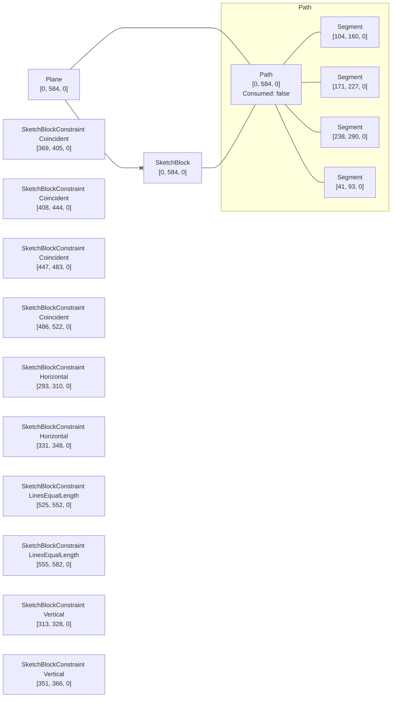

```mermaid
flowchart LR
  subgraph path1 [Path]
    1["Path<br>[0, 584, 0]<br>Consumed: false"]
      %% [ProgramBodyItem { index: 0 }, ExpressionStatementExpr]
    3["Segment<br>[104, 160, 0]"]
      %% [ProgramBodyItem { index: 0 }, ExpressionStatementExpr, SketchBlockBody, SketchBlockBodyItem { index: 1 }, VariableDeclarationDeclaration, VariableDeclarationInit]
    4["Segment<br>[171, 227, 0]"]
      %% [ProgramBodyItem { index: 0 }, ExpressionStatementExpr, SketchBlockBody, SketchBlockBodyItem { index: 2 }, VariableDeclarationDeclaration, VariableDeclarationInit]
    5["Segment<br>[238, 290, 0]"]
      %% [ProgramBodyItem { index: 0 }, ExpressionStatementExpr, SketchBlockBody, SketchBlockBodyItem { index: 3 }, VariableDeclarationDeclaration, VariableDeclarationInit]
    6["Segment<br>[41, 93, 0]"]
      %% [ProgramBodyItem { index: 0 }, ExpressionStatementExpr, SketchBlockBody, SketchBlockBodyItem { index: 0 }, VariableDeclarationDeclaration, VariableDeclarationInit]
  end
  2["Plane<br>[0, 584, 0]"]
    %% [ProgramBodyItem { index: 0 }, ExpressionStatementExpr]
  7["SketchBlock<br>[0, 584, 0]"]
    %% [ProgramBodyItem { index: 0 }, ExpressionStatementExpr]
  8["SketchBlockConstraint Coincident<br>[369, 405, 0]"]
    %% [ProgramBodyItem { index: 0 }, ExpressionStatementExpr, SketchBlockBody, SketchBlockBodyItem { index: 8 }, ExpressionStatementExpr]
  9["SketchBlockConstraint Coincident<br>[408, 444, 0]"]
    %% [ProgramBodyItem { index: 0 }, ExpressionStatementExpr, SketchBlockBody, SketchBlockBodyItem { index: 9 }, ExpressionStatementExpr]
  10["SketchBlockConstraint Coincident<br>[447, 483, 0]"]
    %% [ProgramBodyItem { index: 0 }, ExpressionStatementExpr, SketchBlockBody, SketchBlockBodyItem { index: 10 }, ExpressionStatementExpr]
  11["SketchBlockConstraint Coincident<br>[486, 522, 0]"]
    %% [ProgramBodyItem { index: 0 }, ExpressionStatementExpr, SketchBlockBody, SketchBlockBodyItem { index: 11 }, ExpressionStatementExpr]
  12["SketchBlockConstraint Horizontal<br>[293, 310, 0]"]
    %% [ProgramBodyItem { index: 0 }, ExpressionStatementExpr, SketchBlockBody, SketchBlockBodyItem { index: 4 }, ExpressionStatementExpr]
  13["SketchBlockConstraint Horizontal<br>[331, 348, 0]"]
    %% [ProgramBodyItem { index: 0 }, ExpressionStatementExpr, SketchBlockBody, SketchBlockBodyItem { index: 6 }, ExpressionStatementExpr]
  14["SketchBlockConstraint LinesEqualLength<br>[525, 552, 0]"]
    %% [ProgramBodyItem { index: 0 }, ExpressionStatementExpr, SketchBlockBody, SketchBlockBodyItem { index: 12 }, ExpressionStatementExpr]
  15["SketchBlockConstraint LinesEqualLength<br>[555, 582, 0]"]
    %% [ProgramBodyItem { index: 0 }, ExpressionStatementExpr, SketchBlockBody, SketchBlockBodyItem { index: 13 }, ExpressionStatementExpr]
  16["SketchBlockConstraint Vertical<br>[313, 328, 0]"]
    %% [ProgramBodyItem { index: 0 }, ExpressionStatementExpr, SketchBlockBody, SketchBlockBodyItem { index: 5 }, ExpressionStatementExpr]
  17["SketchBlockConstraint Vertical<br>[351, 366, 0]"]
    %% [ProgramBodyItem { index: 0 }, ExpressionStatementExpr, SketchBlockBody, SketchBlockBodyItem { index: 7 }, ExpressionStatementExpr]
  2 --- 1
  1 --- 3
  1 --- 4
  1 --- 5
  1 --- 6
  7 --- 1
  2 <--x 7
```
