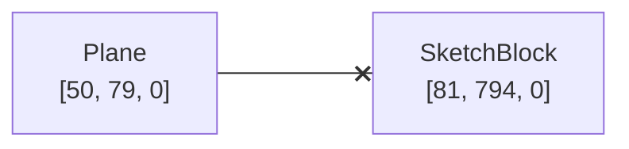

```mermaid
flowchart LR
  1["Plane<br>[50, 79, 0]"]
    %% [ProgramBodyItem { index: 0 }, VariableDeclarationDeclaration, VariableDeclarationInit]
  2["SketchBlock<br>[81, 794, 0]"]
    %% [ProgramBodyItem { index: 1 }, ExpressionStatementExpr, SketchBlock]
  1 <--x 2
```
