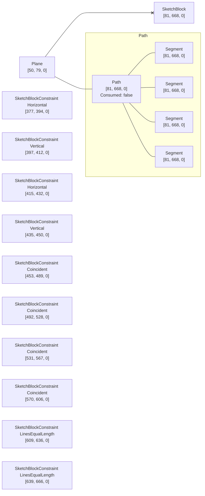

```mermaid
flowchart LR
  subgraph path2 [Path]
    2["Path<br>[81, 668, 0]<br>Consumed: false"]
      %% [ProgramBodyItem { index: 1 }, ExpressionStatementExpr, SketchBlock]
    3["Segment<br>[81, 668, 0]"]
      %% [ProgramBodyItem { index: 1 }, ExpressionStatementExpr, SketchBlock]
    4["Segment<br>[81, 668, 0]"]
      %% [ProgramBodyItem { index: 1 }, ExpressionStatementExpr, SketchBlock]
    5["Segment<br>[81, 668, 0]"]
      %% [ProgramBodyItem { index: 1 }, ExpressionStatementExpr, SketchBlock]
    6["Segment<br>[81, 668, 0]"]
      %% [ProgramBodyItem { index: 1 }, ExpressionStatementExpr, SketchBlock]
  end
  1["Plane<br>[50, 79, 0]"]
    %% [ProgramBodyItem { index: 0 }, VariableDeclarationDeclaration, VariableDeclarationInit]
  7["SketchBlock<br>[81, 668, 0]"]
    %% [ProgramBodyItem { index: 1 }, ExpressionStatementExpr, SketchBlock]
  8["SketchBlockConstraint Horizontal<br>[377, 394, 0]"]
    %% [ProgramBodyItem { index: 1 }, ExpressionStatementExpr, SketchBlock]
  9["SketchBlockConstraint Vertical<br>[397, 412, 0]"]
    %% [ProgramBodyItem { index: 1 }, ExpressionStatementExpr, SketchBlock]
  10["SketchBlockConstraint Horizontal<br>[415, 432, 0]"]
    %% [ProgramBodyItem { index: 1 }, ExpressionStatementExpr, SketchBlock]
  11["SketchBlockConstraint Vertical<br>[435, 450, 0]"]
    %% [ProgramBodyItem { index: 1 }, ExpressionStatementExpr, SketchBlock]
  12["SketchBlockConstraint Coincident<br>[453, 489, 0]"]
    %% [ProgramBodyItem { index: 1 }, ExpressionStatementExpr, SketchBlock]
  13["SketchBlockConstraint Coincident<br>[492, 528, 0]"]
    %% [ProgramBodyItem { index: 1 }, ExpressionStatementExpr, SketchBlock]
  14["SketchBlockConstraint Coincident<br>[531, 567, 0]"]
    %% [ProgramBodyItem { index: 1 }, ExpressionStatementExpr, SketchBlock]
  15["SketchBlockConstraint Coincident<br>[570, 606, 0]"]
    %% [ProgramBodyItem { index: 1 }, ExpressionStatementExpr, SketchBlock]
  16["SketchBlockConstraint LinesEqualLength<br>[609, 636, 0]"]
    %% [ProgramBodyItem { index: 1 }, ExpressionStatementExpr, SketchBlock]
  17["SketchBlockConstraint LinesEqualLength<br>[639, 666, 0]"]
    %% [ProgramBodyItem { index: 1 }, ExpressionStatementExpr, SketchBlock]
  1 --- 2
  1 <--x 7
  2 --- 3
  2 --- 4
  2 --- 5
  2 --- 6
```
