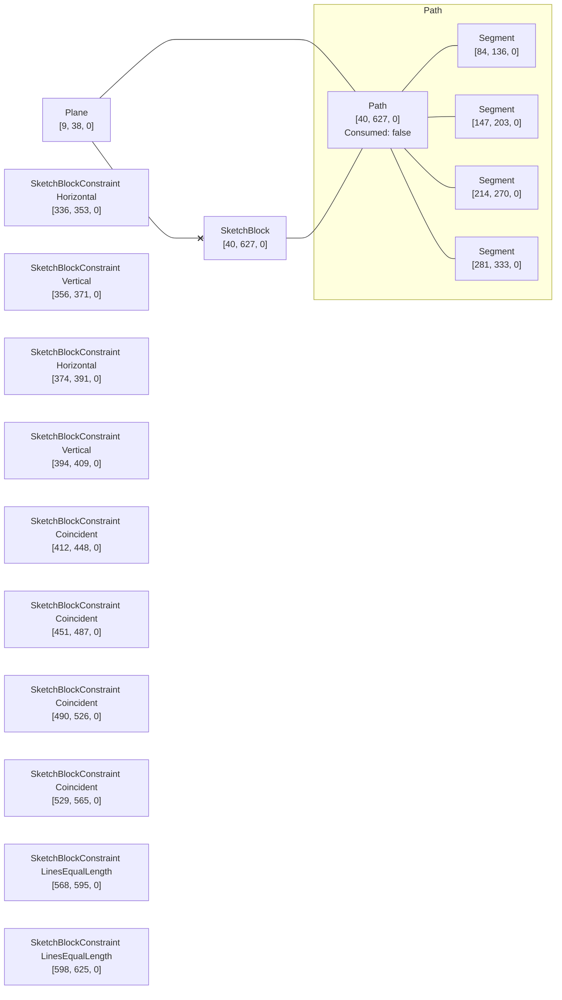

```mermaid
flowchart LR
  subgraph path2 [Path]
    2["Path<br>[40, 627, 0]<br>Consumed: false"]
      %% [ProgramBodyItem { index: 1 }, ExpressionStatementExpr]
    3["Segment<br>[84, 136, 0]"]
      %% [ProgramBodyItem { index: 1 }, ExpressionStatementExpr, SketchBlockBody, SketchBlockBodyItem { index: 0 }, VariableDeclarationDeclaration, VariableDeclarationInit]
    4["Segment<br>[147, 203, 0]"]
      %% [ProgramBodyItem { index: 1 }, ExpressionStatementExpr, SketchBlockBody, SketchBlockBodyItem { index: 1 }, VariableDeclarationDeclaration, VariableDeclarationInit]
    5["Segment<br>[214, 270, 0]"]
      %% [ProgramBodyItem { index: 1 }, ExpressionStatementExpr, SketchBlockBody, SketchBlockBodyItem { index: 2 }, VariableDeclarationDeclaration, VariableDeclarationInit]
    6["Segment<br>[281, 333, 0]"]
      %% [ProgramBodyItem { index: 1 }, ExpressionStatementExpr, SketchBlockBody, SketchBlockBodyItem { index: 3 }, VariableDeclarationDeclaration, VariableDeclarationInit]
  end
  1["Plane<br>[9, 38, 0]"]
    %% [ProgramBodyItem { index: 0 }, VariableDeclarationDeclaration, VariableDeclarationInit]
  7["SketchBlock<br>[40, 627, 0]"]
    %% [ProgramBodyItem { index: 1 }, ExpressionStatementExpr]
  8["SketchBlockConstraint Horizontal<br>[336, 353, 0]"]
    %% [ProgramBodyItem { index: 1 }, ExpressionStatementExpr, SketchBlockBody, SketchBlockBodyItem { index: 4 }, ExpressionStatementExpr]
  9["SketchBlockConstraint Vertical<br>[356, 371, 0]"]
    %% [ProgramBodyItem { index: 1 }, ExpressionStatementExpr, SketchBlockBody, SketchBlockBodyItem { index: 5 }, ExpressionStatementExpr]
  10["SketchBlockConstraint Horizontal<br>[374, 391, 0]"]
    %% [ProgramBodyItem { index: 1 }, ExpressionStatementExpr, SketchBlockBody, SketchBlockBodyItem { index: 6 }, ExpressionStatementExpr]
  11["SketchBlockConstraint Vertical<br>[394, 409, 0]"]
    %% [ProgramBodyItem { index: 1 }, ExpressionStatementExpr, SketchBlockBody, SketchBlockBodyItem { index: 7 }, ExpressionStatementExpr]
  12["SketchBlockConstraint Coincident<br>[412, 448, 0]"]
    %% [ProgramBodyItem { index: 1 }, ExpressionStatementExpr, SketchBlockBody, SketchBlockBodyItem { index: 8 }, ExpressionStatementExpr]
  13["SketchBlockConstraint Coincident<br>[451, 487, 0]"]
    %% [ProgramBodyItem { index: 1 }, ExpressionStatementExpr, SketchBlockBody, SketchBlockBodyItem { index: 9 }, ExpressionStatementExpr]
  14["SketchBlockConstraint Coincident<br>[490, 526, 0]"]
    %% [ProgramBodyItem { index: 1 }, ExpressionStatementExpr, SketchBlockBody, SketchBlockBodyItem { index: 10 }, ExpressionStatementExpr]
  15["SketchBlockConstraint Coincident<br>[529, 565, 0]"]
    %% [ProgramBodyItem { index: 1 }, ExpressionStatementExpr, SketchBlockBody, SketchBlockBodyItem { index: 11 }, ExpressionStatementExpr]
  16["SketchBlockConstraint LinesEqualLength<br>[568, 595, 0]"]
    %% [ProgramBodyItem { index: 1 }, ExpressionStatementExpr, SketchBlockBody, SketchBlockBodyItem { index: 12 }, ExpressionStatementExpr]
  17["SketchBlockConstraint LinesEqualLength<br>[598, 625, 0]"]
    %% [ProgramBodyItem { index: 1 }, ExpressionStatementExpr, SketchBlockBody, SketchBlockBodyItem { index: 13 }, ExpressionStatementExpr]
  1 --- 2
  1 <--x 7
  2 --- 3
  2 --- 4
  2 --- 5
  2 --- 6
  7 --- 2
```
