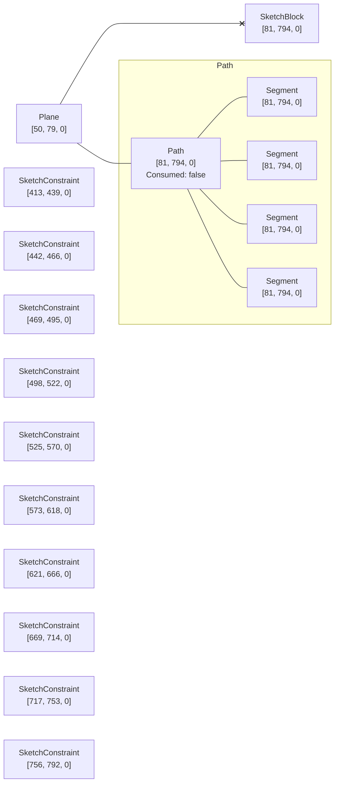

```mermaid
flowchart LR
  subgraph path2 [Path]
    2["Path<br>[81, 794, 0]<br>Consumed: false"]
      %% [ProgramBodyItem { index: 1 }, ExpressionStatementExpr, SketchBlock]
    3["Segment<br>[81, 794, 0]"]
      %% [ProgramBodyItem { index: 1 }, ExpressionStatementExpr, SketchBlock]
    4["Segment<br>[81, 794, 0]"]
      %% [ProgramBodyItem { index: 1 }, ExpressionStatementExpr, SketchBlock]
    5["Segment<br>[81, 794, 0]"]
      %% [ProgramBodyItem { index: 1 }, ExpressionStatementExpr, SketchBlock]
    6["Segment<br>[81, 794, 0]"]
      %% [ProgramBodyItem { index: 1 }, ExpressionStatementExpr, SketchBlock]
  end
  1["Plane<br>[50, 79, 0]"]
    %% [ProgramBodyItem { index: 0 }, VariableDeclarationDeclaration, VariableDeclarationInit]
  7["SketchBlock<br>[81, 794, 0]"]
    %% [ProgramBodyItem { index: 1 }, ExpressionStatementExpr, SketchBlock]
  8["SketchConstraint<br>[413, 439, 0]"]
    %% [ProgramBodyItem { index: 1 }, ExpressionStatementExpr, SketchBlock]
  9["SketchConstraint<br>[442, 466, 0]"]
    %% [ProgramBodyItem { index: 1 }, ExpressionStatementExpr, SketchBlock]
  10["SketchConstraint<br>[469, 495, 0]"]
    %% [ProgramBodyItem { index: 1 }, ExpressionStatementExpr, SketchBlock]
  11["SketchConstraint<br>[498, 522, 0]"]
    %% [ProgramBodyItem { index: 1 }, ExpressionStatementExpr, SketchBlock]
  12["SketchConstraint<br>[525, 570, 0]"]
    %% [ProgramBodyItem { index: 1 }, ExpressionStatementExpr, SketchBlock]
  13["SketchConstraint<br>[573, 618, 0]"]
    %% [ProgramBodyItem { index: 1 }, ExpressionStatementExpr, SketchBlock]
  14["SketchConstraint<br>[621, 666, 0]"]
    %% [ProgramBodyItem { index: 1 }, ExpressionStatementExpr, SketchBlock]
  15["SketchConstraint<br>[669, 714, 0]"]
    %% [ProgramBodyItem { index: 1 }, ExpressionStatementExpr, SketchBlock]
  16["SketchConstraint<br>[717, 753, 0]"]
    %% [ProgramBodyItem { index: 1 }, ExpressionStatementExpr, SketchBlock]
  17["SketchConstraint<br>[756, 792, 0]"]
    %% [ProgramBodyItem { index: 1 }, ExpressionStatementExpr, SketchBlock]
  1 --- 2
  1 <--x 7
  2 --- 3
  2 --- 4
  2 --- 5
  2 --- 6
```
